# //speed-index/samples/pages+cached+noadtech+nomedia+nocss

[→ Parent](../..)


## Raw


```yaml
p90min: 1607.5315
p90max: 3672.48213799967
p90range: 2064.95063799967
p90mean: 1979.0526098510445
p90median: 1804.8752499997984
p90stdev: 452.12752785412897
p90skewness: 1.5404333373293027
p90eccentricity: 1.0000000000000002
p90discretization: 1
outlandishness: 1.0790833299209432
confidence: 268.174699785141
p90confidence: 182.79954474665269

```

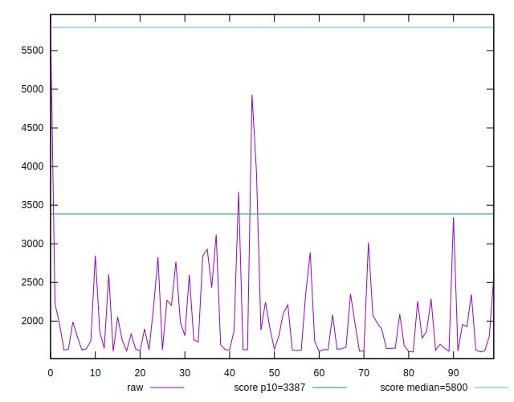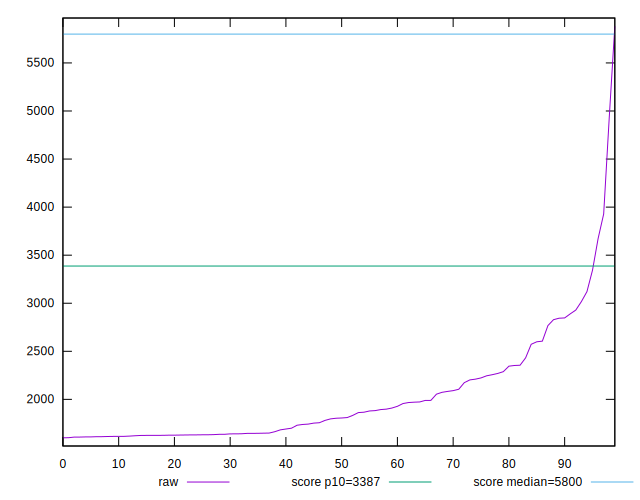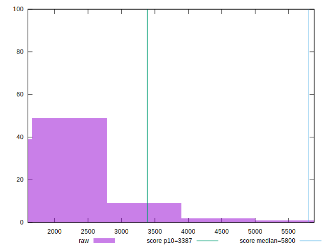
## Score


```yaml
p90min: 0.86
p90max: 1
p90range: 0.14
p90mean: 0.9896808510638295
p90median: 1
p90stdev: 0.02175551422687341
p90skewness: -3.35608964558555
p90eccentricity: 0.9999999999999967
p90discretization: 9.4
outlandishness: 0.9803320034087382
confidence: 0.025677742412455427
p90confidence: 0.008795965411079463

```

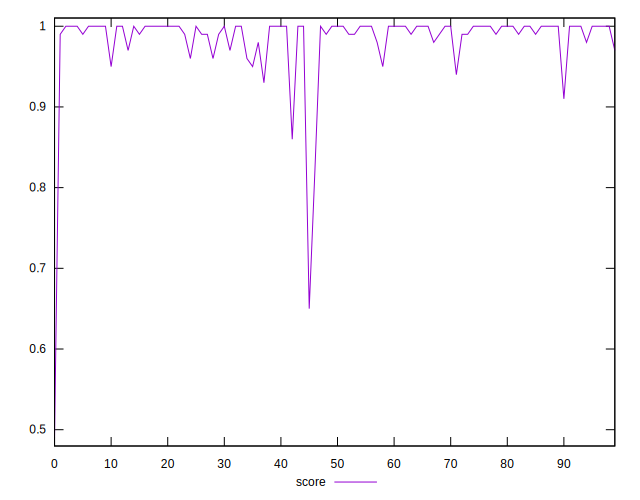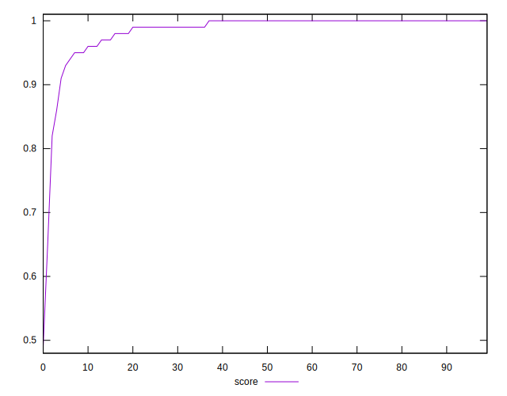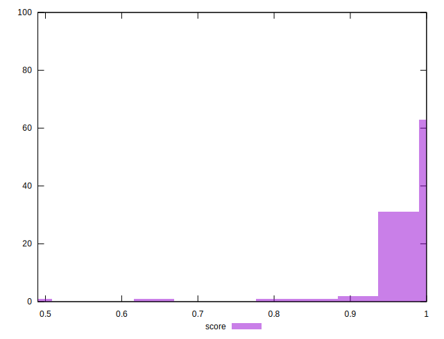
## Raw Estimate

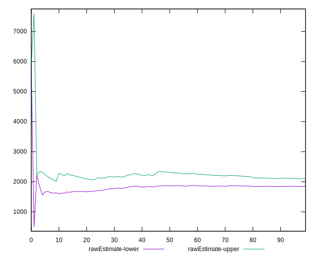
## Score Estimate

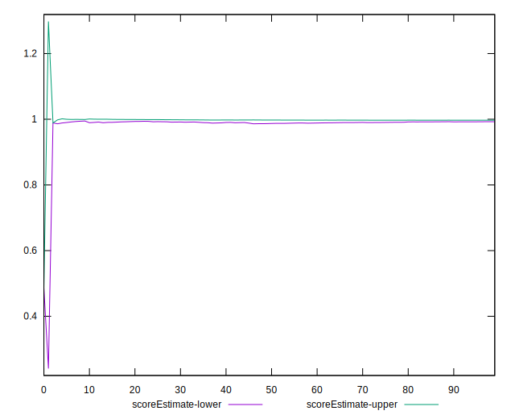
## P Score


```yaml
p90min: 0.861869235739479
p90max: 0.9988823331406194
p90range: 0.13701309740114032
p90mean: 0.9888240166832857
p90median: 0.9972919289758075
p90stdev: 0.021235446468386546
p90skewness: -3.5132597441829514
p90eccentricity: 1.0000000000000004
p90discretization: 1
outlandishness: 0.9803593671348269
confidence: 0.025623804786916626
p90confidence: 0.008585696972128135

```

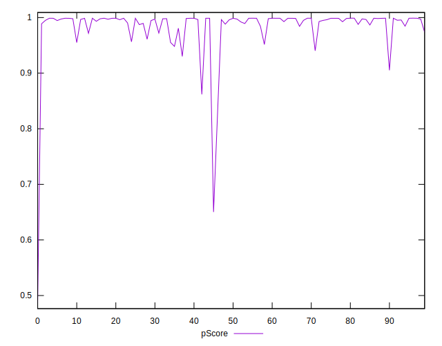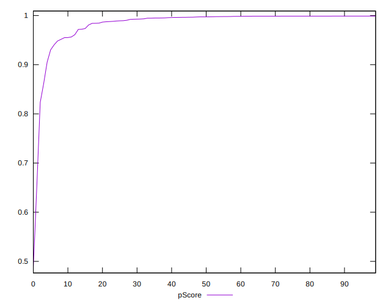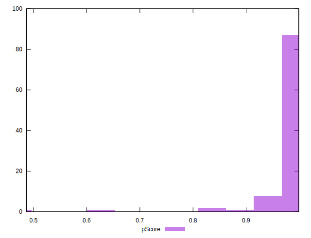
## Score Difference


```yaml
p90min: 0
p90max: 1.1102230246251565e-16
p90range: 1.1102230246251565e-16
p90mean: 2.362176648138631e-18
p90median: 0
p90stdev: 1.6021061506108986e-17
p90skewness: 6.63488802697037
p90eccentricity: 0.9999999999999991
p90discretization: 47
outlandishness: 5.522500000000001
confidence: 9.484951648085953e-18
p90confidence: 6.477470556979047e-18

```

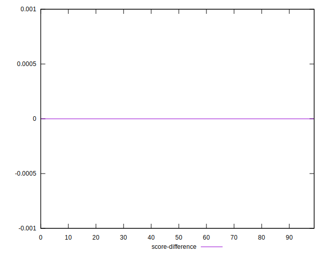
## P Score Difference


```yaml
p90min: -0.00478721941057203
p90max: 0.004608394991710618
p90range: 0.009395614402282648
p90mean: -0.0008904393056407078
p90median: -0.0012415784818610165
p90stdev: 0.002134801937856241
p90skewness: 0.9679216297191273
p90eccentricity: 0.9999999999999997
p90discretization: 1
outlandishness: 0.8787287095112697
confidence: 0.0009420344493384172
p90confidence: 0.0008631211291569425

```

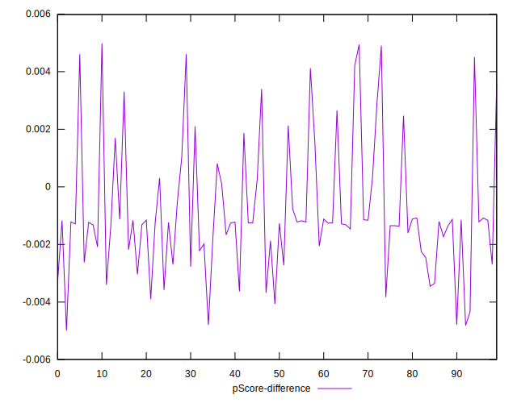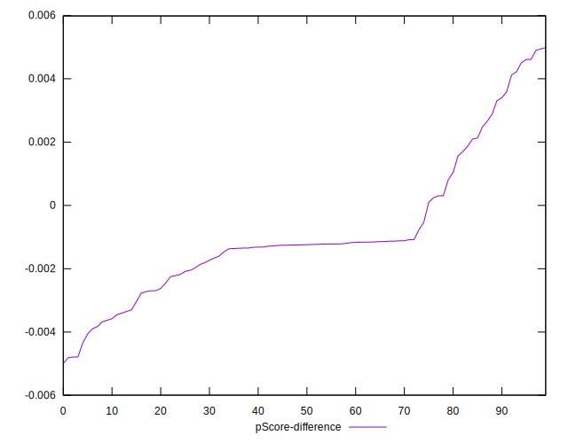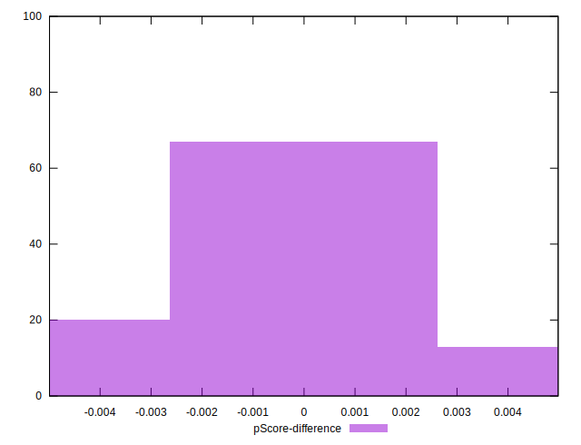