# //speed-index/samples/pages+cached+noadtech+nomedia

[→ Parent](../..)


## Raw


```yaml
p90min: 2125.32
p90max: 4444.807799999689
p90range: 2319.4877999996893
p90mean: 2852.1463962636903
p90median: 2710.185369999677
p90stdev: 651.9497636663709
p90skewness: 0.8819893050706737
p90eccentricity: 1.0000000000000002
p90discretization: 1
outlandishness: 1.032703250575877
confidence: 300.2176333243365
p90confidence: 263.5896127836536

```

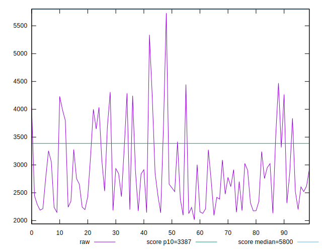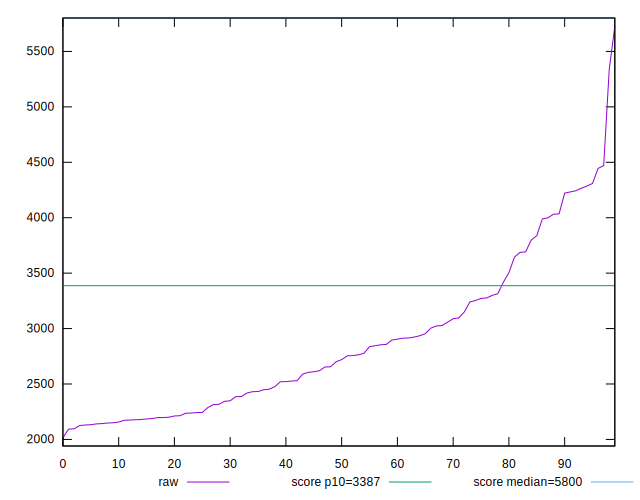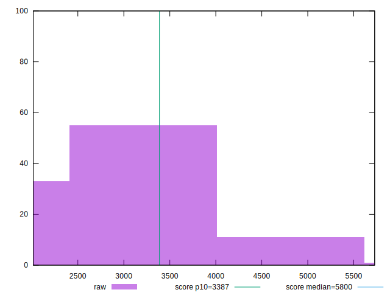
## Score


```yaml
p90min: 0.74
p90max: 0.99
p90range: 0.25
p90mean: 0.9382978723404253
p90median: 0.965
p90stdev: 0.06750316458889623
p90skewness: -1.5350052252712079
p90eccentricity: 1.000000000000001
p90discretization: 4.947368421052632
outlandishness: 0.9821798777721216
confidence: 0.03471956568493174
p90confidence: 0.02729218416399927

```

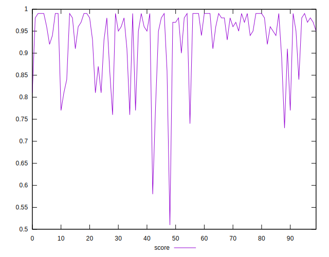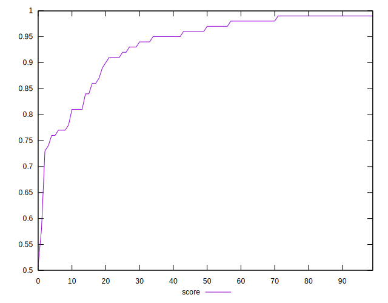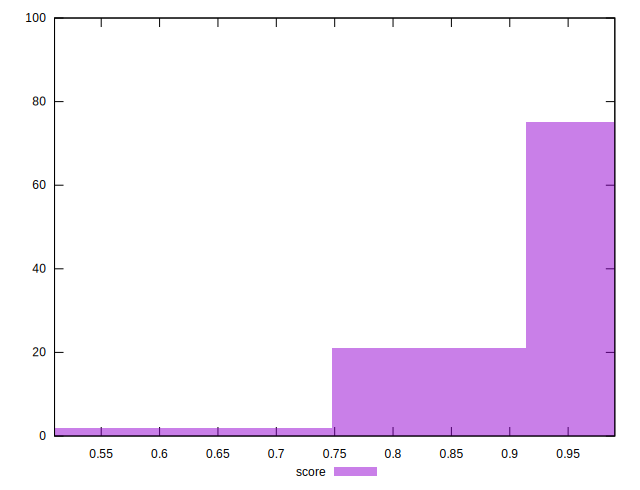
## Raw Estimate

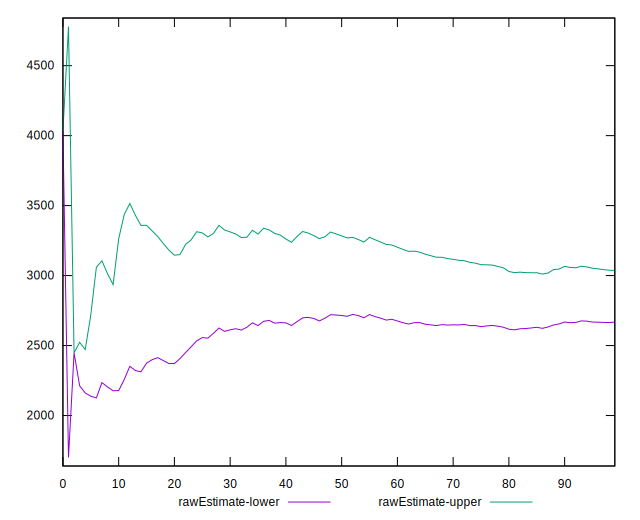
## Score Estimate

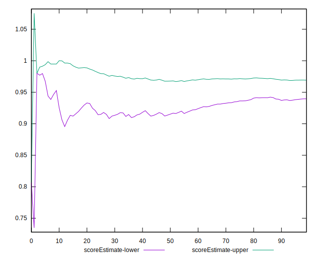
## P Score


```yaml
p90min: 0.736966377710462
p90max: 0.9916176161335706
p90range: 0.25465123842310855
p90mean: 0.9380592493662572
p90median: 0.9650543849432943
p90stdev: 0.06757842478445657
p90skewness: -1.5273300119759274
p90eccentricity: 1.0000000000000002
p90discretization: 1
outlandishness: 0.9824529836601714
confidence: 0.03472435604903176
p90confidence: 0.02732261259102133

```

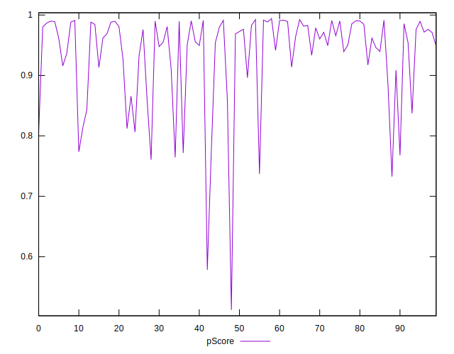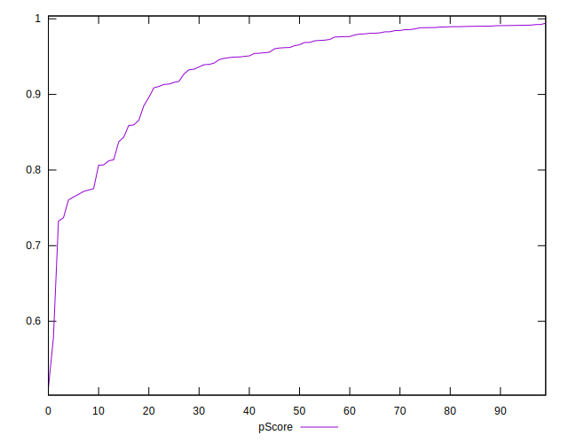
## Score Difference


```yaml
p90min: 0
p90max: 1.1102230246251565e-16
p90range: 1.1102230246251565e-16
p90mean: 1.1810883240693155e-17
p90median: 0
p90stdev: 3.423119174922784e-17
p90skewness: 2.553242569566718
p90eccentricity: 1.0000000000000016
p90discretization: 47
outlandishness: 1.4932839999999998
confidence: 1.463590624989346e-17
p90confidence: 1.3840002836352577e-17

```

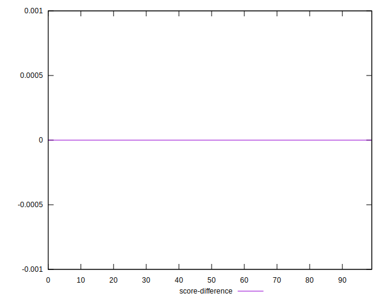
## P Score Difference


```yaml
p90min: -0.004407856215115746
p90max: 0.004394023962825733
p90range: 0.008801880177941479
p90mean: -0.00010353544587861511
p90median: 0.0001034764286255152
p90stdev: 0.0024186826662566064
p90skewness: -0.1268503400111355
p90eccentricity: 1.0000000000000007
p90discretization: 1
outlandishness: 1.072935103599624
confidence: 0.001021633220136001
p90confidence: 0.0009778968610399997

```

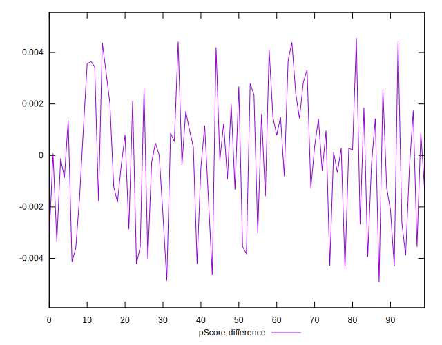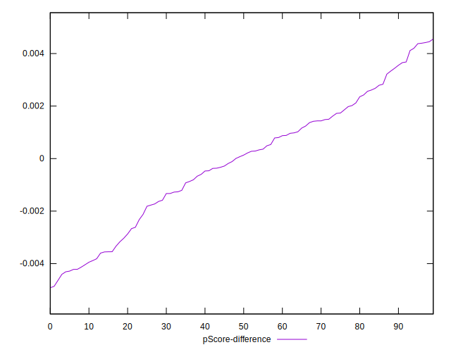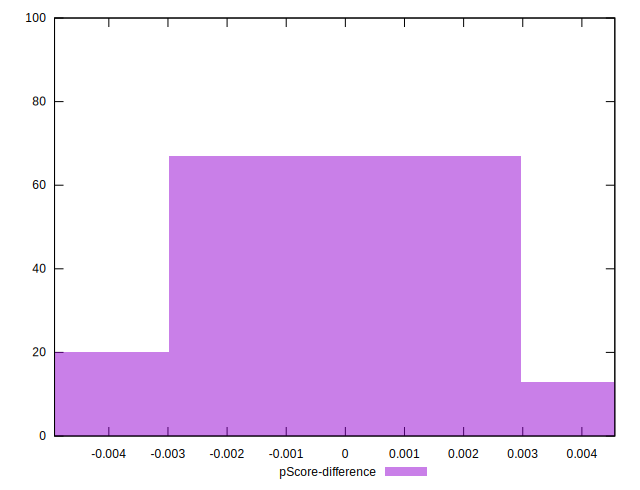