# //speed-index/samples/pages+cached+noadtech

[→ Parent](../..)


## Raw


```yaml
p90min: 2136.3199999999997
p90max: 5843.903282698261
p90range: 3707.5832826982614
p90mean: 2988.965125066418
p90median: 2809.4162239997736
p90stdev: 849.6571757573801
p90skewness: 1.3760569726727403
p90eccentricity: 1.0000000000000002
p90discretization: 1
outlandishness: 1.0542840072144315
confidence: 407.9307938650284
p90confidence: 343.5246370782494

```

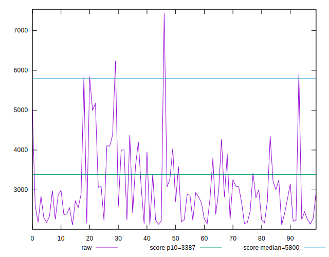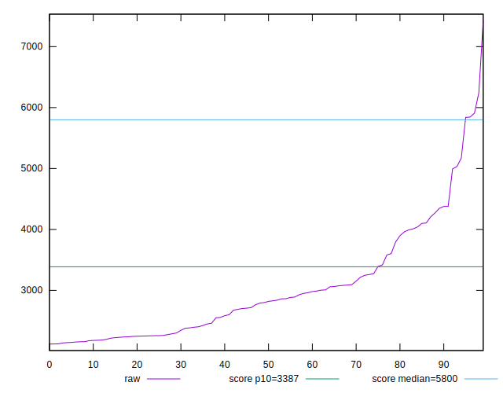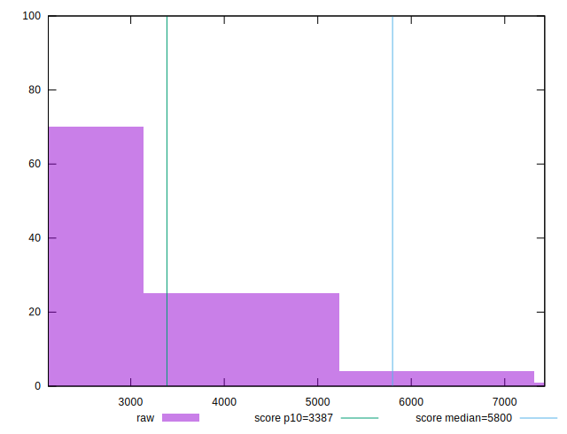
## Score


```yaml
p90min: 0.49
p90max: 0.99
p90range: 0.5
p90mean: 0.9188297872340424
p90median: 0.96
p90stdev: 0.10601943201029006
p90skewness: -2.232173834511135
p90eccentricity: 0.9999999999999989
p90discretization: 3.9166666666666665
outlandishness: 0.9707667856983767
confidence: 0.05393414918333899
p90confidence: 0.04286468465603456

```

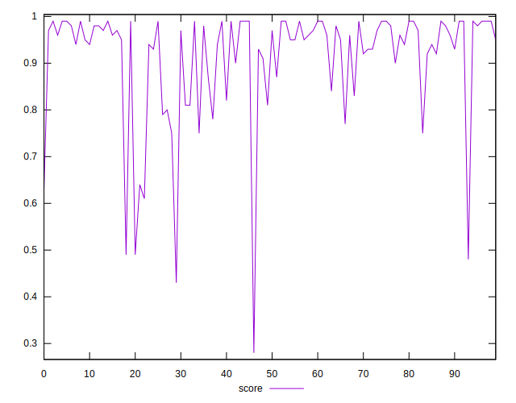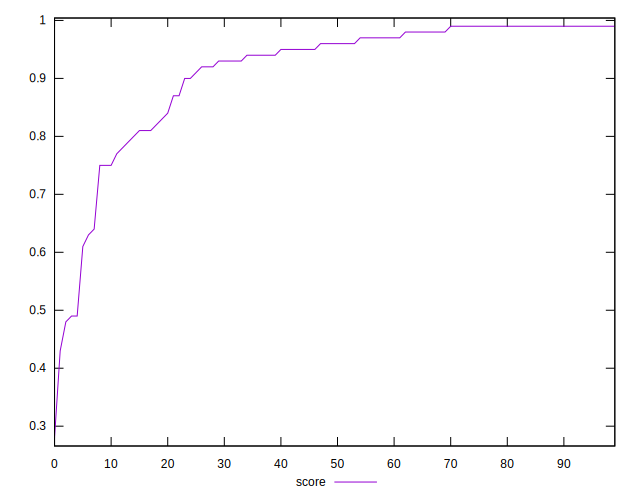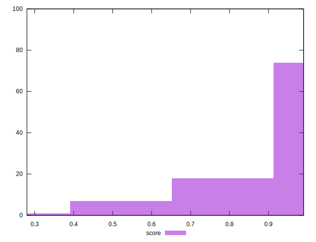
## Raw Estimate

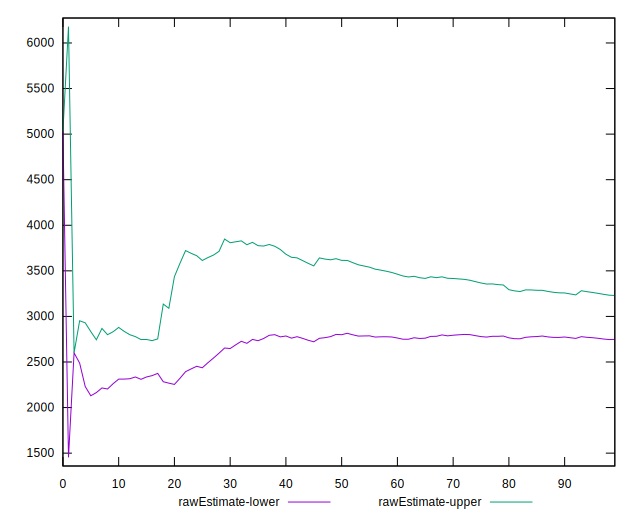
## Score Estimate

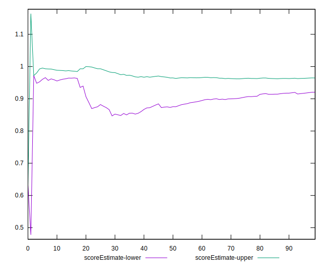
## P Score


```yaml
p90min: 0.4928329045347023
p90max: 0.9913325758890987
p90range: 0.49849967135439643
p90mean: 0.9187736776763803
p90median: 0.9579116506364922
p90stdev: 0.10571738283122335
p90skewness: -2.2239299850759746
p90eccentricity: 1.0000000000000002
p90discretization: 1
outlandishness: 0.970897593901904
confidence: 0.05386372766914296
p90confidence: 0.04274256324332927

```

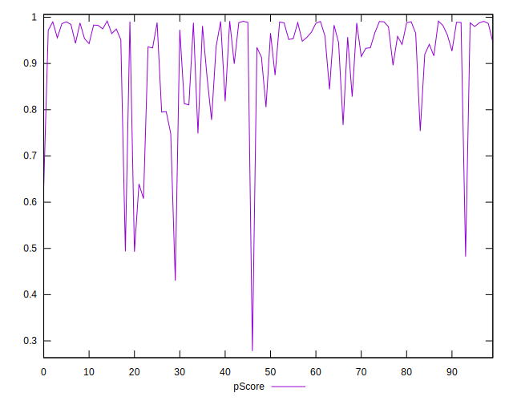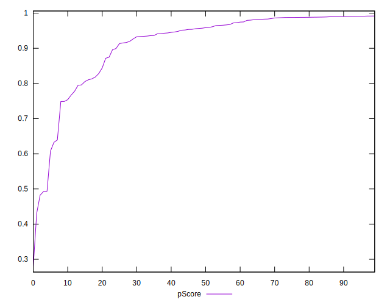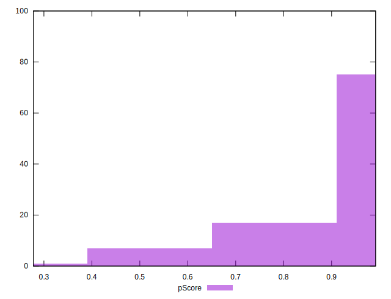
## Score Difference


```yaml
p90min: 0
p90max: 1.1102230246251565e-16
p90range: 1.1102230246251565e-16
p90mean: 1.4173059888831785e-17
p90median: 0
p90stdev: 3.704929304568198e-17
p90skewness: 2.2315184957216814
p90eccentricity: 0.9999999999999983
p90discretization: 47
outlandishness: 1.3806250000000002
confidence: 1.5539727857965513e-17
p90confidence: 1.49793885235872e-17

```

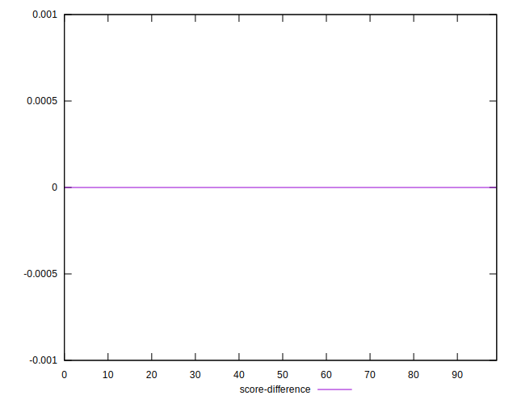
## P Score Difference


```yaml
p90min: -0.004515181198541107
p90max: 0.004722846392192004
p90range: 0.009238027590733111
p90mean: 0.000004051612087564627
p90median: 0.000008190183090561742
p90stdev: 0.002617595293988465
p90skewness: 0.06662026149402282
p90eccentricity: 1.0000000000000004
p90discretization: 1
outlandishness: 1.9821674355535406
confidence: 0.0010962822495924525
p90confidence: 0.0010583191657077117

```

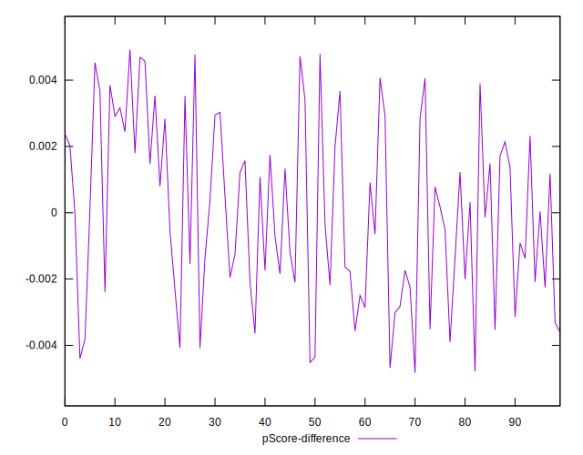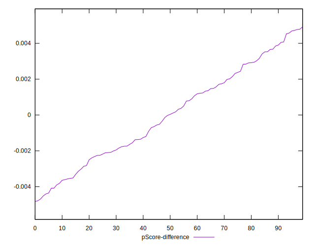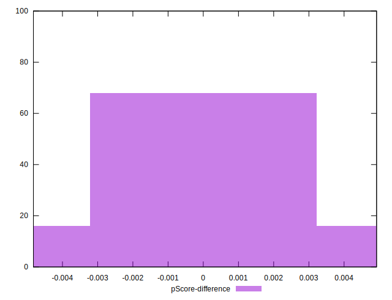