# //speed-index/samples/pages+cached

[→ Parent](../..)


## Raw


```yaml
p90min: 4054.615080586157
p90max: 7892.159835482871
p90range: 3837.544754896714
p90mean: 5749.9073843087135
p90median: 5792.7324499615315
p90stdev: 975.5143229304956
p90skewness: 0.22322231330233758
p90eccentricity: 0.9999999999999994
p90discretization: 1
outlandishness: 1.0132747303380656
confidence: 449.5023027617439
p90confidence: 394.40990238282217

```

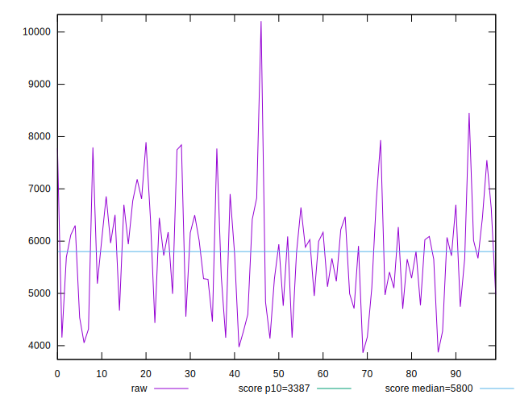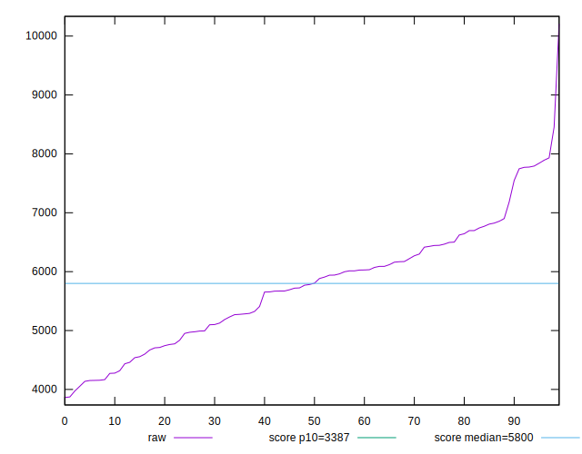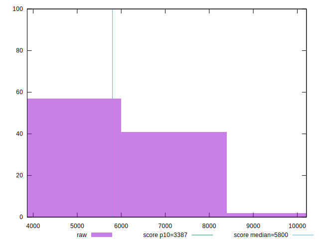
## Score


```yaml
p90min: 0.23
p90max: 0.8
p90range: 0.5700000000000001
p90mean: 0.5202127659574469
p90median: 0.5
p90stdev: 0.15271987095976244
p90skewness: 0.09983381647291674
p90eccentricity: 0.9999999999999997
p90discretization: 2.088888888888889
outlandishness: 0.994575882436089
confidence: 0.06628105578537045
p90confidence: 0.061746125076062815

```

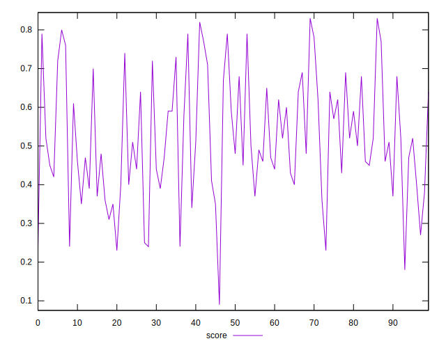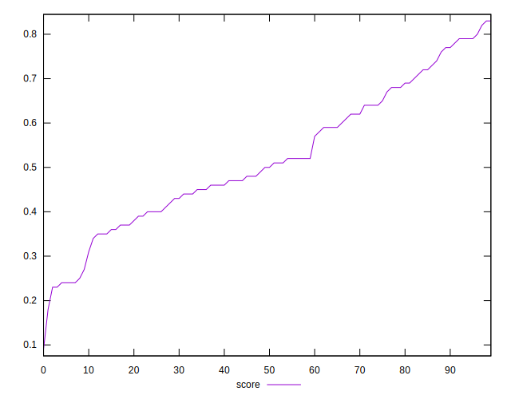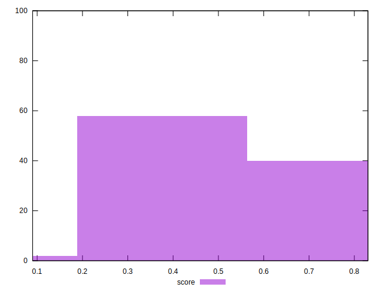
## Raw Estimate

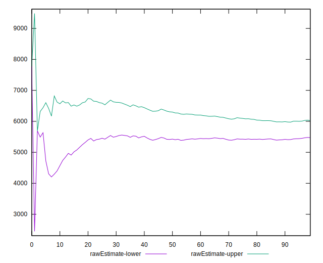
## Score Estimate

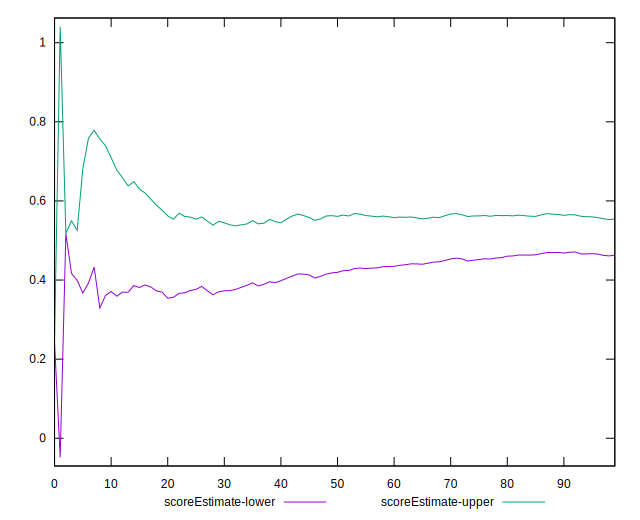
## P Score


```yaml
p90min: 0.23152825339101568
p90max: 0.8031488181588985
p90range: 0.5716205647678828
p90mean: 0.5198577335824455
p90median: 0.5011936389253355
p90stdev: 0.15268309176781977
p90skewness: 0.09210716473585448
p90eccentricity: 0.9999999999999997
p90discretization: 1
outlandishness: 0.9947832668208851
confidence: 0.06626921677698568
p90confidence: 0.061731254892034904

```

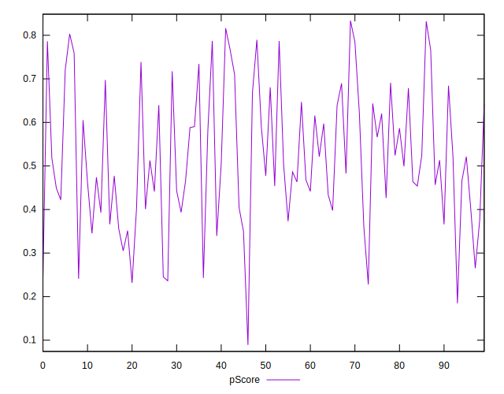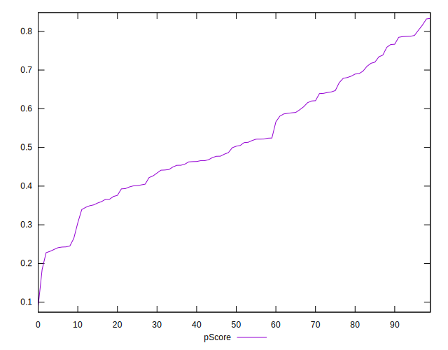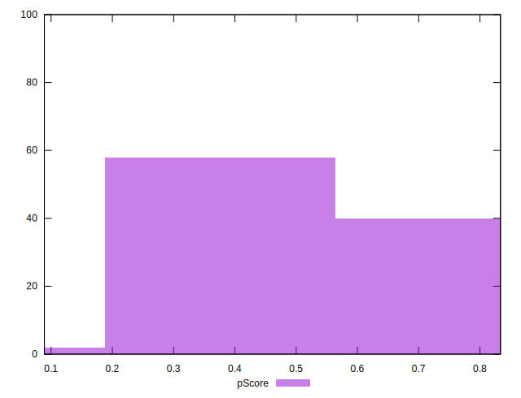
## Score Difference


```yaml
p90min: 0
p90max: 1.1102230246251565e-16
p90range: 1.1102230246251565e-16
p90mean: 9.448706592554524e-18
p90median: 0
p90stdev: 2.640993780050293e-17
p90skewness: 2.8324720284585276
p90eccentricity: 0.9999999999999984
p90discretization: 31.333333333333332
outlandishness: 1.67055625
confidence: 1.2146664757747573e-17
p90confidence: 1.0677794005670298e-17

```

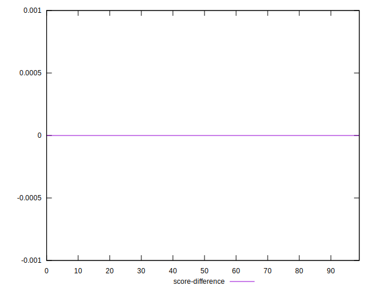
## P Score Difference


```yaml
p90min: -0.004854890746884832
p90max: 0.004152394899116563
p90range: 0.009007285646001395
p90mean: -0.000304435765680204
p90median: -0.00037700030785042804
p90stdev: 0.0027996531465004425
p90skewness: -0.00898632786530385
p90eccentricity: 1
p90discretization: 1
outlandishness: 0.971194632790418
confidence: 0.0011578761804763669
p90confidence: 0.0011319269212776842

```

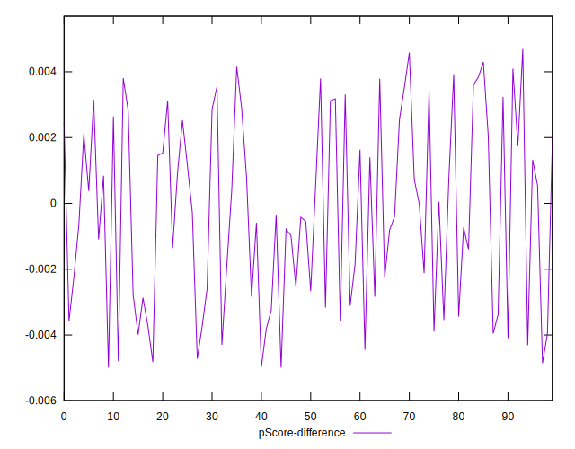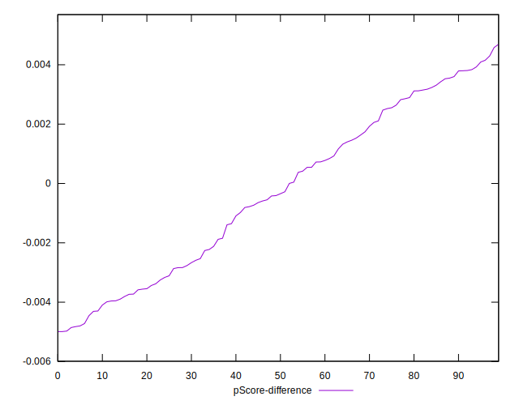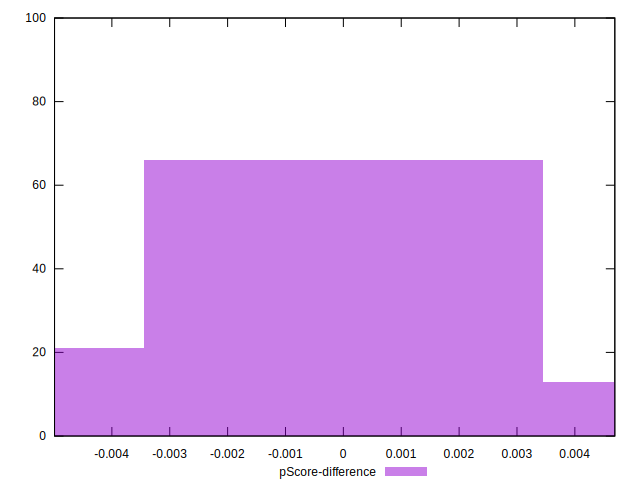