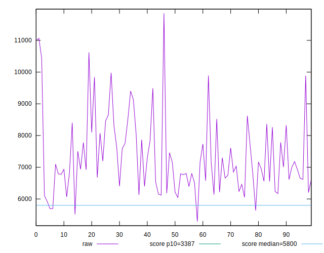
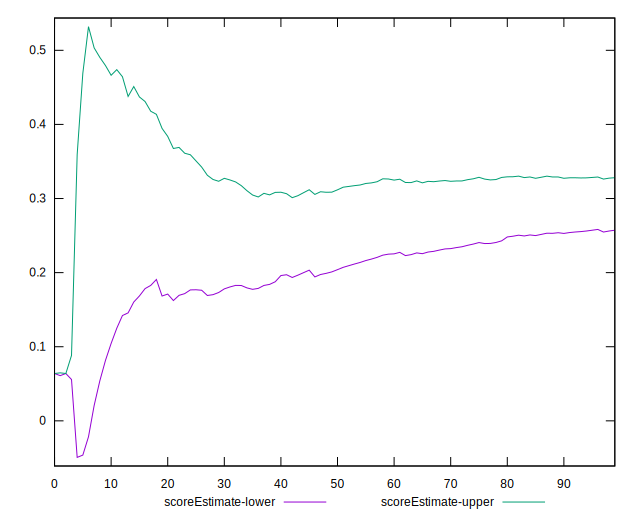

# //speed-index/samples/pages

[→ Parent](../..)


## Raw


```yaml
p90min: 5693.65993405112
p90max: 10621.328352538801
p90range: 4927.668418487681
p90mean: 7294.868597686922
p90median: 6943.124949061906
p90stdev: 1114.1368365601127
p90skewness: 1.0871293543149112
p90eccentricity: 1.000000000000001
p90discretization: 1
outlandishness: 1.0181212573966196
confidence: 518.3697462735454
p90confidence: 450.456329158469

```


## Score


```yaml
p90min: 0.07
p90max: 0.52
p90range: 0.45
p90mean: 0.3124468085106382
p90median: 0.33
p90stdev: 0.10916205180209912
p90skewness: -0.378361083003736
p90eccentricity: 1.0000000000000013
p90discretization: 2.6857142857142855
outlandishness: 0.9971419837006138
confidence: 0.048050706650266846
p90confidence: 0.044135276318482186

```


## Raw Estimate


## Score Estimate


## P Score


```yaml
p90min: 0.074736343594482
p90max: 0.5175823018497573
p90range: 0.4428459582552753
p90mean: 0.3124453976203875
p90median: 0.3341121760439788
p90stdev: 0.10852518739410534
p90skewness: -0.3700242426770922
p90eccentricity: 1.0000000000000002
p90discretization: 1
outlandishness: 0.997297640486256
confidence: 0.04769763199207797
p90confidence: 0.04387778586131151

```


## Score Difference


```yaml
p90min: 0
p90max: 5.551115123125783e-17
p90range: 5.551115123125783e-17
p90mean: 3.543264972207946e-18
p90median: 0
p90stdev: 1.356967173742159e-17
p90skewness: 3.5685919470917944
p90eccentricity: 0.9999999999999968
p90discretization: 47
outlandishness: 1.9881000000000004
confidence: 6.227306930844215e-18
p90confidence: 5.486349897196452e-18

```


## P Score Difference


```yaml
p90min: -0.004622302532894362
p90max: 0.004863103169250871
p90range: 0.009485405702145233
p90mean: 0.000019331130457975113
p90median: -0.00019092159394326624
p90stdev: 0.002794999375365589
p90skewness: 0.13183619937047036
p90eccentricity: 0.9999999999999999
p90discretization: 1
outlandishness: 1.408486704769729
confidence: 0.0011609732205777505
p90confidence: 0.0011300453564704186

```

