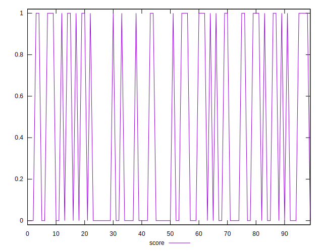
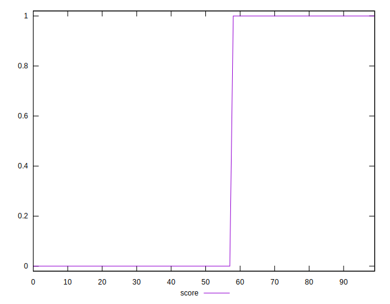
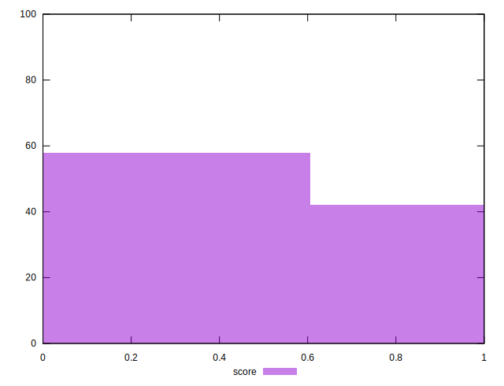

# //third-party-summary/samples/pages+cached+noadtech+nomedia+nocss

[→ Parent](../..)


## Raw


```yaml
p90range: 0

```


## Score


```yaml
p90min: 0
p90max: 1
p90range: 1
p90mean: 0.4148936170212766
p90median: 0
p90stdev: 0.4927036671025283
p90skewness: 0.34546681367002413
p90eccentricity: 0.9999999999999988
p90discretization: 47
outlandishness: 1.0247668639053256
confidence: 0.193471379663359
p90confidence: 0.19920487139727247

```

