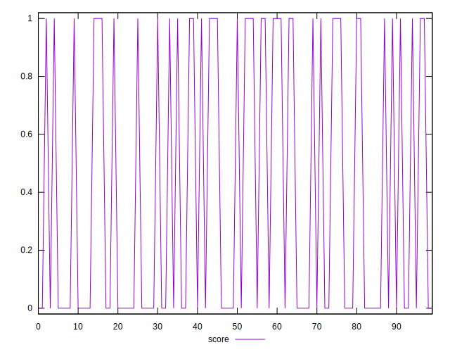
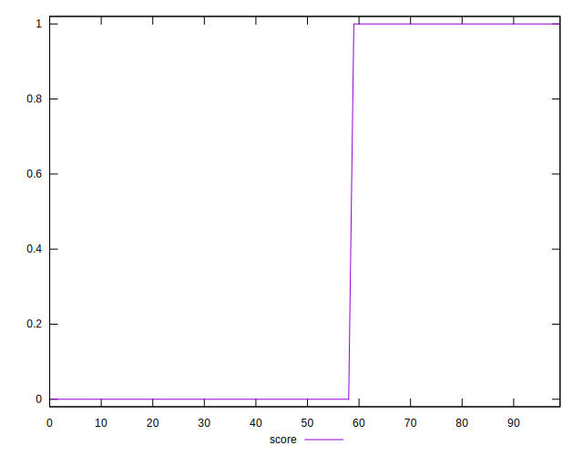
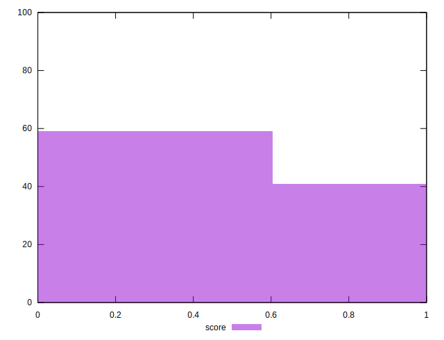

# //third-party-summary/samples/pages+cached+noadtech

[→ Parent](../..)


## Raw


```yaml
p90range: 0

```


## Score


```yaml
p90min: 0
p90max: 1
p90range: 1
p90mean: 0.40425531914893614
p90median: 0
p90stdev: 0.49074734445407575
p90skewness: 0.39019948628585566
p90eccentricity: 1.0000000000000024
p90discretization: 47
outlandishness: 1.0286229916897507
confidence: 0.1927951128764325
p90confidence: 0.19841391117591195

```

