# //total-blocking-time/samples/pages+cached+noadtech+nomedia+nocss

[→ Parent](../..)


## Raw


```yaml
p90min: 56.5
p90max: 892.182
p90range: 835.682
p90mean: 324.2099308510638
p90median: 284.81600000000003
p90stdev: 194.65119324776768
p90skewness: 0.9312052352616346
p90eccentricity: 0.9999999999999994
p90discretization: 1.0217391304347827
outlandishness: 1.0966322354789457
confidence: 94.85255530302486
p90confidence: 78.69936537366644

```

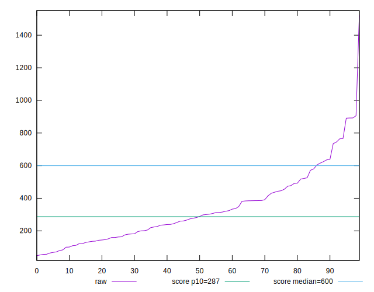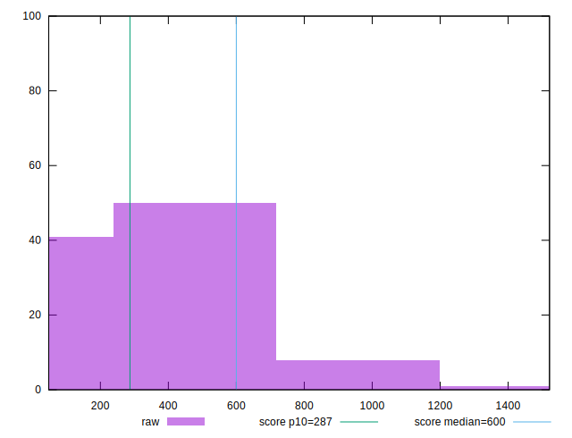
## Score


```yaml
p90min: 0.25
p90max: 1
p90range: 0.75
p90mean: 0.8211702127659576
p90median: 0.905
p90stdev: 0.20281978366184003
p90skewness: -1.2052645059744385
p90eccentricity: 0.9999999999999999
p90discretization: 2.292682926829268
outlandishness: 0.9665037208271667
confidence: 0.0894067685909947
p90confidence: 0.08200200570614374

```

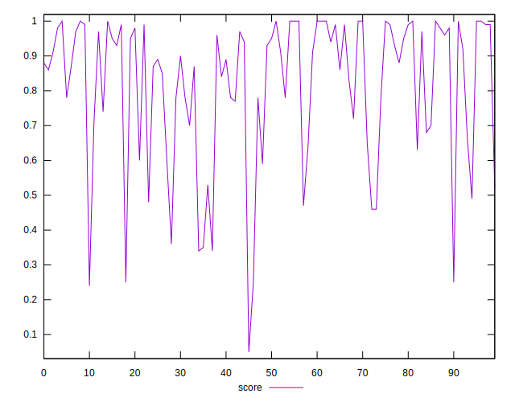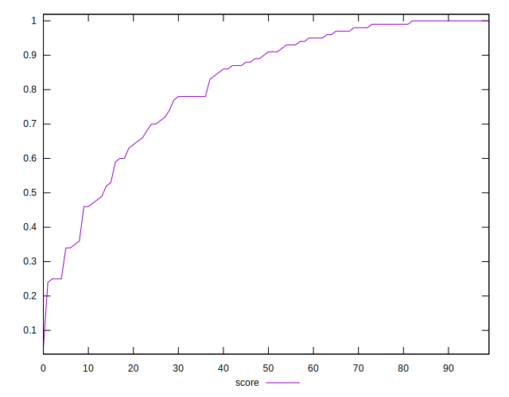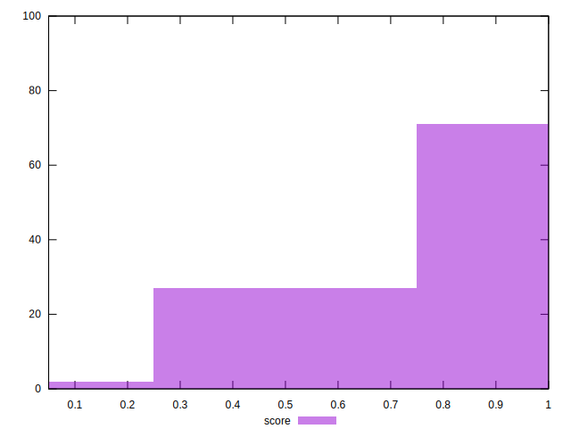
## Raw Estimate

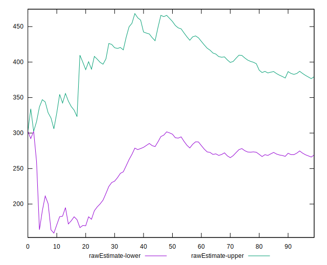
## Score Estimate

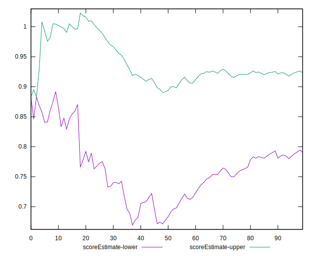
## P Score


```yaml
p90min: 0.24526561855179385
p90max: 0.9999798544367375
p90range: 0.7547142358849437
p90mean: 0.8211329921324431
p90median: 0.9022844909065086
p90stdev: 0.20282635729451207
p90skewness: -1.2128728568875897
p90eccentricity: 1.0000000000000002
p90discretization: 1.0217391304347827
outlandishness: 0.9663936622596638
confidence: 0.08944401526888185
p90confidence: 0.08200466348959143

```

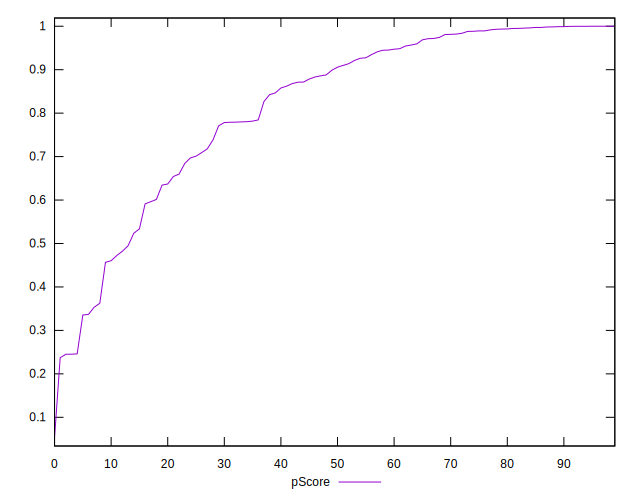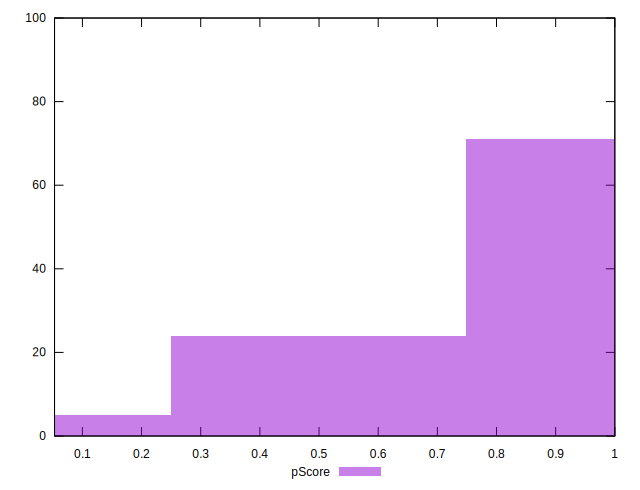
## Score Difference


```yaml
p90min: 0
p90max: 1.1102230246251565e-16
p90range: 1.1102230246251565e-16
p90mean: 8.267618268485208e-18
p90median: 0
p90stdev: 2.799951663225835e-17
p90skewness: 3.2334877596906404
p90eccentricity: 0.9999999999999959
p90discretization: 31.333333333333332
outlandishness: 1.8032653061224493
confidence: 1.2688134664576156e-17
p90confidence: 1.1320476144851072e-17

```

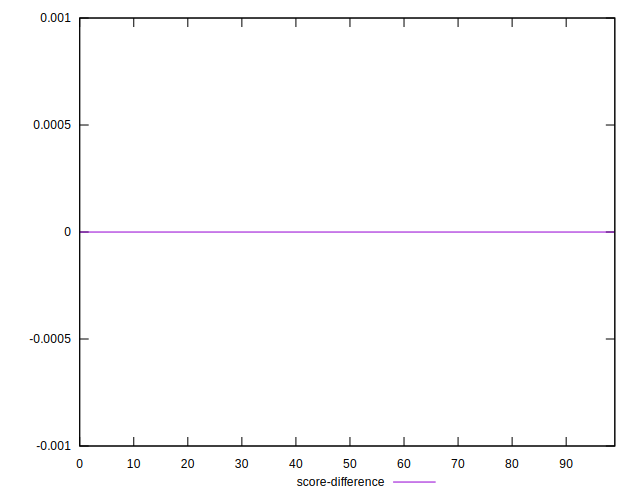
## P Score Difference


```yaml
p90min: -0.004734381448206149
p90max: 0.004607288318270952
p90range: 0.009341669766477101
p90mean: -0.0000857728433811274
p90median: -0.00013879856940851587
p90stdev: 0.002579793521699098
p90skewness: 0.11590205838331069
p90eccentricity: 1.0000000000000002
p90discretization: 1.0217391304347827
outlandishness: 0.9263973008257214
confidence: 0.001085243145767716
p90confidence: 0.0010430355425275224

```

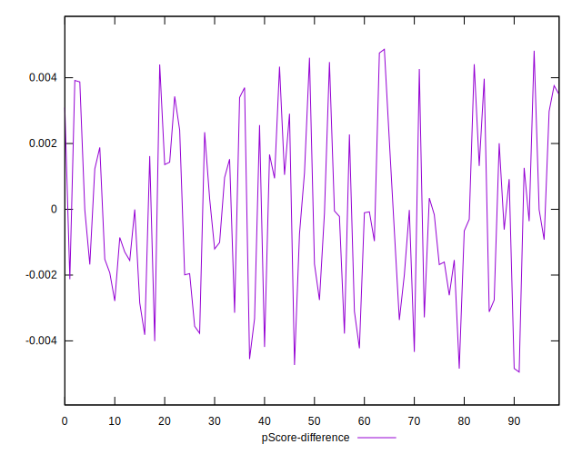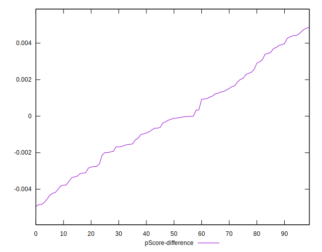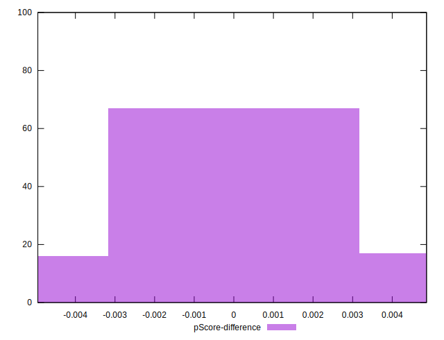