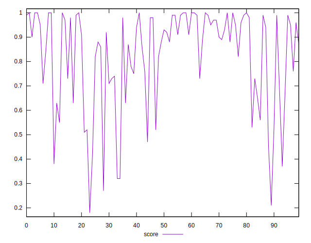

# //total-blocking-time/samples/pages+cached+noadtech+nomedia

[→ Parent](../..)


## Raw


```yaml
p90min: 72
p90max: 786.2139999999993
p90range: 714.2139999999993
p90mean: 317.5155159574468
p90median: 281.5
p90stdev: 175.57246765998127
p90skewness: 0.7984039005394459
p90eccentricity: 1.0000000000000002
p90discretization: 1.032967032967033
outlandishness: 1.0714196183423503
confidence: 81.06194846524062
p90confidence: 70.98565157184088

```


## Score


```yaml
p90min: 0.32
p90max: 1
p90range: 0.6799999999999999
p90mean: 0.8304255319148941
p90median: 0.905
p90stdev: 0.18822753825259458
p90skewness: -1.1301670168544473
p90eccentricity: 1.0000000000000002
p90discretization: 2.473684210526316
outlandishness: 0.9684012229698544
confidence: 0.08335002119607027
p90confidence: 0.07610221935537301

```


## Raw Estimate


## Score Estimate


## P Score


```yaml
p90min: 0.31927330802515924
p90max: 0.9998854547554081
p90range: 0.6806121467302488
p90mean: 0.8304548653699074
p90median: 0.9057695608079275
p90stdev: 0.18791725801803452
p90skewness: -1.1313811846798312
p90eccentricity: 1
p90discretization: 1.032967032967033
outlandishness: 0.9682548362391658
confidence: 0.08331410857080035
p90confidence: 0.07597677004709784

```


## Score Difference


```yaml
p90min: 0
p90max: 1.1102230246251565e-16
p90range: 1.1102230246251565e-16
p90mean: 7.677074106450551e-18
p90median: 0
p90stdev: 2.757910785993851e-17
p90skewness: 3.3941101404118648
p90eccentricity: 1.0000000000000022
p90discretization: 31.333333333333332
outlandishness: 1.8874532544378695
confidence: 1.2573799485070423e-17
p90confidence: 1.1150500800610675e-17

```


## P Score Difference


```yaml
p90min: -0.004705418656270055
p90max: 0.004596452125260608
p90range: 0.009301870781530663
p90mean: -0.00003052388014567038
p90median: -0.00017772848270580788
p90stdev: 0.0026783177919389263
p90skewness: 0.021725762550295267
p90eccentricity: 1.0000000000000004
p90discretization: 1.032967032967033
outlandishness: 1.162000379462011
confidence: 0.0011167117753921518
p90confidence: 0.001082869860583351

```

