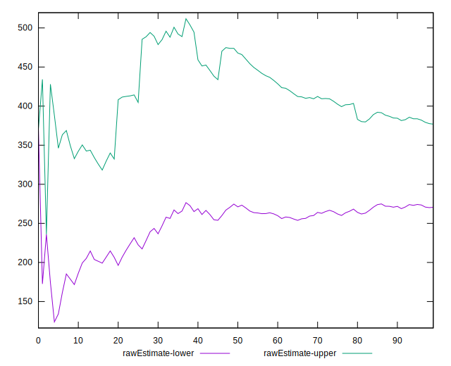

# //total-blocking-time/samples/pages+cached+noadtech

[→ Parent](../..)


## Raw


```yaml
p90min: 69.5
p90max: 981.9999999999998
p90range: 912.4999999999998
p90mean: 323.77502393617027
p90median: 310.4999999999998
p90stdev: 187.58381995600269
p90skewness: 0.9942265649307277
p90eccentricity: 1.0000000000000007
p90discretization: 1.0217391304347827
outlandishness: 1.1586568523156668
confidence: 105.0543871318772
p90confidence: 75.84195780456547

```


## Score


```yaml
p90min: 0.2
p90max: 1
p90range: 0.8
p90mean: 0.8230851063829788
p90median: 0.875
p90stdev: 0.19277937227287792
p90skewness: -1.2031992563084968
p90eccentricity: 0.9999999999999999
p90discretization: 2.35
outlandishness: 0.9586781409430878
confidence: 0.0897913301380477
p90confidence: 0.07794256999851848

```


## Raw Estimate


## Score Estimate


## P Score


```yaml
p90min: 0.19595523020036354
p90max: 0.9999101526794045
p90range: 0.803954922479041
p90mean: 0.8229744947727955
p90median: 0.8738276043578043
p90stdev: 0.19302402069544117
p90skewness: -1.2182693200051928
p90eccentricity: 1
p90discretization: 1.032967032967033
outlandishness: 0.9588360907120529
confidence: 0.0897827284895674
p90confidence: 0.0780414837286331

```


## Score Difference


```yaml
p90min: 0
p90max: 1.1102230246251565e-16
p90range: 1.1102230246251565e-16
p90mean: 1.0629794916623839e-17
p90median: 0
p90stdev: 3.26672889352398e-17
p90skewness: 2.7477857990363144
p90eccentricity: 1.0000000000000018
p90discretization: 47
outlandishness: 1.570844444444444
confidence: 1.414230748695887e-17
p90confidence: 1.3207701760189705e-17

```


## P Score Difference


```yaml
p90min: -0.004767846253265318
p90max: 0.004415985010188694
p90range: 0.009183831263454012
p90mean: -0.00003706021994324192
p90median: -0.00013793782773363628
p90stdev: 0.002588222194798991
p90skewness: 0.019432062937940177
p90eccentricity: 1.0000000000000002
p90discretization: 1.032967032967033
outlandishness: 1.2797424466244318
confidence: 0.0010870105097864492
p90confidence: 0.001046443336812448

```

