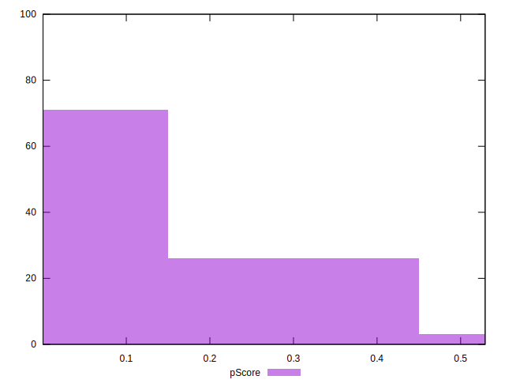

# //total-blocking-time/samples/pages+cached

[→ Parent](../..)


## Raw


```yaml
p90min: 650
p90max: 3668.935999999999
p90range: 3018.935999999999
p90mean: 1606.012494680851
p90median: 1547.5000000000005
p90stdev: 688.0268028038143
p90skewness: 0.705987640533549
p90eccentricity: 0.9999999999999996
p90discretization: 1.010752688172043
outlandishness: 1.0486957205149647
confidence: 310.95281593443895
p90confidence: 278.17590962214103

```


## Score


```yaml
p90min: 0
p90max: 0.44
p90range: 0.44
p90mean: 0.10989361702127654
p90median: 0.05
p90stdev: 0.1219739654890744
p90skewness: 1.2416857613576853
p90eccentricity: 1.0000000000000007
p90discretization: 3.1333333333333333
outlandishness: 1.1471177234513716
confidence: 0.053221175438961335
p90confidence: 0.0493152572863035

```


## Raw Estimate


## Score Estimate


## P Score


```yaml
p90min: 0.0008256321487475349
p90max: 0.44468558094829147
p90range: 0.44385994879954394
p90mean: 0.10978645419132746
p90median: 0.04983284545018524
p90stdev: 0.12202290420651705
p90skewness: 1.2510354487725106
p90eccentricity: 0.9999999999999997
p90discretization: 1.010752688172043
outlandishness: 1.1478627735689002
confidence: 0.053237306567873684
p90confidence: 0.04933504368442764

```


## Score Difference


```yaml
p90min: 0
p90max: 0
p90range: 0
p90mean: 0
p90median: 0
p90stdev: 0
p90skewness: .nan
p90eccentricity: .nan
p90discretization: 94
outlandishness: .nan
confidence: 0
p90confidence: 0

```


## P Score Difference


```yaml
p90min: -0.004522642542898268
p90max: 0.004660387843240197
p90range: 0.009183030386138465
p90mean: -0.00008163708136929484
p90median: -0.00006690514643694755
p90stdev: 0.002897429977124623
p90skewness: 0.13559852156542437
p90eccentricity: 1.0000000000000004
p90discretization: 1.010752688172043
outlandishness: 0.8803080058274214
confidence: 0.0011929293321781378
p90confidence: 0.0011714590422474062

```

