# //total-blocking-time/samples/pages

[→ Parent](../..)


## Raw


```yaml
p90min: 612.9999999999991
p90max: 3621.140000000002
p90range: 3008.140000000003
p90mean: 1819.6023989361704
p90median: 1713.334
p90stdev: 764.3795009749618
p90skewness: 0.5522795900115904
p90eccentricity: 0.9999999999999999
p90discretization: 1
outlandishness: 1.0230046809321687
confidence: 330.40613957780164
p90confidence: 309.04604604605595

```

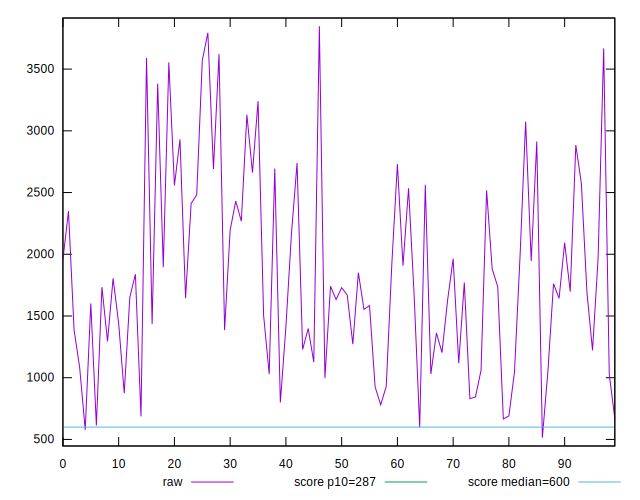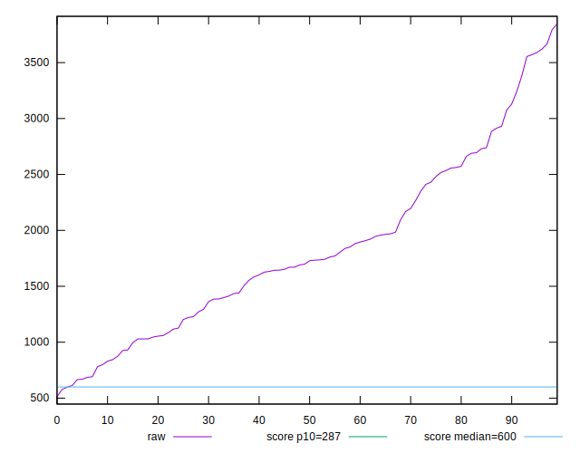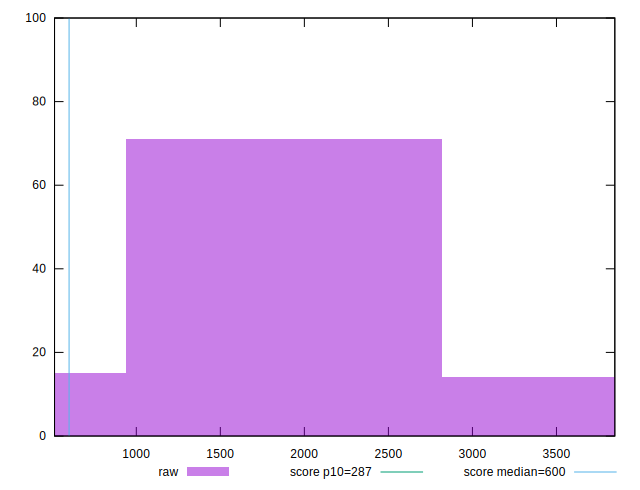
## Score


```yaml
p90min: 0
p90max: 0.49
p90range: 0.49
p90mean: 0.08319148936170208
p90median: 0.035
p90stdev: 0.11292261298479463
p90skewness: 1.870819197639887
p90eccentricity: 1.0000000000000007
p90discretization: 3.2413793103448274
outlandishness: 1.2930772587829744
confidence: 0.05342164357012642
p90confidence: 0.04565570767874757

```

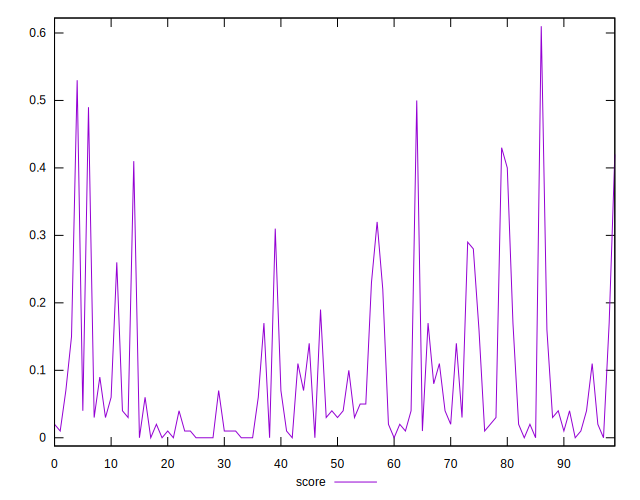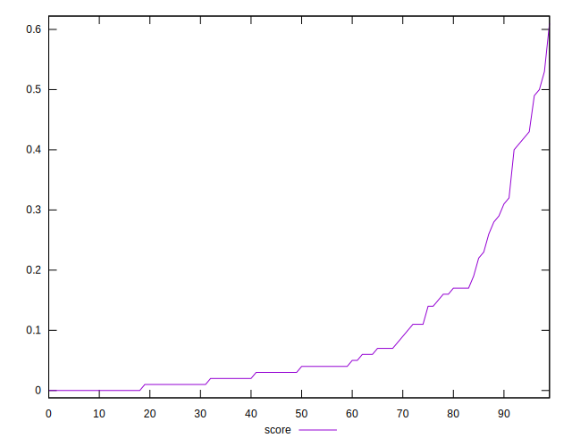
## Raw Estimate

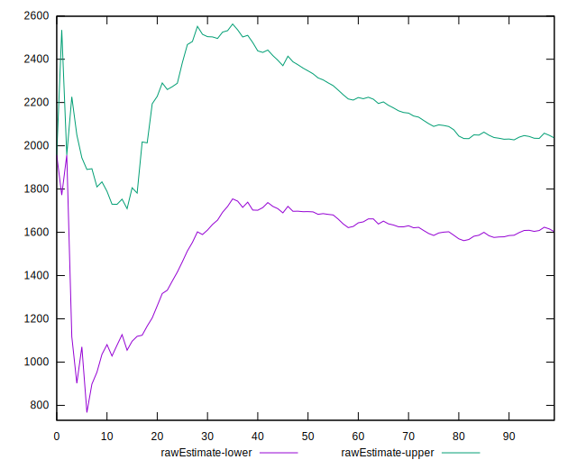
## Score Estimate

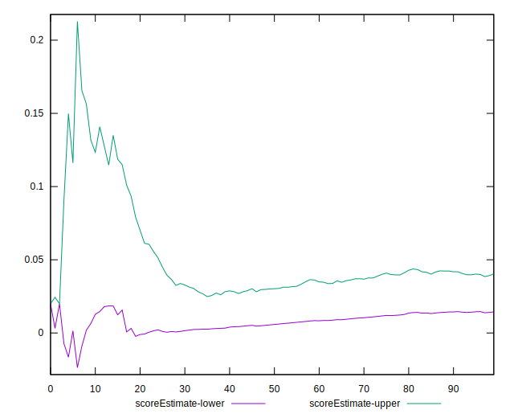
## P Score


```yaml
p90min: 0.0008923256279076419
p90max: 0.48514250555219457
p90range: 0.4842501799242869
p90mean: 0.08341169483247718
p90median: 0.03414191391410823
p90stdev: 0.11262139484938298
p90skewness: 1.8724880181599117
p90eccentricity: 0.9999999999999997
p90discretization: 1
outlandishness: 1.2911506706755582
confidence: 0.05324693427196533
p90confidence: 0.04553392226505241

```

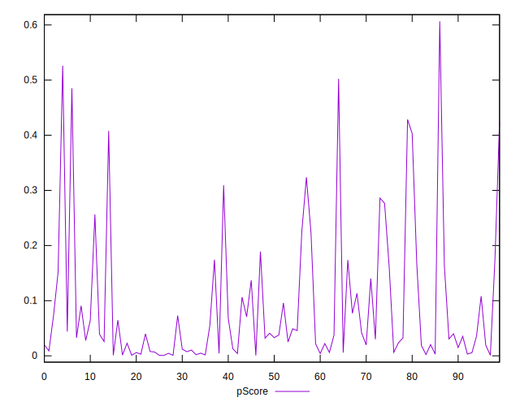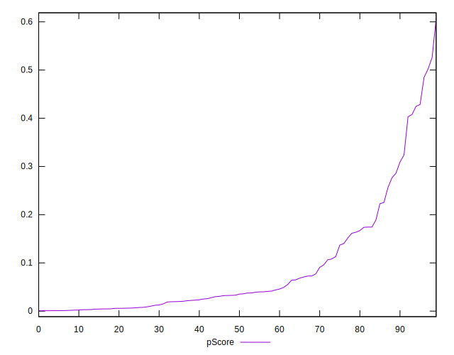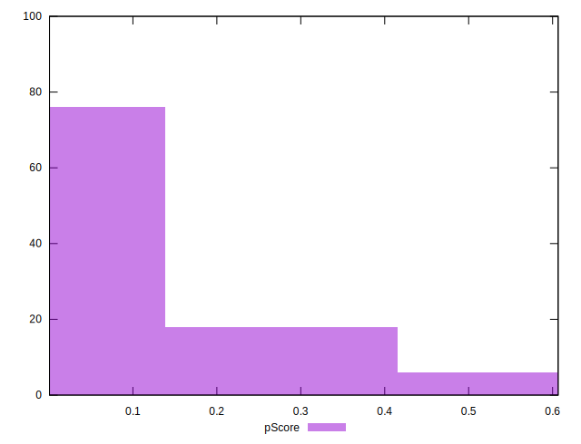
## Score Difference


```yaml
p90min: 0
p90max: 0
p90range: 0
p90mean: 0
p90median: 0
p90stdev: 0
p90skewness: .nan
p90eccentricity: .nan
p90discretization: 94
outlandishness: .inf
confidence: 2.165089820536967e-18
p90confidence: 0

```

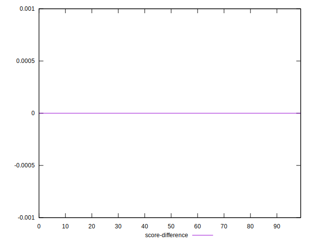
## P Score Difference


```yaml
p90min: -0.004642513767889343
p90max: 0.004710846820639547
p90range: 0.00935336058852889
p90mean: 0.00019358118386497664
p90median: 0.0006645694857582846
p90stdev: 0.0027900275113172464
p90skewness: -0.18898706444769048
p90eccentricity: 0.9999999999999997
p90discretization: 1
outlandishness: 0.8618917051038208
confidence: 0.0011590752178465907
p90confidence: 0.0011280351836130108

```

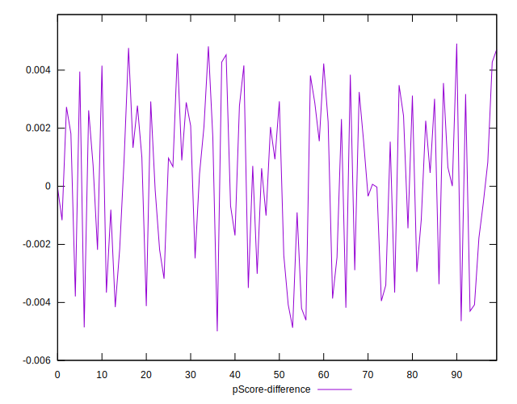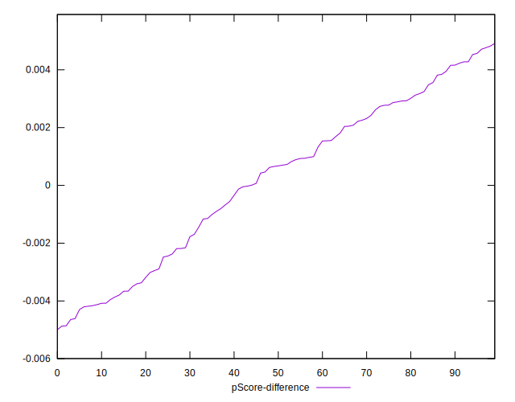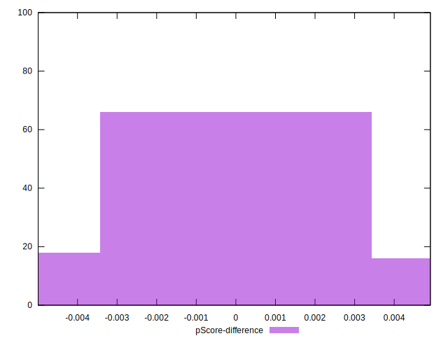