# //total-byte-weight/samples/pages+cached

[→ Parent](../..)


## Raw


```yaml
p90min: 2201054
p90max: 2201072
p90range: 18
p90mean: 2201060.5319148935
p90median: 2201061
p90stdev: 3.9885531095436724
p90skewness: 1.0484651996332885
p90eccentricity: 1.0000000000000016
p90discretization: 5.875
outlandishness: 1.0000891300073609
confidence: 326.8690212666412
p90confidence: 1.6126107076091647

```

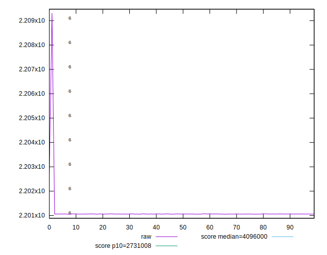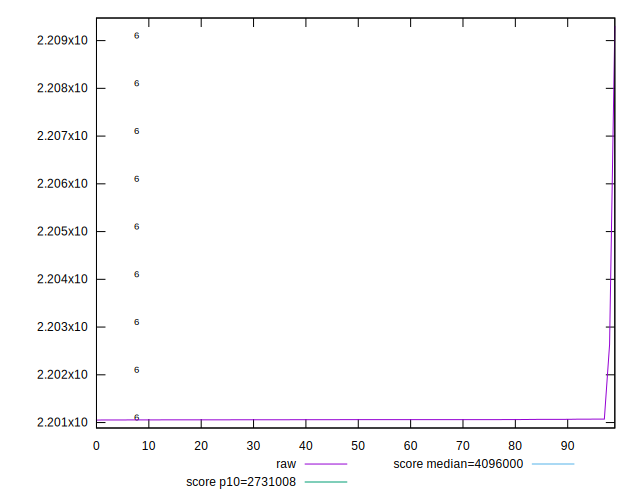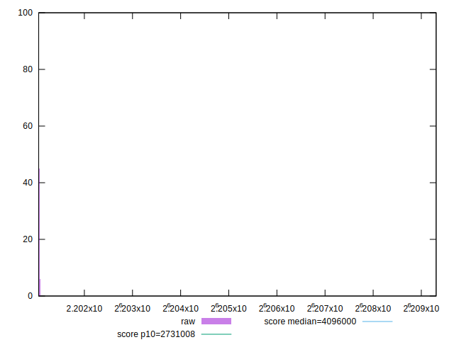
## Score


```yaml
p90min: 0.98
p90max: 0.98
p90range: 0
p90mean: 0.9800000000000002
p90median: 0.98
p90stdev: 2.220446049250313e-16
p90skewness: -1
p90eccentricity: 1
p90discretization: 94
outlandishness: 0.9997959287796755
confidence: 0.0003900279083597579
p90confidence: 8.977478740653372e-17

```

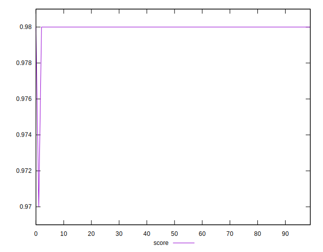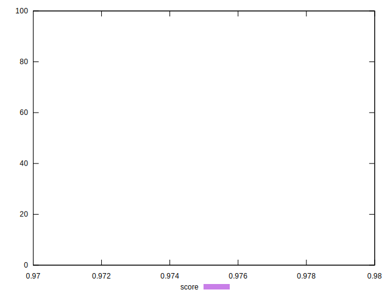
## Raw Estimate

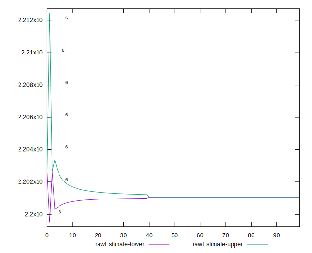
## Score Estimate


## P Score


```yaml
p90min: 0
p90max: 0
p90range: 0
p90mean: 0
p90median: 0
p90stdev: 0
p90skewness: .nan
p90eccentricity: .nan
p90discretization: 94
outlandishness: .nan
confidence: 0
p90confidence: 0

```


## Score Difference


```yaml
p90min: -0.98
p90max: -0.98
p90range: 0
p90mean: -0.9800000000000002
p90median: -0.98
p90stdev: 2.220446049250313e-16
p90skewness: 1
p90eccentricity: 1
p90discretization: 94
outlandishness: 0.9997959287796755
confidence: 0.0003900279083597579
p90confidence: 8.977478740653372e-17

```

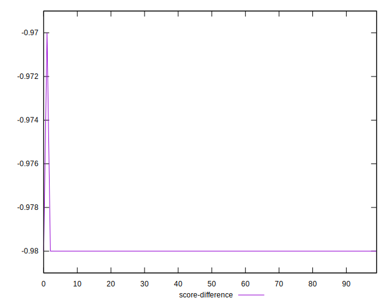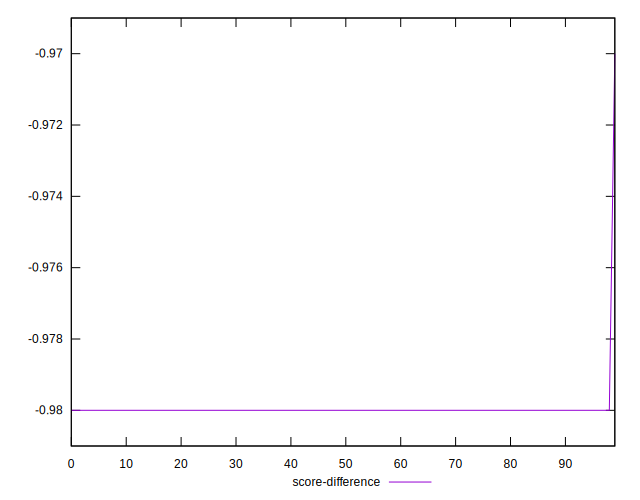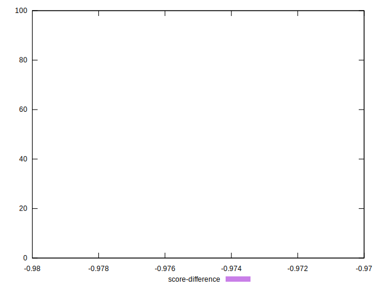
## P Score Difference


```yaml
p90min: -0.98
p90max: -0.98
p90range: 0
p90mean: -0.9800000000000002
p90median: -0.98
p90stdev: 2.220446049250313e-16
p90skewness: 1
p90eccentricity: 1
p90discretization: 94
outlandishness: 0.9997959287796755
confidence: 0.0003900279083597579
p90confidence: 8.977478740653372e-17

```

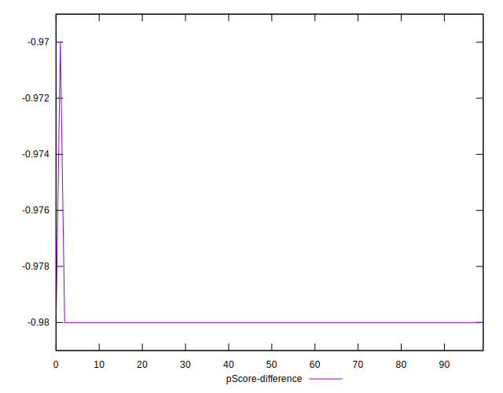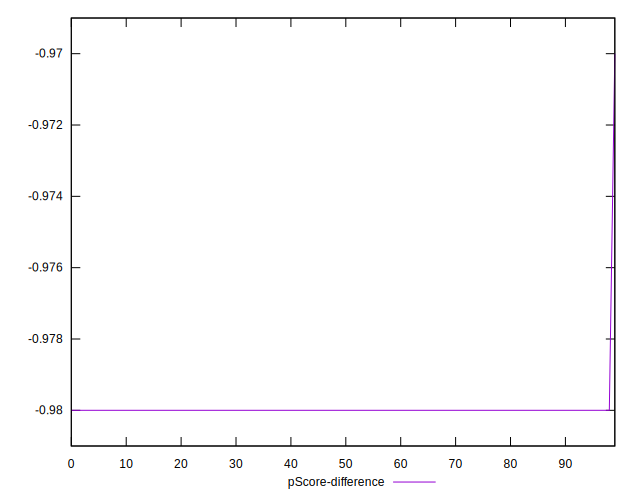