# //total-byte-weight/samples/pages

[→ Parent](../..)


## Raw


```yaml
p90min: 2201619
p90max: 2217537
p90range: 15918
p90mean: 2202420.861702128
p90median: 2202238.5
p90stdev: 1641.9593355491793
p90skewness: 8.274993831083314
p90eccentricity: 0.9999999999999994
p90discretization: 1.2702702702702702
outlandishness: 1.001425410815525
confidence: 5130.99292649958
p90confidence: 663.8600849089291

```

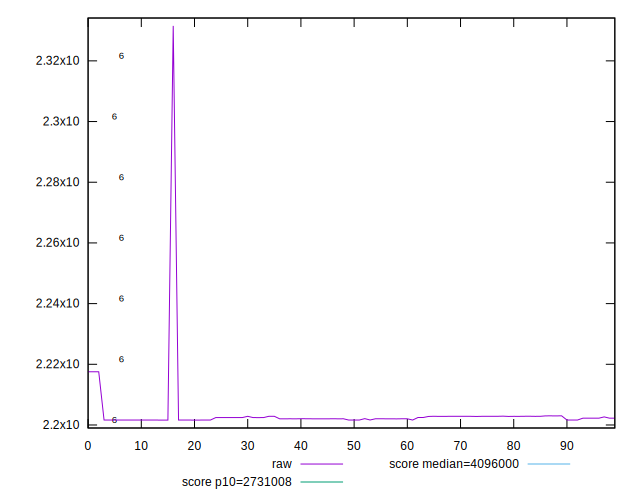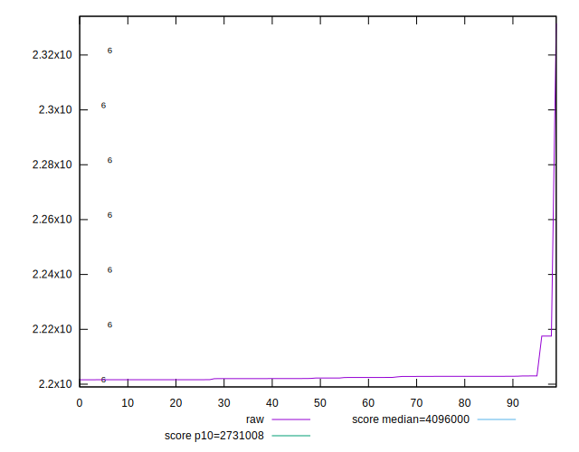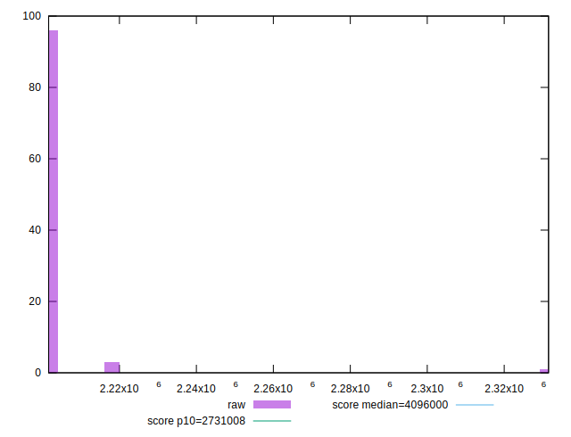
## Score


```yaml
p90min: 0.97
p90max: 0.98
p90range: 0.010000000000000009
p90mean: 0.9798936170212768
p90median: 0.98
p90stdev: 0.0010259202937226556
p90skewness: -9.539955591520396
p90eccentricity: 0.9999999999999971
p90discretization: 47
outlandishness: 0.999196774103401
confidence: 0.0010184271606685556
p90confidence: 0.0004147895252672149

```

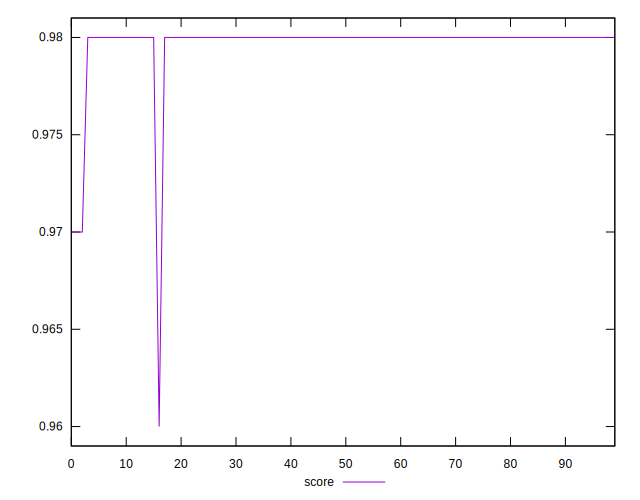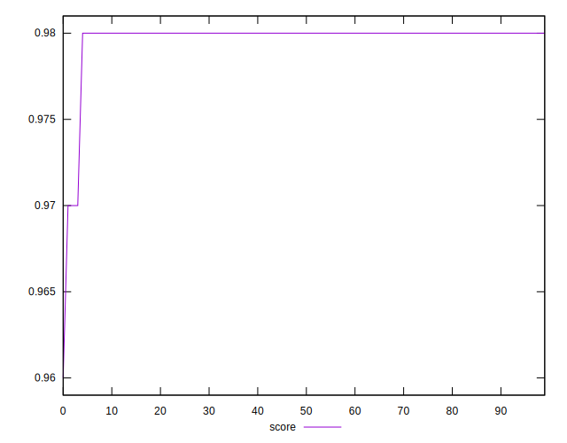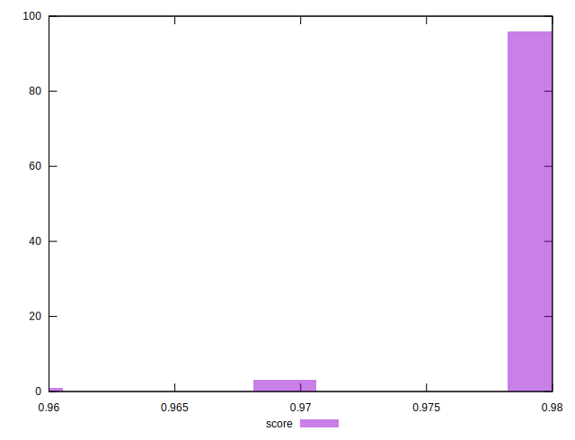
## Raw Estimate

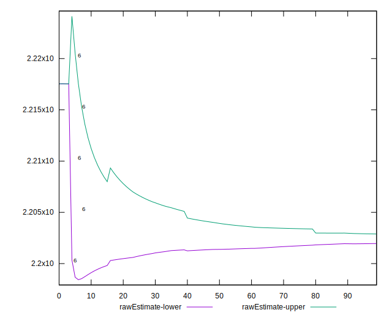
## Score Estimate


## P Score


```yaml
p90min: 0
p90max: 0
p90range: 0
p90mean: 0
p90median: 0
p90stdev: 0
p90skewness: .nan
p90eccentricity: .nan
p90discretization: 94
outlandishness: .nan
confidence: 0
p90confidence: 0

```


## Score Difference


```yaml
p90min: -0.98
p90max: -0.97
p90range: 0.010000000000000009
p90mean: -0.9798936170212768
p90median: -0.98
p90stdev: 0.0010259202937226556
p90skewness: 9.539955591520396
p90eccentricity: 0.9999999999999971
p90discretization: 47
outlandishness: 0.999196774103401
confidence: 0.0010184271606685556
p90confidence: 0.0004147895252672149

```

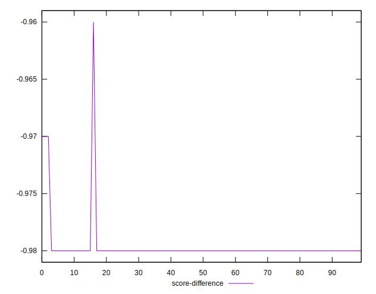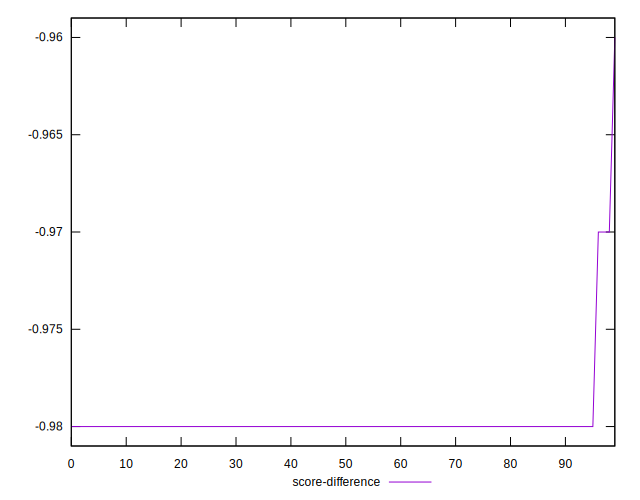
## P Score Difference


```yaml
p90min: -0.98
p90max: -0.97
p90range: 0.010000000000000009
p90mean: -0.9798936170212768
p90median: -0.98
p90stdev: 0.0010259202937226556
p90skewness: 9.539955591520396
p90eccentricity: 0.9999999999999971
p90discretization: 47
outlandishness: 0.999196774103401
confidence: 0.0010184271606685556
p90confidence: 0.0004147895252672149

```

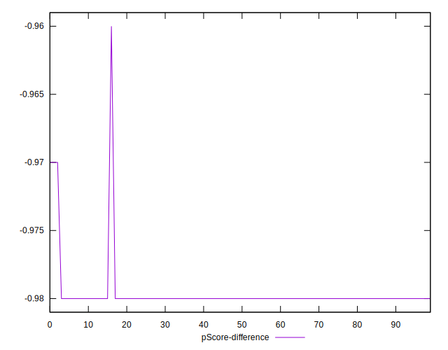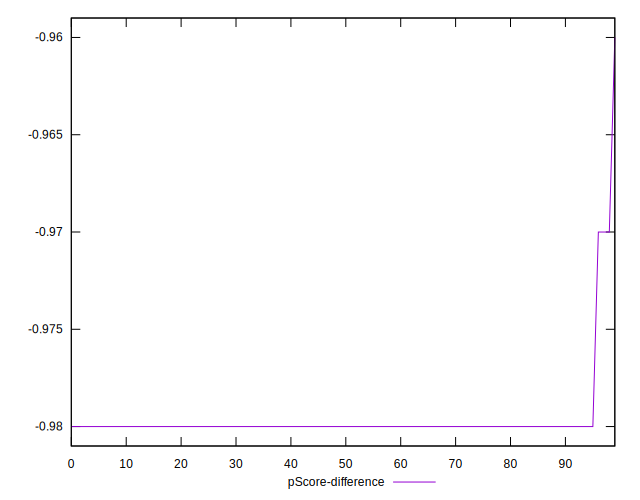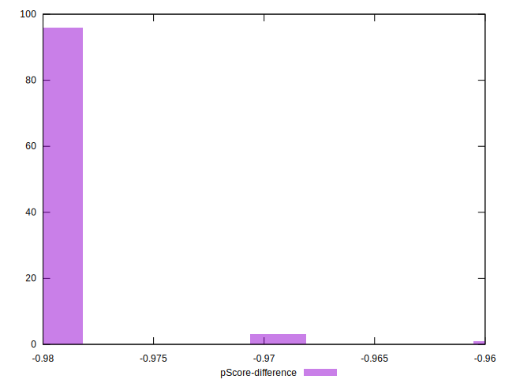