# //unminified-css/samples/pages+cached+noadtech

[→ Parent](../..)


## Raw


```yaml
p90min: 0
p90max: 150
p90range: 150
p90mean: 15.957446808510639
p90median: 0
p90stdev: 46.249074721881186
p90skewness: 2.553242569566713
p90eccentricity: 1.000000000000001
p90discretization: 47
outlandishness: 1.4932839999999998
confidence: 19.77427857997493
p90confidence: 18.698949484981235

```

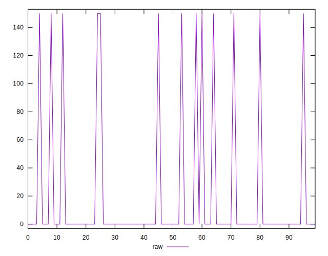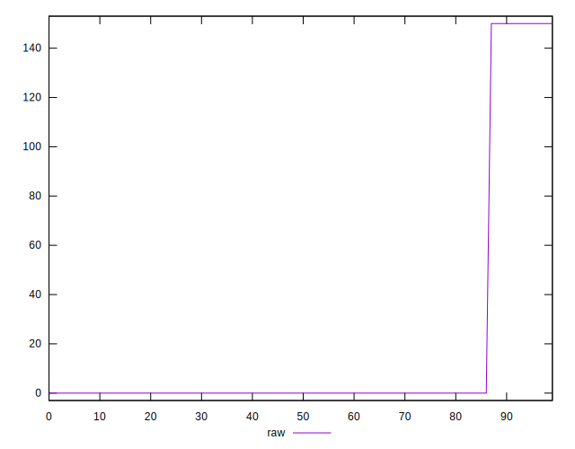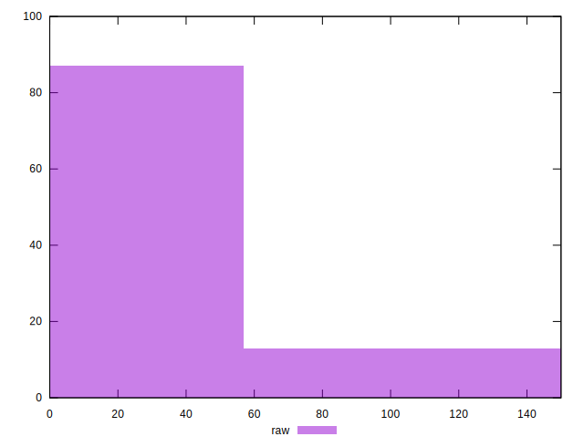
## Score


```yaml
p90min: 0.88
p90max: 1
p90range: 0.12
p90mean: 0.9872340425531916
p90median: 1
p90stdev: 0.03699925977750496
p90skewness: -2.5532425695667023
p90eccentricity: 1.0000000000000013
p90discretization: 47
outlandishness: 0.9942668615487512
confidence: 0.015819422863979932
p90confidence: 0.014959159587984992

```

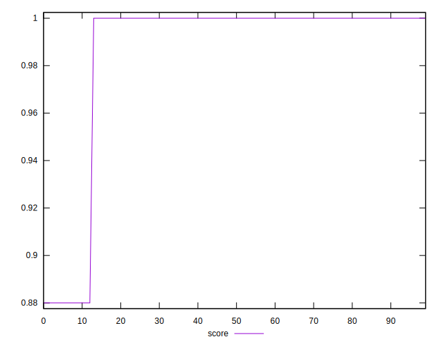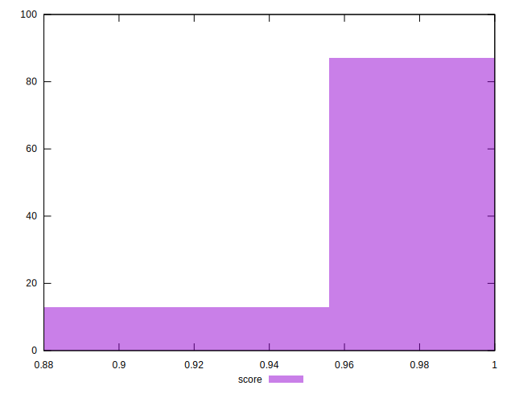
## Raw Estimate

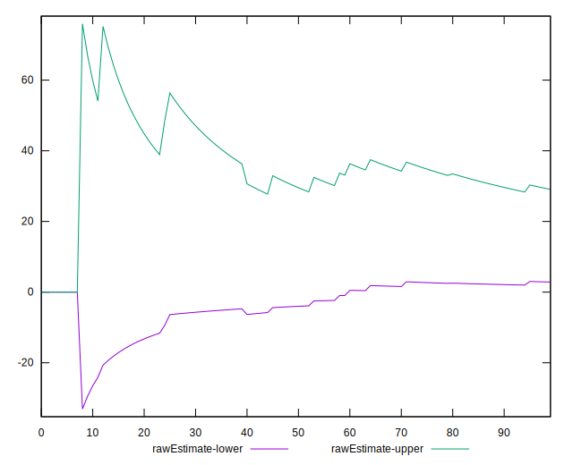
## Score Estimate

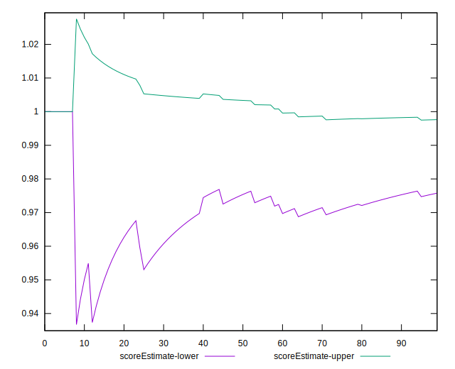
## P Score


```yaml
p90min: 0.875
p90max: 1
p90range: 0.125
p90mean: 0.9867021276595744
p90median: 1
p90stdev: 0.03854089560156767
p90skewness: -2.553242569566709
p90eccentricity: 1.0000000000000002
p90discretization: 47
outlandishness: 0.994025124054606
confidence: 0.01647856548331243
p90confidence: 0.015582457904151033

```

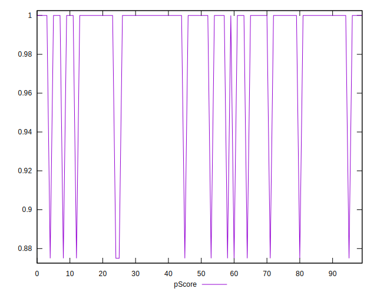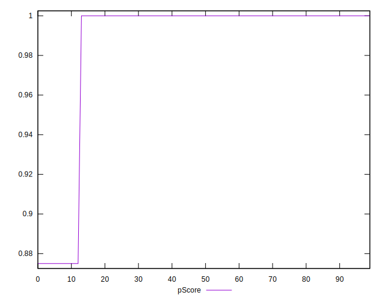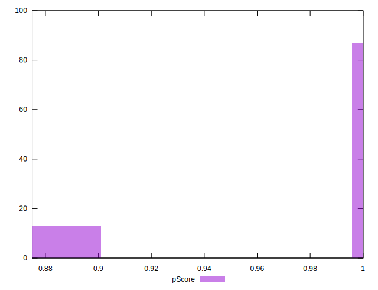
## Score Difference


```yaml
p90min: 0
p90max: 0
p90range: 0
p90mean: 0
p90median: 0
p90stdev: 0
p90skewness: .nan
p90eccentricity: .nan
p90discretization: 94
outlandishness: .nan
confidence: 0
p90confidence: 0

```


## P Score Difference


```yaml
p90min: -0.0050000000000000044
p90max: 0
p90range: 0.0050000000000000044
p90mean: -0.0005319148936170217
p90median: 0
p90stdev: 0.0015416358240627071
p90skewness: -2.5532425695667156
p90eccentricity: 1.0000000000000016
p90discretization: 47
outlandishness: 1.4932840000000005
confidence: 0.0006591426193324985
p90confidence: 0.0006232983161660415

```

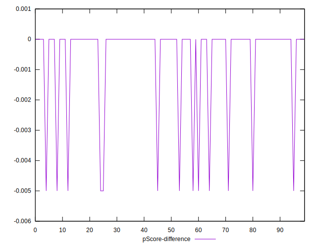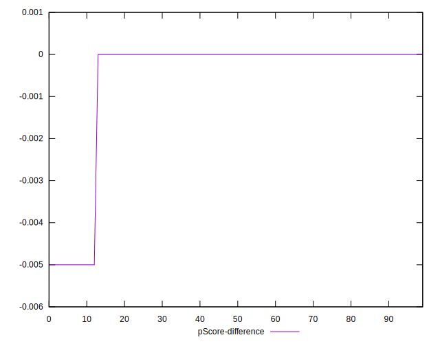