# //unminified-css/samples/pages+cached

[→ Parent](../..)


## Raw


```yaml
p90min: 0
p90max: 150
p90range: 150
p90mean: 5.74468085106383
p90median: 0
p90stdev: 27.073161779296
p90skewness: 4.912278299702429
p90eccentricity: 0.9999999999999963
p90discretization: 23.5
outlandishness: 3.0301783264746227
confidence: 14.274136606100438
p90confidence: 10.945941892979544

```

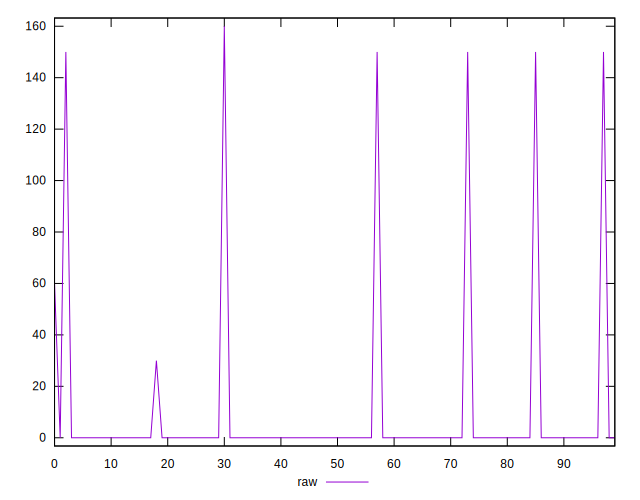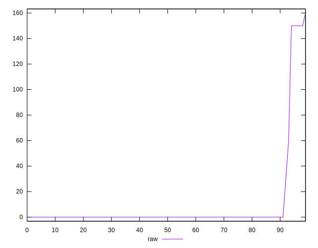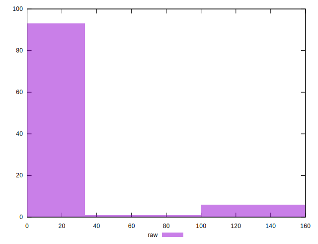
## Score


```yaml
p90min: 0.88
p90max: 1
p90range: 0.12
p90mean: 0.9954255319148936
p90median: 1
p90stdev: 0.021667943456942014
p90skewness: -4.917379873299178
p90eccentricity: 1.000000000000002
p90discretization: 23.5
outlandishness: 0.9931292945409836
confidence: 0.011455314631860235
p90confidence: 0.008760559699437552

```

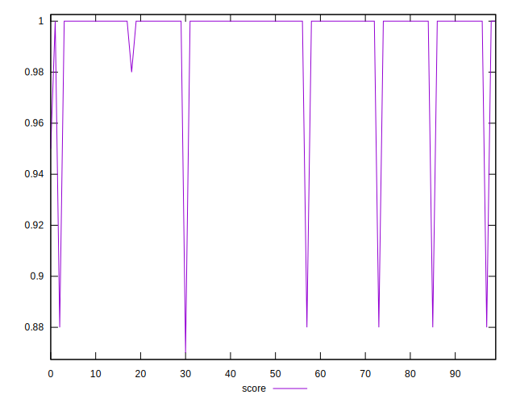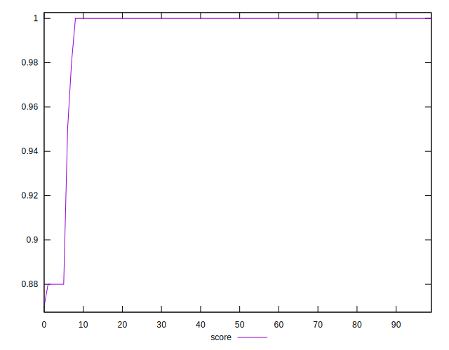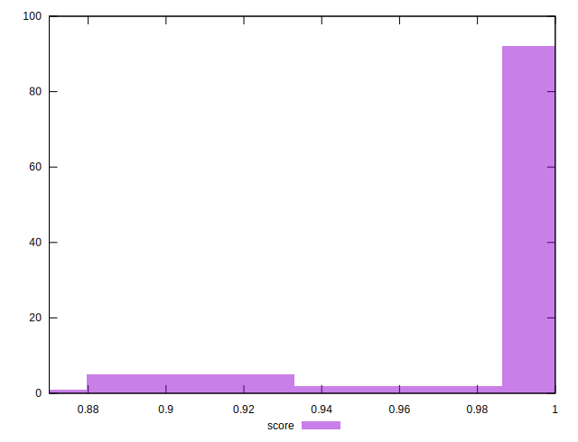
## Raw Estimate

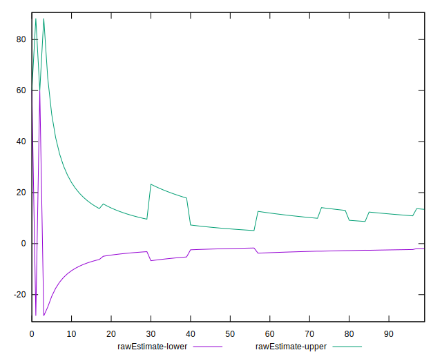
## Score Estimate

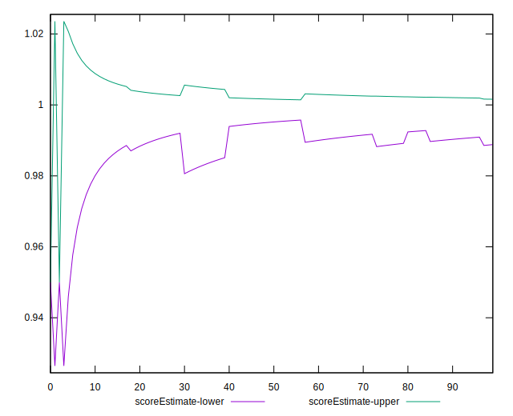
## P Score


```yaml
p90min: 0.875
p90max: 1
p90range: 0.125
p90mean: 0.9952127659574468
p90median: 1
p90stdev: 0.022560968149413295
p90skewness: -4.912278299702444
p90eccentricity: 1.0000000000000002
p90discretization: 23.5
outlandishness: 0.9928863821733729
confidence: 0.01189511383841703
p90confidence: 0.009121618244149605

```

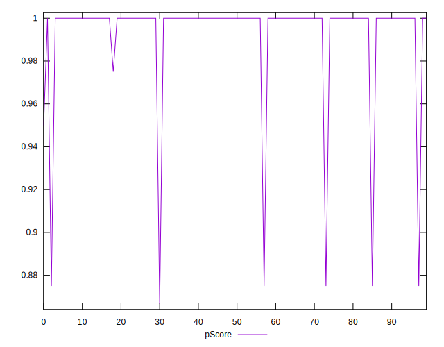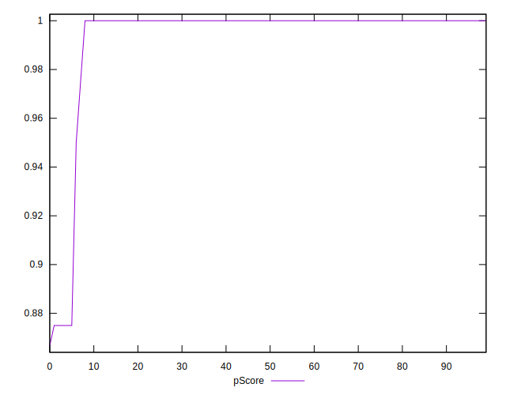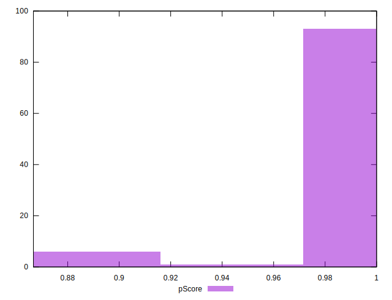
## Score Difference


```yaml
p90min: 0
p90max: 0
p90range: 0
p90mean: 0
p90median: 0
p90stdev: 0
p90skewness: .nan
p90eccentricity: .nan
p90discretization: 94
outlandishness: .inf
confidence: 4.330179641073934e-18
p90confidence: 0

```


## P Score Difference


```yaml
p90min: -0.0050000000000000044
p90max: 0
p90range: 0.0050000000000000044
p90mean: -0.0001950354609929076
p90median: 0
p90stdev: 0.0009370361887747382
p90skewness: -4.694254863381931
p90eccentricity: 0.9999999999999971
p90discretization: 31.333333333333332
outlandishness: 2.920991735537195
confidence: 0.0004800911676355313
p90confidence: 0.00037885281953994247

```

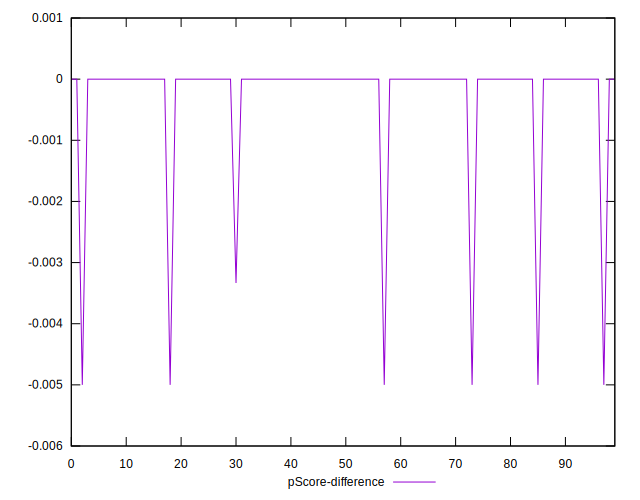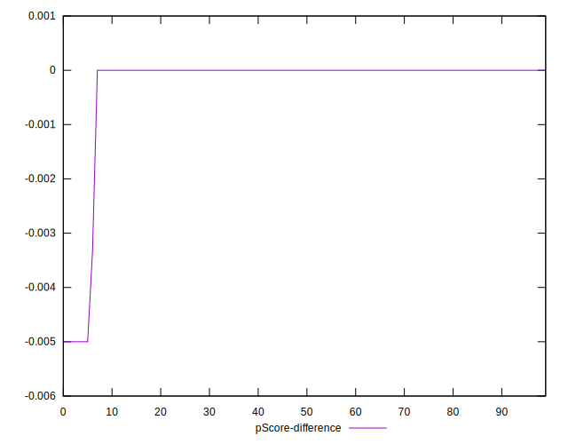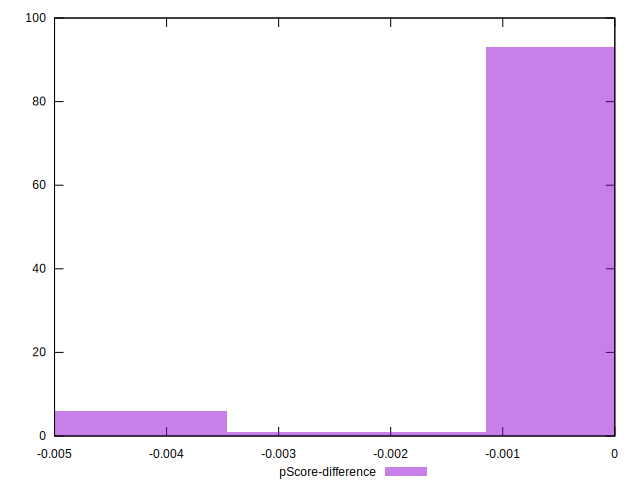