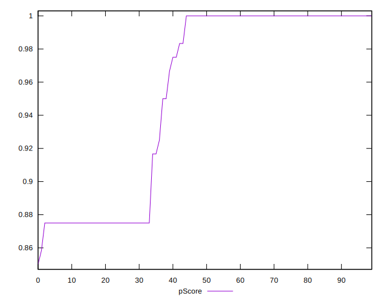
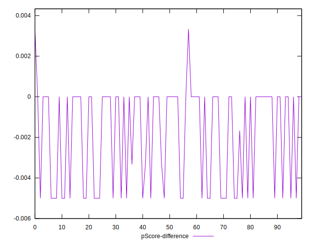

# //unminified-css/samples/pages

[→ Parent](../..)


## Raw


```yaml
p90min: 0
p90max: 150
p90range: 150
p90mean: 55.319148936170215
p90median: 0
p90stdev: 69.13911550557116
p90skewness: 0.5612234081968758
p90eccentricity: 0.9999999999999992
p90discretization: 11.75
outlandishness: 1.0616924556213014
confidence: 27.60419844286168
p90confidence: 27.953614986881014

```


## Score


```yaml
p90min: 0.88
p90max: 1
p90range: 0.12
p90mean: 0.9557446808510637
p90median: 1
p90stdev: 0.05530359846901055
p90skewness: -0.5614313406389054
p90eccentricity: 1.0000000000000004
p90discretization: 13.428571428571429
outlandishness: 0.9969791325917089
confidence: 0.022148494937267612
p90confidence: 0.022359781256779506

```


## Raw Estimate


## Score Estimate


## P Score


```yaml
p90min: 0.875
p90max: 1
p90range: 0.125
p90mean: 0.9539007092198583
p90median: 1
p90stdev: 0.05761592958797597
p90skewness: -0.5612234081968818
p90eccentricity: 0.9999999999999997
p90discretization: 11.75
outlandishness: 0.9970653532289492
confidence: 0.02300349870238472
p90confidence: 0.02329467915573418

```


## Score Difference


```yaml
p90min: 0
p90max: 0
p90range: 0
p90mean: 0
p90median: 0
p90stdev: 0
p90skewness: .nan
p90eccentricity: .nan
p90discretization: 94
outlandishness: .inf
confidence: 6.092792000602807e-18
p90confidence: 0

```


## P Score Difference


```yaml
p90min: -0.0050000000000000044
p90max: 0
p90range: 0.0050000000000000044
p90mean: -0.001826241134751775
p90median: 0
p90stdev: 0.0023578893892873963
p90skewness: -0.5518285797218859
p90eccentricity: 1.000000000000001
p90discretization: 18.8
outlandishness: 0.9714686021302676
confidence: 0.0009676216012628682
p90confidence: 0.0009533175495205866

```

