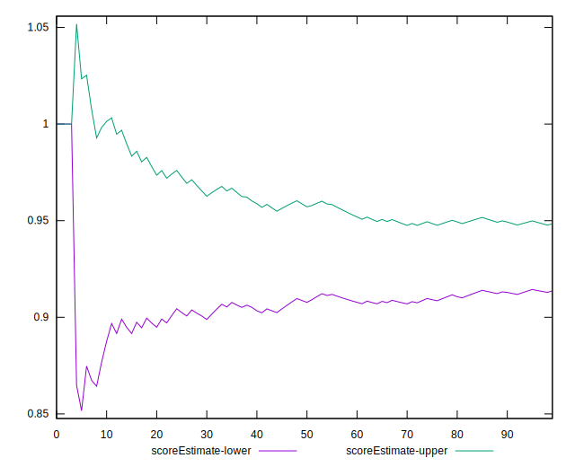
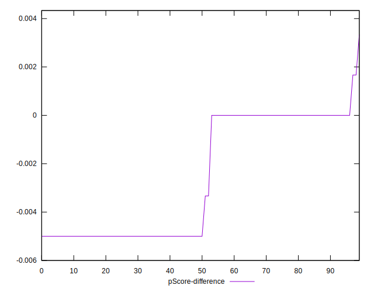

# //unminified-javascript/samples/pages+cached+noadtech+nomedia+nocss

[→ Parent](../..)


## Raw


```yaml
p90min: 0
p90max: 150
p90range: 150
p90mean: 82.76595744680851
p90median: 150
p90stdev: 73.43261863370007
p90skewness: -0.20520407894254764
p90eccentricity: 1.0000000000000016
p90discretization: 15.666666666666666
outlandishness: 0.9935835905128833
confidence: 28.90863826682273
p90confidence: 29.689519944748373

```


## Score


```yaml
p90min: 0.88
p90max: 1
p90range: 0.12
p90mean: 0.9336170212765956
p90median: 0.88
p90stdev: 0.05874305869052697
p90skewness: 0.21075285511140843
p90eccentricity: 1.000000000000001
p90discretization: 15.666666666666666
outlandishness: 1.0003920165338633
confidence: 0.02314271825612422
p90confidence: 0.023750388384046202

```


## Raw Estimate


## Score Estimate


## P Score


```yaml
p90min: 0.875
p90max: 1
p90range: 0.125
p90mean: 0.9310283687943263
p90median: 0.875
p90stdev: 0.06119384886141678
p90skewness: 0.20520407894254072
p90eccentricity: 0.9999999999999999
p90discretization: 15.666666666666666
outlandishness: 1.000476156458269
confidence: 0.024090531889018944
p90confidence: 0.02474126662062367

```


## Score Difference


```yaml
p90min: 0
p90max: 0
p90range: 0
p90mean: 0
p90median: 0
p90stdev: 0
p90skewness: .nan
p90eccentricity: .nan
p90discretization: 94
outlandishness: .inf
confidence: 6.092792000602808e-18
p90confidence: 0

```


## P Score Difference


```yaml
p90min: -0.0050000000000000044
p90max: 0
p90range: 0.0050000000000000044
p90mean: -0.0026241134751773063
p90median: -0.0050000000000000044
p90stdev: 0.0024731341523635056
p90skewness: 0.1059113960539352
p90eccentricity: 1
p90discretization: 31.333333333333332
outlandishness: 0.9443111943024112
confidence: 0.0010098200757516905
p90confidence: 0.0009999121250040448

```

