# //unminified-javascript/samples/pages+cached+noadtech

[→ Parent](../..)


## Raw


```yaml
p90min: 0
p90max: 150
p90range: 150
p90mean: 86.17021276595744
p90median: 150
p90stdev: 74.16351088482291
p90skewness: -0.3012320380383539
p90eccentricity: 0.9999999999999974
p90discretization: 47
outlandishness: 1.024044051821369
confidence: 30.257578414081284
p90confidence: 29.985026770882655

```

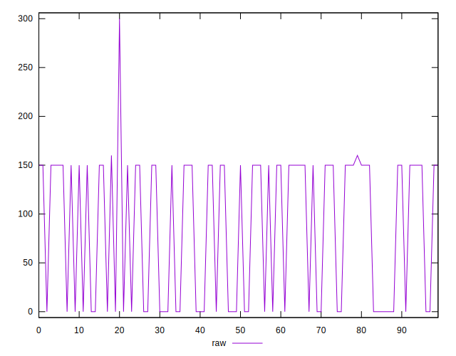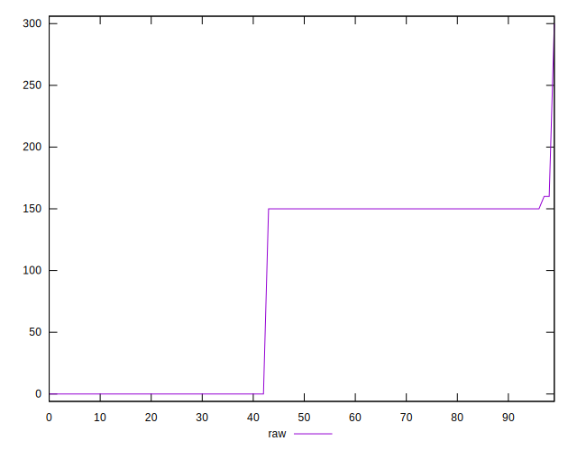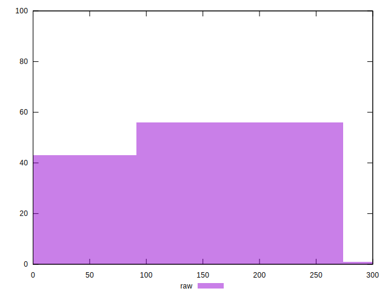
## Score


```yaml
p90min: 0.88
p90max: 1
p90range: 0.12
p90mean: 0.9310638297872339
p90median: 0.88
p90stdev: 0.05933080870785831
p90skewness: 0.30123203803837895
p90eccentricity: 0.9999999999999994
p90discretization: 47
outlandishness: 0.9979306877101374
confidence: 0.024331956289247485
p90confidence: 0.023988021416706116

```

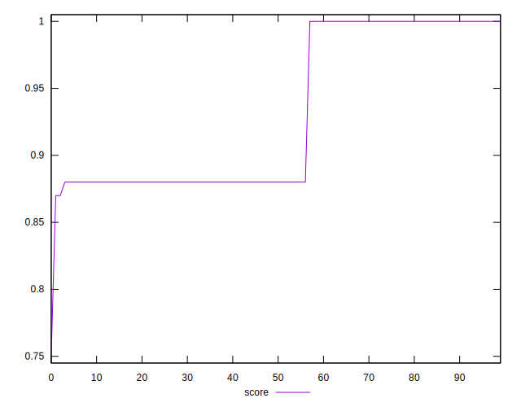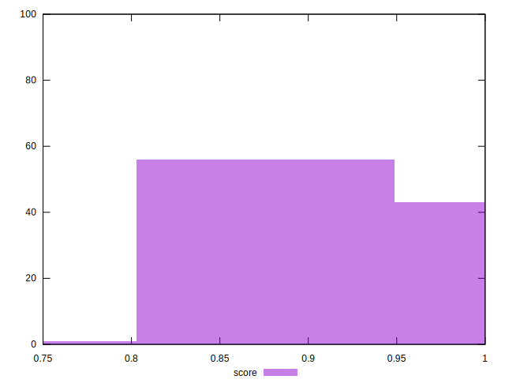
## Raw Estimate

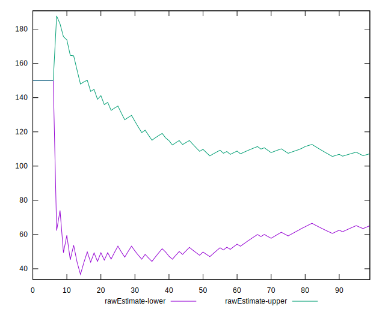
## Score Estimate

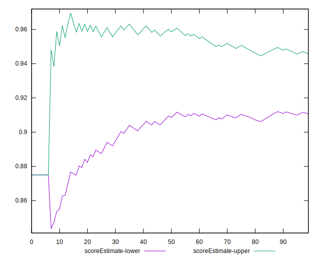
## P Score


```yaml
p90min: 0.875
p90max: 1
p90range: 0.125
p90mean: 0.9281914893617021
p90median: 0.875
p90stdev: 0.0618029257373524
p90skewness: 0.3012320380383539
p90eccentricity: 1.0000000000000004
p90discretization: 47
outlandishness: 0.9981517621402488
confidence: 0.025214648678401046
p90confidence: 0.024987522309068866

```

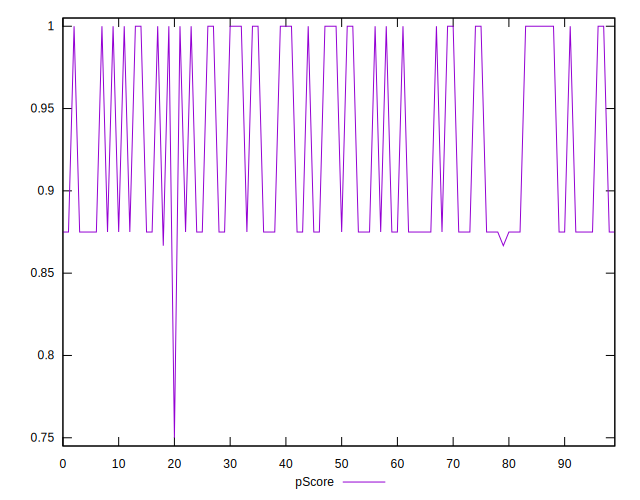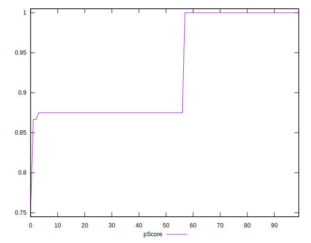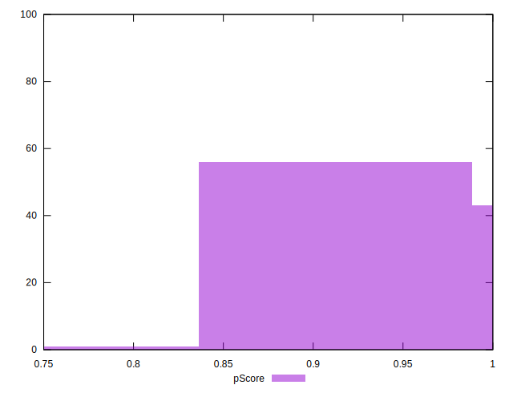
## Score Difference


```yaml
p90min: 0
p90max: 0
p90range: 0
p90mean: 0
p90median: 0
p90stdev: 0
p90skewness: .nan
p90eccentricity: .nan
p90discretization: 94
outlandishness: .nan
confidence: 0
p90confidence: 0

```


## P Score Difference


```yaml
p90min: -0.0050000000000000044
p90max: 0
p90range: 0.0050000000000000044
p90mean: -0.002783687943262413
p90median: -0.0050000000000000044
p90stdev: 0.002459942649972736
p90skewness: 0.23501050929249104
p90eccentricity: 0.9999999999999994
p90discretization: 31.333333333333332
outlandishness: 0.9878080895776707
confidence: 0.0009655903575835103
p90confidence: 0.0009945786726416066

```

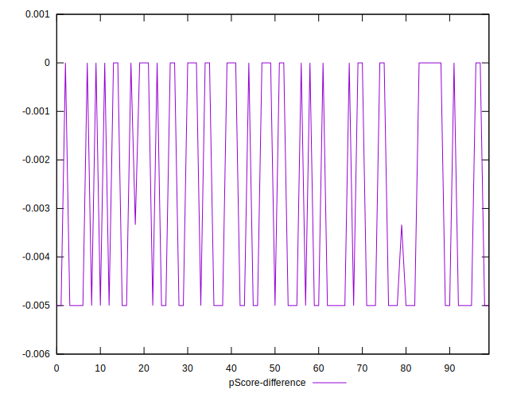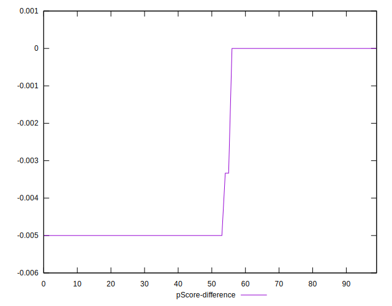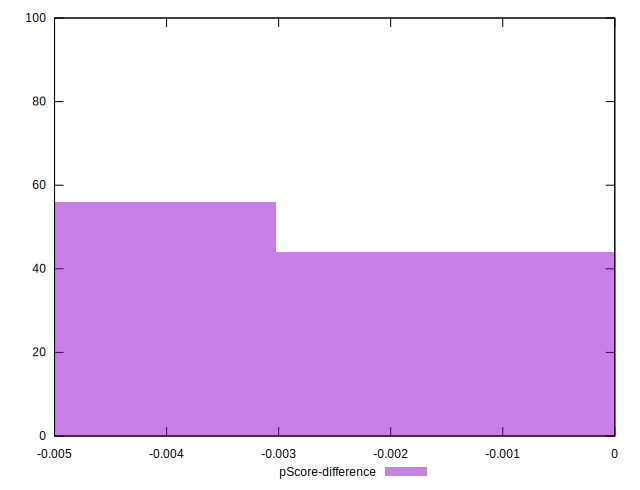