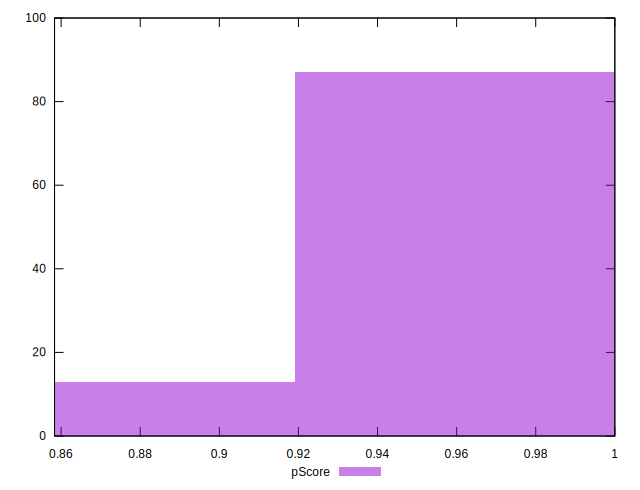
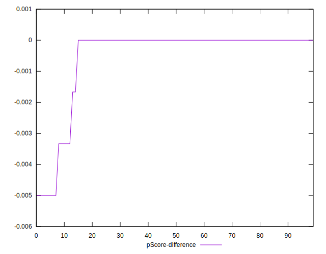

# //unminified-javascript/samples/pages+cached

[→ Parent](../..)


## Raw


```yaml
p90min: 0
p90max: 160
p90range: 160
p90mean: 17.76595744680851
p90median: 0
p90stdev: 47.17902200873096
p90skewness: 2.4230165416922653
p90eccentricity: 0.9999999999999989
p90discretization: 15.666666666666666
outlandishness: 1.4781900247409379
confidence: 20.456766714836643
p90confidence: 19.074936192716866

```


## Score


```yaml
p90min: 0.87
p90max: 1
p90range: 0.13
p90mean: 0.9857446808510638
p90median: 1
p90stdev: 0.037882499235166615
p90skewness: -2.425049935172457
p90eccentricity: 0.9999999999999997
p90discretization: 15.666666666666666
outlandishness: 0.9936298619747064
confidence: 0.016497448919837593
p90confidence: 0.01531626186735543

```


## Raw Estimate


## Score Estimate


## P Score


```yaml
p90min: 0.8666666666666667
p90max: 1
p90range: 0.1333333333333333
p90mean: 0.9851950354609931
p90median: 1
p90stdev: 0.03931585167394245
p90skewness: -2.423016541692269
p90eccentricity: 0.9999999999999978
p90discretization: 15.666666666666666
outlandishness: 0.9935244200013031
confidence: 0.017047305595697195
p90confidence: 0.01589578016059738

```


## Score Difference


```yaml
p90min: 0
p90max: 0
p90range: 0
p90mean: 0
p90median: 0
p90stdev: 0
p90skewness: .nan
p90eccentricity: .nan
p90discretization: 94
outlandishness: .inf
confidence: 4.330179641073934e-18
p90confidence: 0

```


## P Score Difference


```yaml
p90min: -0.0050000000000000044
p90max: 0
p90range: 0.0050000000000000044
p90mean: -0.00047872340425531603
p90median: 0
p90stdev: 0.001323151291262807
p90skewness: -2.6304726836168024
p90eccentricity: 1.0000000000000018
p90discretization: 23.5
outlandishness: 1.5708444444444503
confidence: 0.0005881343599600459
p90confidence: 0.0005349629004492342

```

