# //unminified-javascript/samples/pages

[→ Parent](../..)


## Raw


```yaml
p90min: 0
p90max: 150
p90range: 150
p90mean: 58.829787234042556
p90median: 10
p90stdev: 67.94641792225234
p90skewness: 0.46660437026468315
p90eccentricity: 0.9999999999999987
p90discretization: 7.833333333333333
outlandishness: 1.096394552155103
confidence: 28.395650845904687
p90confidence: 27.47139578583857

```

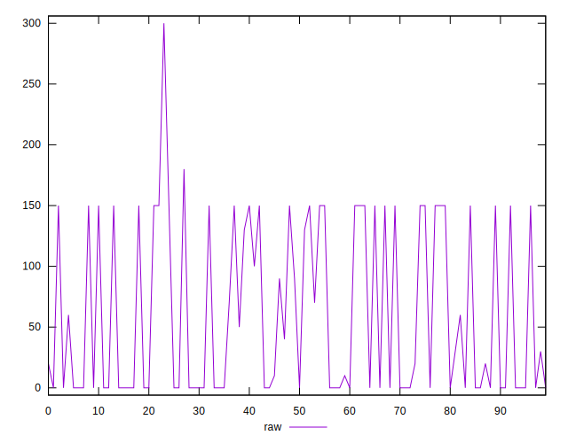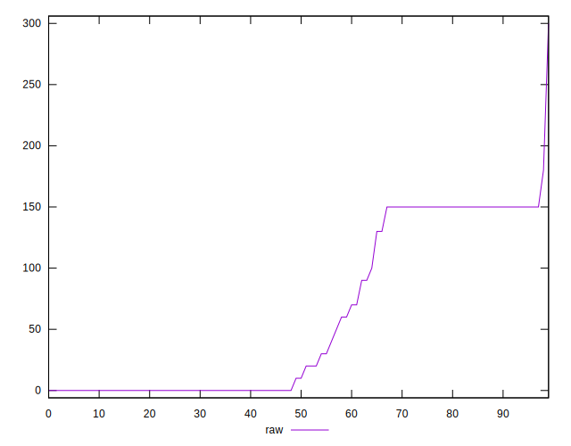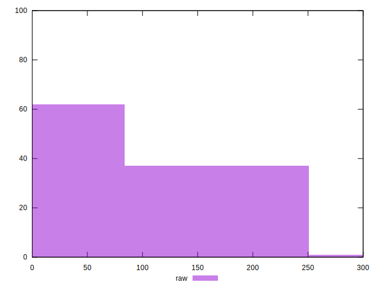
## Score


```yaml
p90min: 0.88
p90max: 1
p90range: 0.12
p90mean: 0.9526595744680852
p90median: 0.99
p90stdev: 0.05444449705336059
p90skewness: -0.4594497478653656
p90eccentricity: 0.9999999999999987
p90discretization: 8.545454545454545
outlandishness: 0.9950524775050884
confidence: 0.022913680681215715
p90confidence: 0.022012438221911953

```

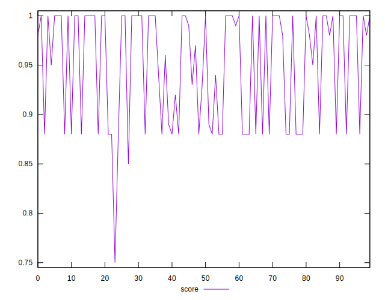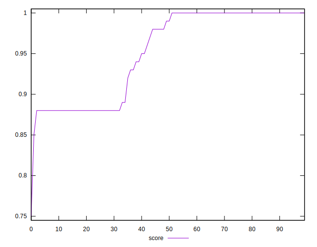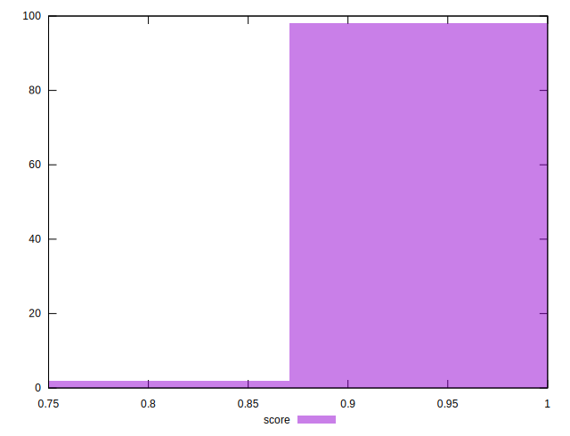
## Raw Estimate

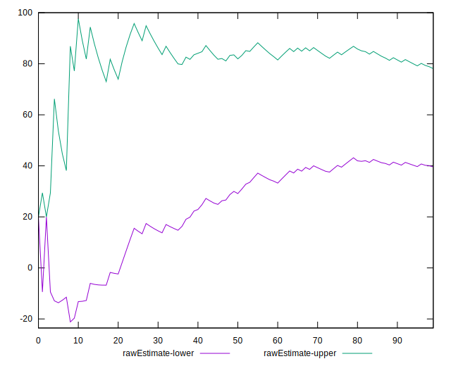
## Score Estimate

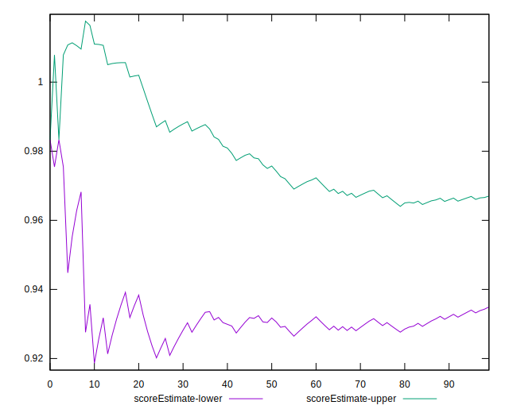
## P Score


```yaml
p90min: 0.875
p90max: 1
p90range: 0.125
p90mean: 0.9509751773049645
p90median: 0.9916666666666667
p90stdev: 0.05662201493521024
p90skewness: -0.4666043702646938
p90eccentricity: 1.0000000000000013
p90discretization: 7.833333333333333
outlandishness: 0.9951508541627396
confidence: 0.023663042371587225
p90confidence: 0.022892829821532127

```

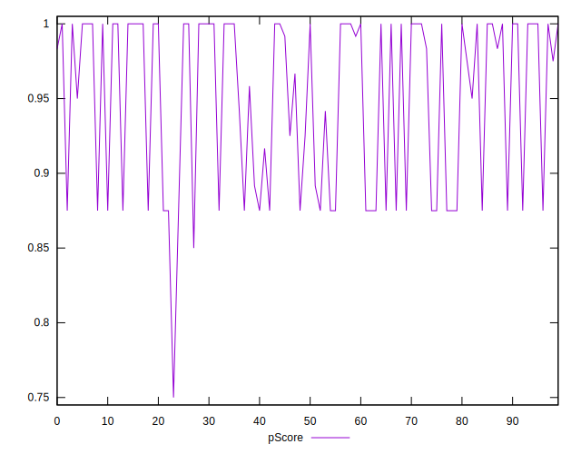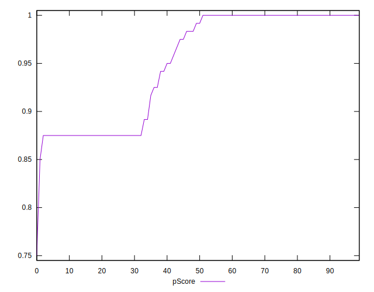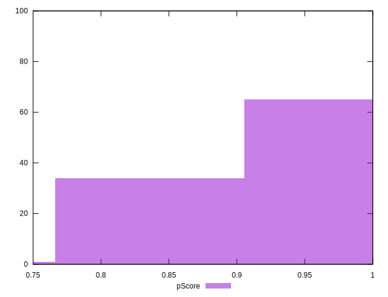
## Score Difference


```yaml
p90min: 0
p90max: 1.1102230246251565e-16
p90range: 1.1102230246251565e-16
p90mean: 1.1810883240693154e-18
p90median: 0
p90stdev: 1.139000331521095e-17
p90skewness: 9.539955591519904
p90eccentricity: 1.0000000000000002
p90discretization: 47
outlandishness: 14.137600000000003
confidence: 8.528132291650275e-18
p90confidence: 4.605088813249998e-18

```

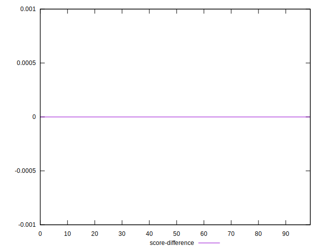
## P Score Difference


```yaml
p90min: -0.0050000000000000044
p90max: 0.0016666666666667052
p90range: 0.00666666666666671
p90mean: -0.0016843971631205685
p90median: 0
p90stdev: 0.00247319770865397
p90skewness: -0.48963442779763666
p90eccentricity: 1.000000000000001
p90discretization: 13.428571428571429
outlandishness: 0.9402874681440456
confidence: 0.0010246111520083698
p90confidence: 0.0009999378214287193

```

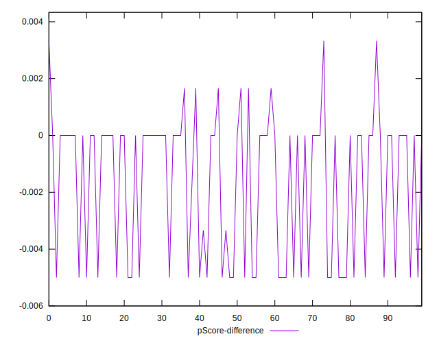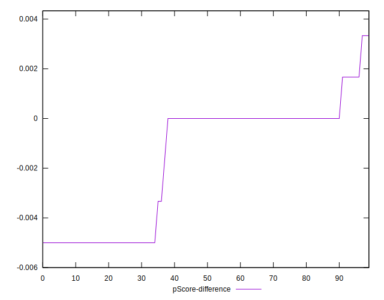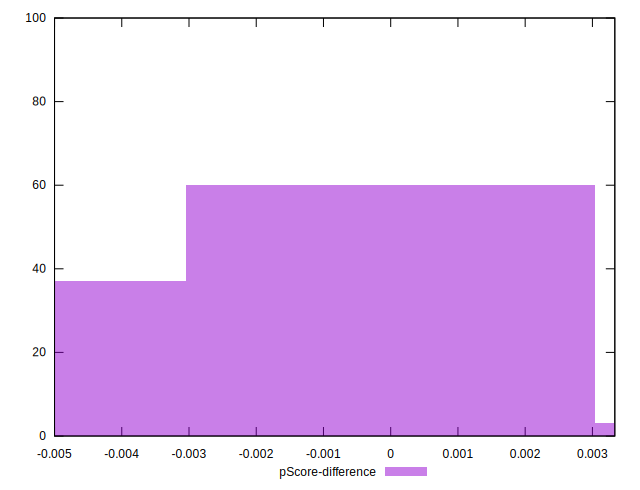