# //unused-css-rules/samples/pages+cached+noadtech+nomedia

[→ Parent](../..)


## Raw


```yaml
p90min: 80
p90max: 450
p90range: 370
p90mean: 302.3404255319149
p90median: 300
p90stdev: 93.62016435729547
p90skewness: -0.1528274995074431
p90eccentricity: 0.9999999999999988
p90discretization: 7.230769230769231
outlandishness: 0.9904941970274969
confidence: 43.65080491985603
p90confidence: 37.851540482051455

```

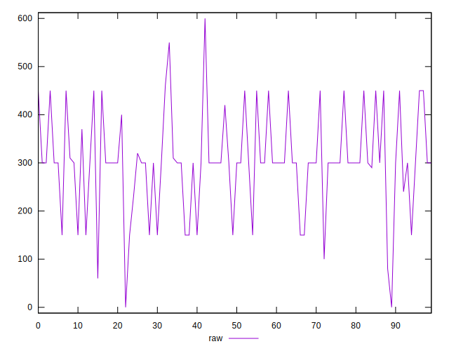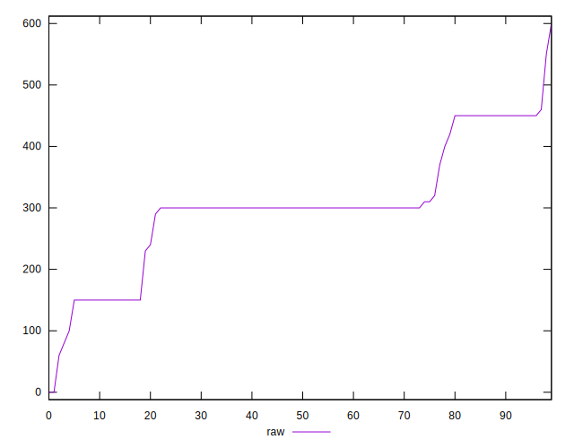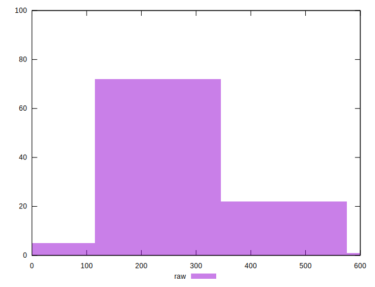
## Score


```yaml
p90min: 0.67
p90max: 0.93
p90range: 0.26
p90mean: 0.7577659574468087
p90median: 0.75
p90stdev: 0.06665494275967881
p90skewness: 0.8169318634238314
p90eccentricity: 1.0000000000000007
p90discretization: 7.833333333333333
outlandishness: 1.0066993761590255
confidence: 0.031219242507382526
p90confidence: 0.026949239851448713

```

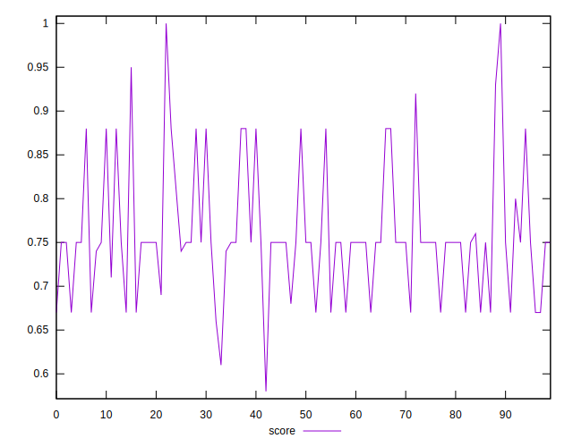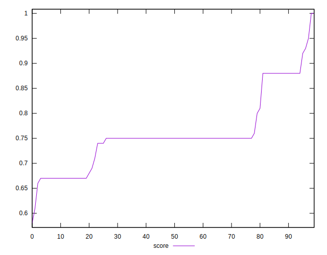
## Raw Estimate

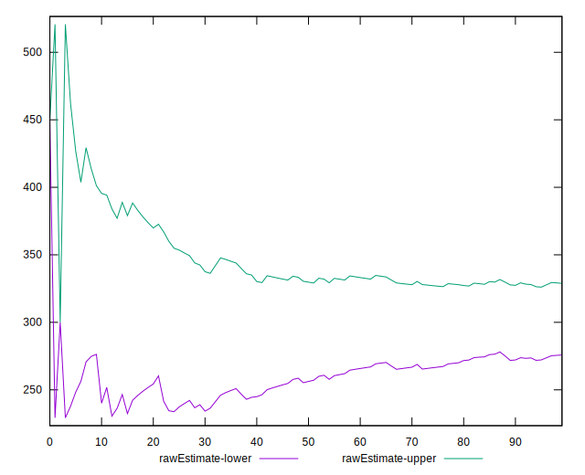
## Score Estimate

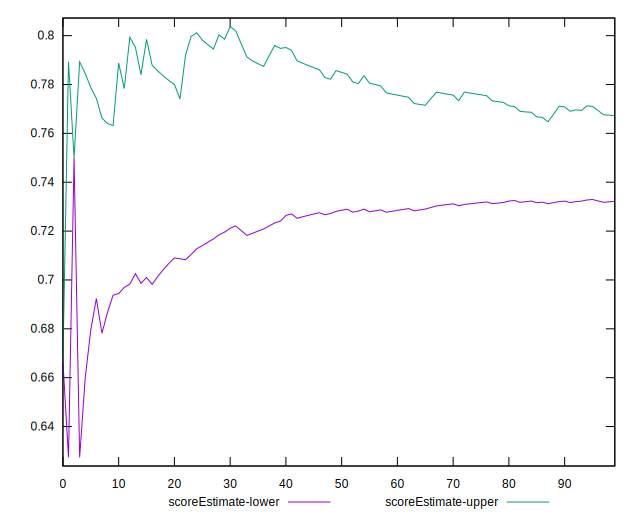
## P Score


```yaml
p90min: 0.6666666666666666
p90max: 0.9333333333333333
p90range: 0.2666666666666667
p90mean: 0.756560283687943
p90median: 0.75
p90stdev: 0.0659907757459702
p90skewness: 0.7407592679294956
p90eccentricity: 1.0000000000000009
p90discretization: 7.230769230769231
outlandishness: 1.0070493299054275
confidence: 0.030986262202297842
p90confidence: 0.02668071068597651

```

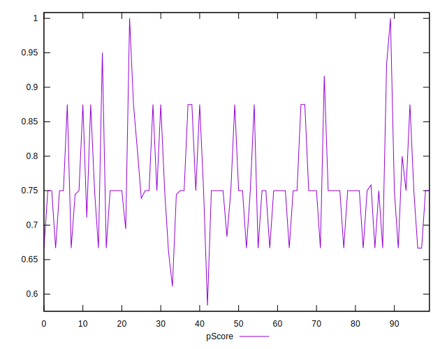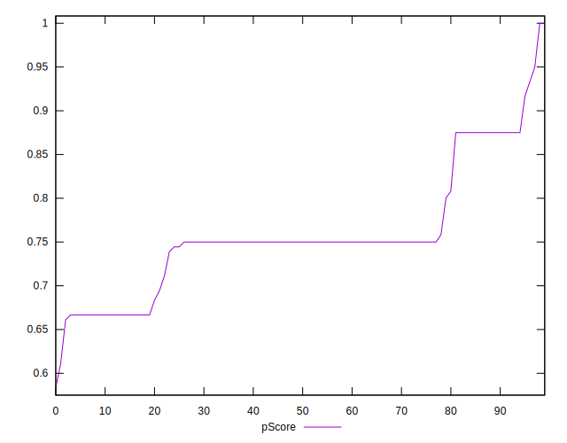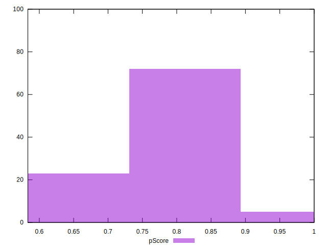
## Score Difference


```yaml
p90min: 0
p90max: 0
p90range: 0
p90mean: 0
p90median: 0
p90stdev: 0
p90skewness: .nan
p90eccentricity: .nan
p90discretization: 94
outlandishness: .inf
confidence: 6.092792000602812e-18
p90confidence: 0

```

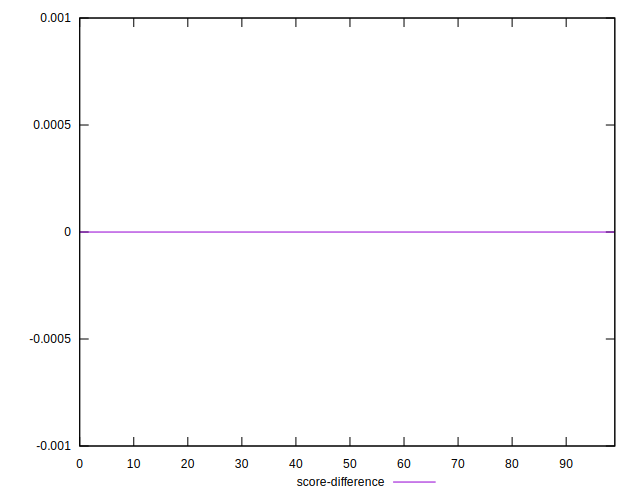
## P Score Difference


```yaml
p90min: -0.0050000000000000044
p90max: 0.0033333333333334103
p90range: 0.008333333333333415
p90mean: -0.0011288416075650265
p90median: 0
p90stdev: 0.002060377271915029
p90skewness: -0.5479095584964727
p90eccentricity: 1.0000000000000009
p90discretization: 10.444444444444445
outlandishness: 0.9115750555083452
confidence: 0.0009083124647845677
p90confidence: 0.0008330305148637899

```

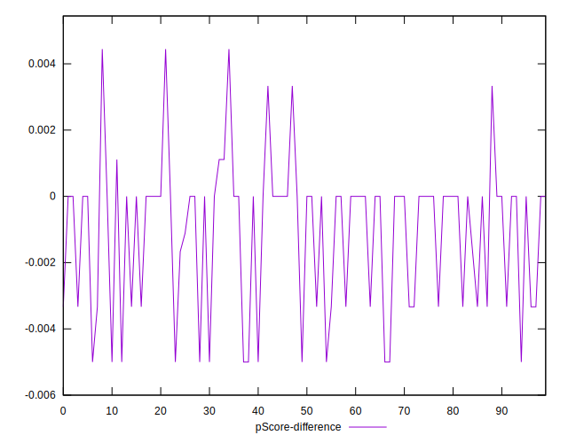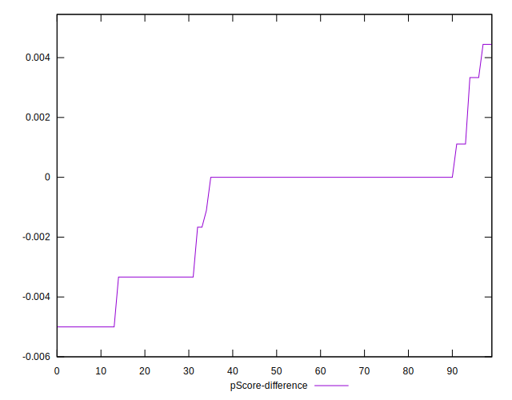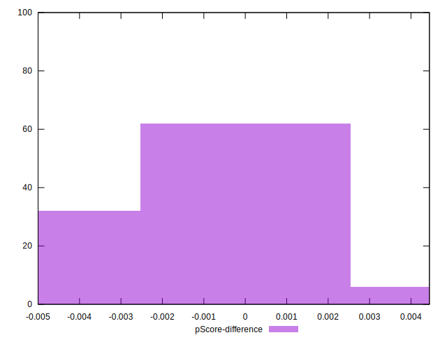