# //unused-css-rules/samples/pages+cached+noadtech

[→ Parent](../..)


## Raw


```yaml
p90min: 0
p90max: 450
p90range: 450
p90mean: 146.27659574468086
p90median: 150
p90stdev: 127.52124597746487
p90skewness: 0.5861460129564705
p90eccentricity: 1.000000000000001
p90discretization: 5.222222222222222
outlandishness: 1.0869010247933881
confidence: 55.14817642435467
p90confidence: 51.55807659145081

```

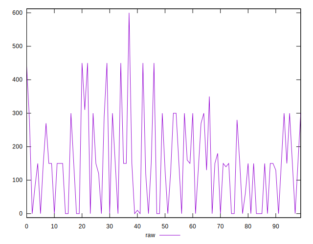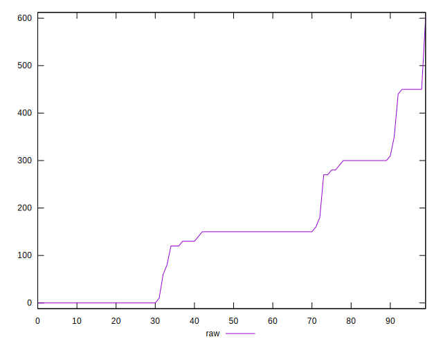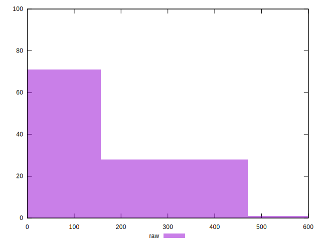
## Score


```yaml
p90min: 0.67
p90max: 1
p90range: 0.32999999999999996
p90mean: 0.8821276595744678
p90median: 0.88
p90stdev: 0.10063492414838995
p90skewness: -0.4362475858068094
p90eccentricity: 0.9999999999999994
p90discretization: 5.875
outlandishness: 0.9915663375087176
confidence: 0.04246467214178237
p90confidence: 0.040687675902527136

```

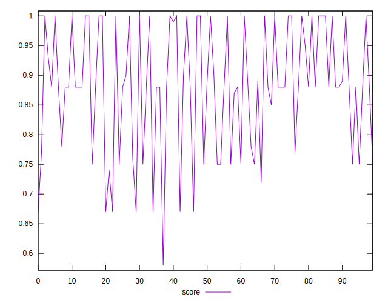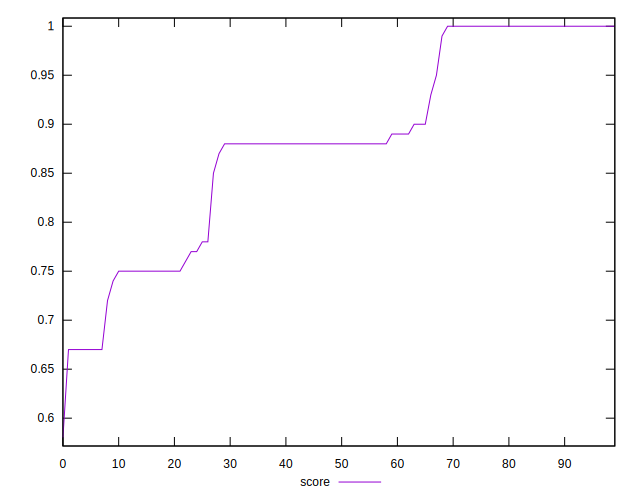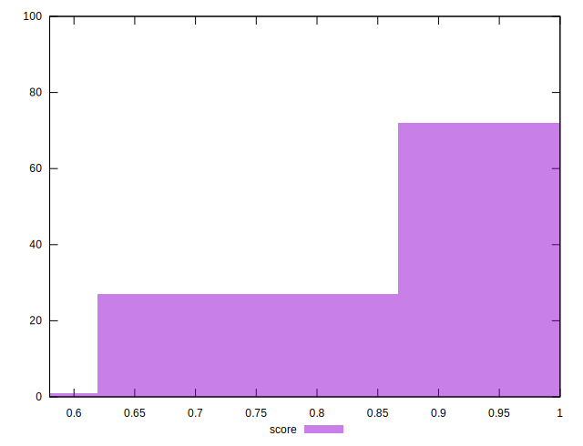
## Raw Estimate

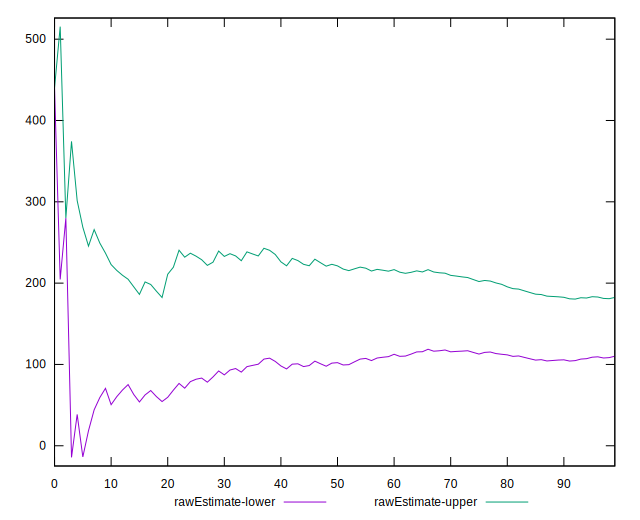
## Score Estimate

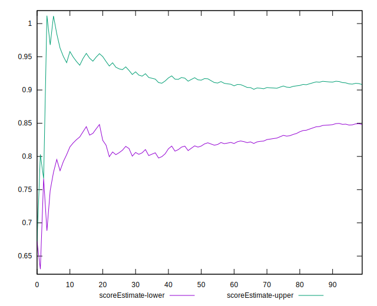
## P Score


```yaml
p90min: 0.6666666666666666
p90max: 1
p90range: 0.33333333333333337
p90mean: 0.880466903073286
p90median: 0.875
p90stdev: 0.10109920250421875
p90skewness: -0.3983544508431235
p90eccentricity: 0.9999999999999996
p90discretization: 5.222222222222222
outlandishness: 0.9917004607391434
confidence: 0.042617603261721315
p90confidence: 0.04087538814487618

```

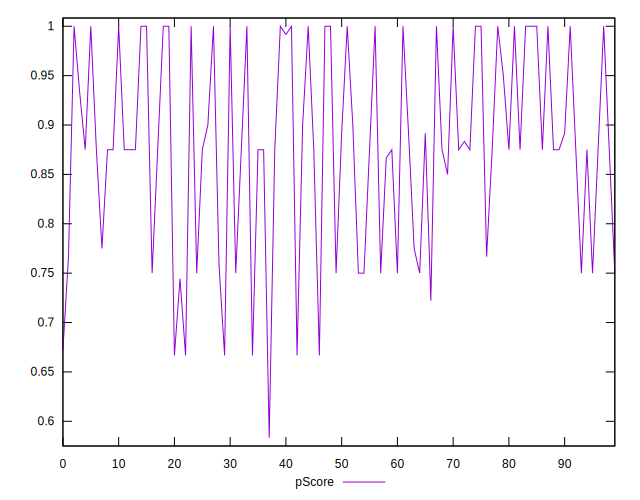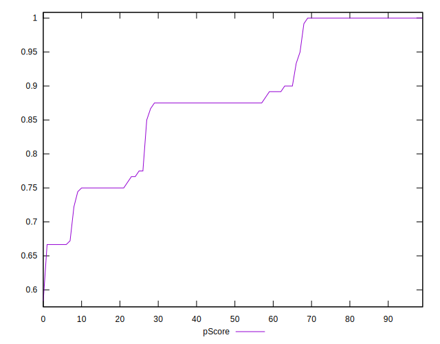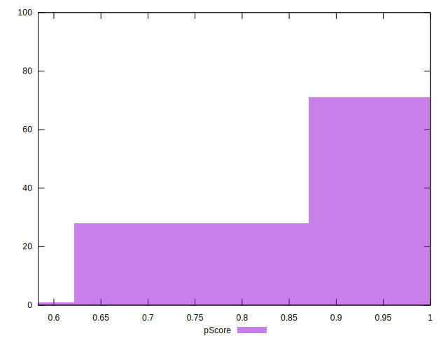
## Score Difference


```yaml
p90min: 0
p90max: 0
p90range: 0
p90mean: 0
p90median: 0
p90stdev: 0
p90skewness: .nan
p90eccentricity: .nan
p90discretization: 94
outlandishness: .inf
confidence: 4.330179641073932e-18
p90confidence: 0

```

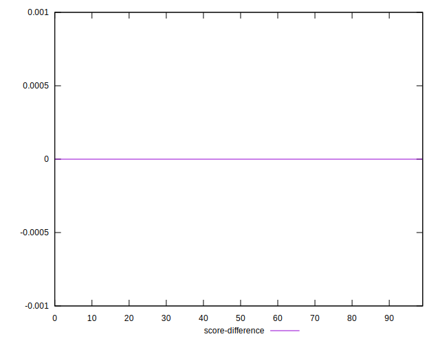
## P Score Difference


```yaml
p90min: -0.0050000000000000044
p90max: 0.0033333333333332993
p90range: 0.008333333333333304
p90mean: -0.0016548463356974102
p90median: 0
p90stdev: 0.0024844918566879278
p90skewness: -0.31163260453927005
p90eccentricity: 1.0000000000000002
p90discretization: 10.444444444444445
outlandishness: 0.928332249999999
confidence: 0.0010374149327844308
p90confidence: 0.0010045041550220475

```

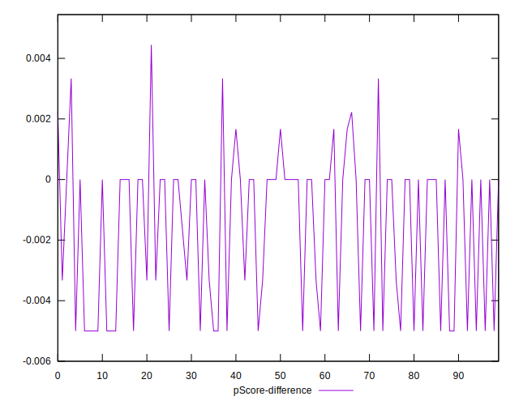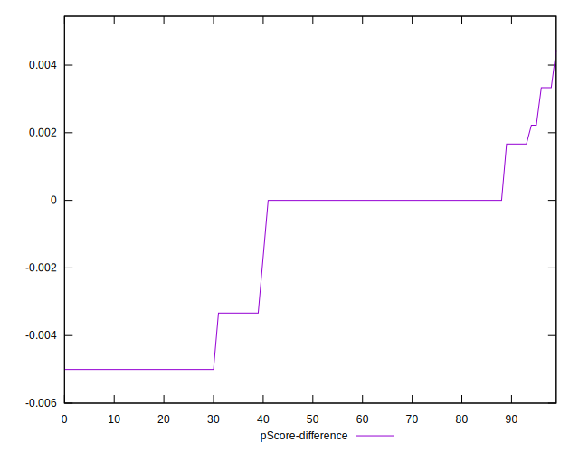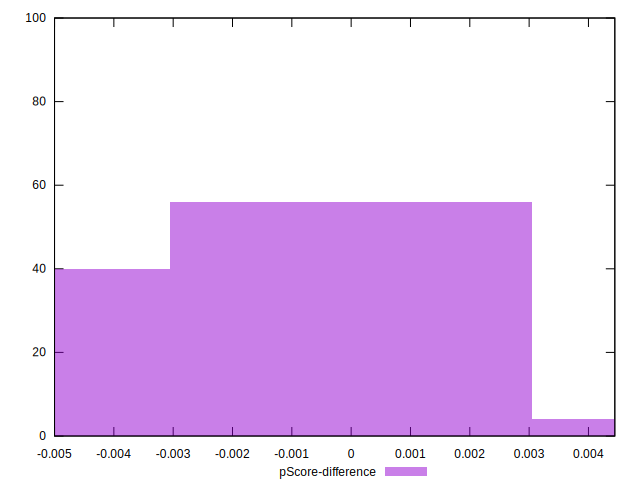