# //unused-css-rules/samples/pages+cached

[→ Parent](../..)


## Raw


```yaml
p90min: 0
p90max: 450
p90range: 450
p90mean: 97.02127659574468
p90median: 130
p90stdev: 96.85292411181295
p90skewness: 0.832327328874282
p90eccentricity: 1.0000000000000016
p90discretization: 5.875
outlandishness: 1.2185545403393352
confidence: 47.527554586748046
p90confidence: 39.15857660569964

```

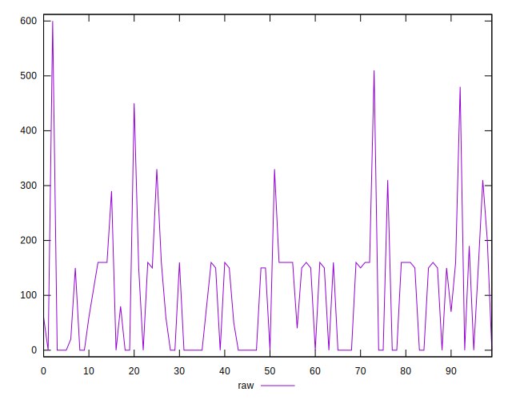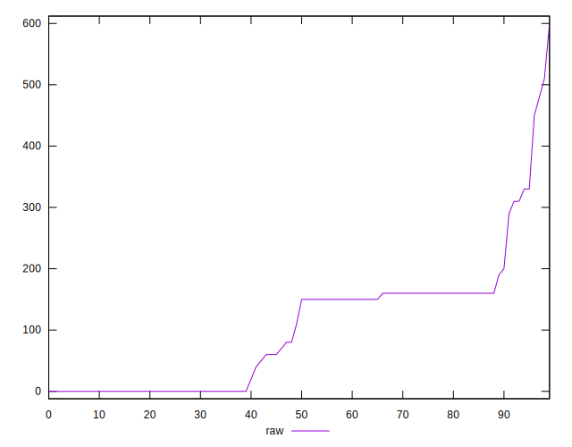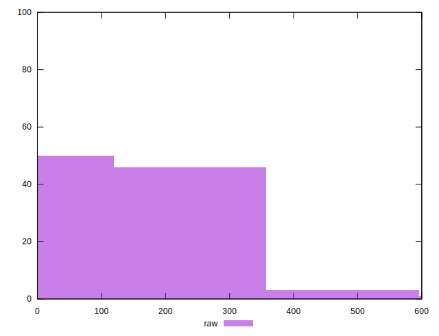
## Score


```yaml
p90min: 0.67
p90max: 1
p90range: 0.32999999999999996
p90mean: 0.9212765957446807
p90median: 0.895
p90stdev: 0.0779011108345838
p90skewness: -0.7423502136369547
p90eccentricity: 1.0000000000000002
p90discretization: 5.875
outlandishness: 0.9855582943212666
confidence: 0.03634100930379051
p90confidence: 0.031496174681969

```

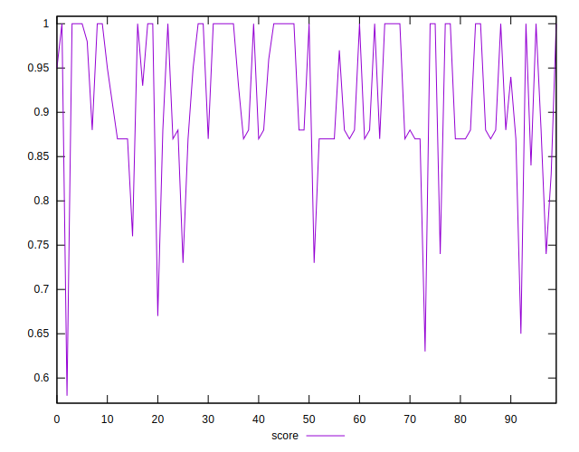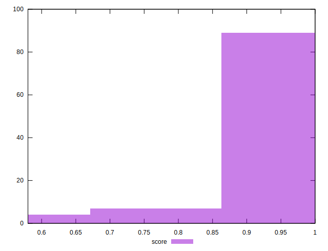
## Raw Estimate

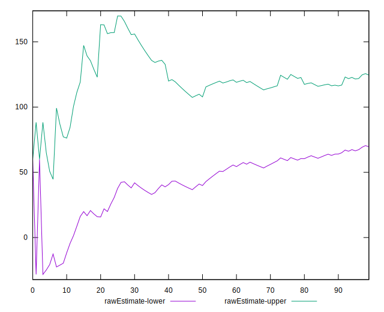
## Score Estimate

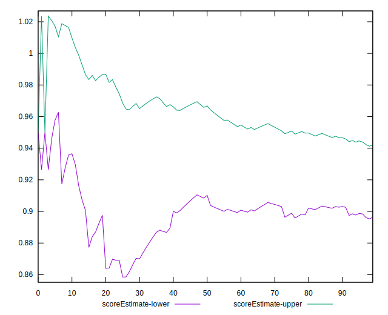
## P Score


```yaml
p90min: 0.6666666666666666
p90max: 1
p90range: 0.33333333333333337
p90mean: 0.9198286052009451
p90median: 0.8916666666666666
p90stdev: 0.0786338411447597
p90skewness: -0.6704651919567748
p90eccentricity: 0.9999999999999992
p90discretization: 5.875
outlandishness: 0.9858671056680771
confidence: 0.03644419742770716
p90confidence: 0.031792424653205975

```

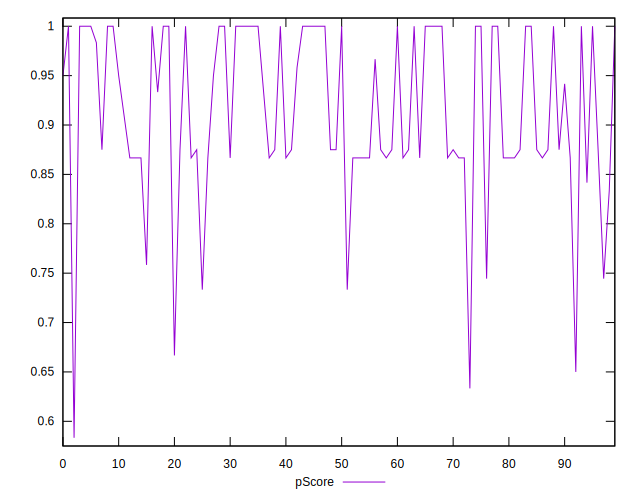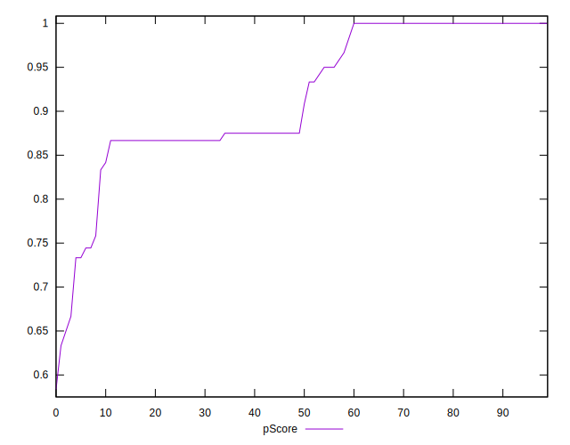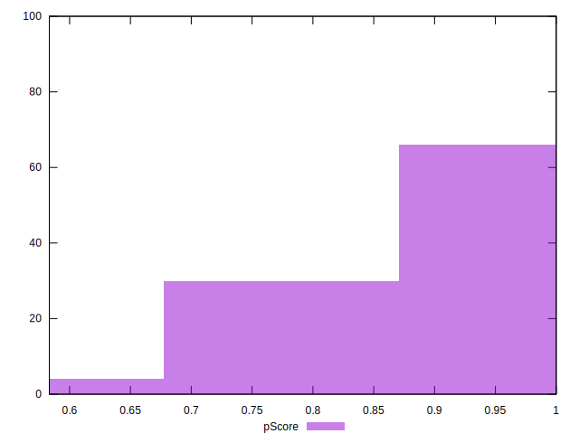
## Score Difference


```yaml
p90min: 0
p90max: 1.1102230246251565e-16
p90range: 1.1102230246251565e-16
p90mean: 2.362176648138631e-18
p90median: 0
p90stdev: 1.6021061506108986e-17
p90skewness: 6.6348880269703665
p90eccentricity: 0.9999999999999996
p90discretization: 47
outlandishness: 5.522500000000001
confidence: 9.484951648085947e-18
p90confidence: 6.477470556979047e-18

```

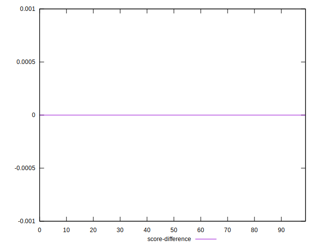
## P Score Difference


```yaml
p90min: -0.0050000000000000044
p90max: 0.0033333333333332993
p90range: 0.008333333333333304
p90mean: -0.0013475177304964484
p90median: 0
p90stdev: 0.0023604878355521362
p90skewness: 0.041274390844530155
p90eccentricity: 0.9999999999999988
p90discretization: 11.75
outlandishness: 0.9227793244075086
confidence: 0.0010013118868479073
p90confidence: 0.0009543681265480405

```

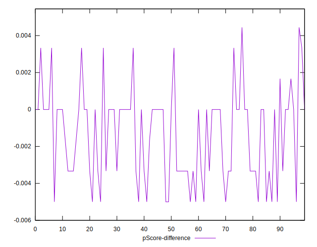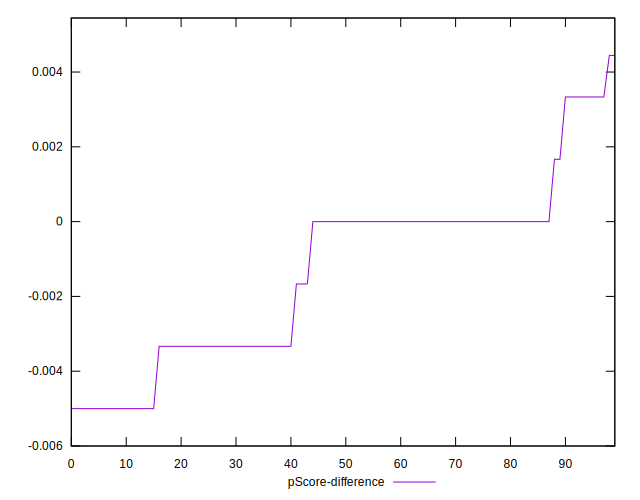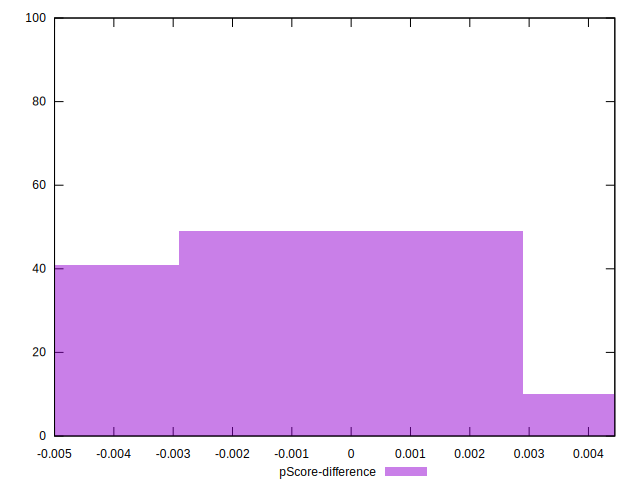