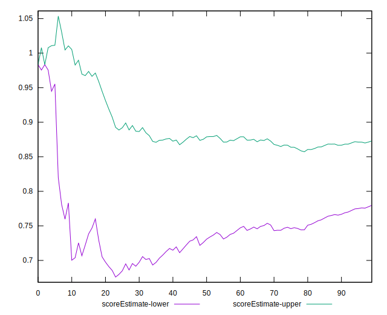

# //unused-css-rules/samples/pages

[→ Parent](../..)


## Raw


```yaml
p90min: 0
p90max: 750
p90range: 750
p90mean: 208.40425531914894
p90median: 150
p90stdev: 197.3241376543711
p90skewness: 0.7833683273146386
p90eccentricity: 1.0000000000000002
p90discretization: 2.9375
outlandishness: 1.115390446365917
confidence: 86.44929016423714
p90confidence: 79.78006272244157

```


## Score


```yaml
p90min: 0.5
p90max: 1
p90range: 0.5
p90mean: 0.8414893617021278
p90median: 0.88
p90stdev: 0.14096896781500037
p90skewness: -0.5534018220281843
p90eccentricity: 0.9999999999999991
p90discretization: 3.1333333333333333
outlandishness: 0.9865235880648444
confidence: 0.05950078794569636
p90confidence: 0.05699512096131767

```


## Raw Estimate


## Score Estimate


## P Score


```yaml
p90min: 0.5
p90max: 1
p90range: 0.5
p90mean: 0.8405437352245863
p90median: 0.875
p90stdev: 0.14063168914069865
p90skewness: -0.5340029399987163
p90eccentricity: 1.0000000000000002
p90discretization: 2.9375
outlandishness: 0.9866425712304437
confidence: 0.05937129985617591
p90confidence: 0.05685875592199407

```


## Score Difference


```yaml
p90min: 0
p90max: 1.1102230246251565e-16
p90range: 1.1102230246251565e-16
p90mean: 8.267618268485208e-18
p90median: 0
p90stdev: 2.914680950318572e-17
p90skewness: 3.2417635938924136
p90eccentricity: 0.9999999999999958
p90discretization: 47
outlandishness: 1.8032653061224493
confidence: 1.3055982858434588e-17
p90confidence: 1.1784337780288294e-17

```


## P Score Difference


```yaml
p90min: -0.0050000000000000044
p90max: 0.0033333333333334103
p90range: 0.008333333333333415
p90mean: -0.0009160756501182095
p90median: 0
p90stdev: 0.002591439356765234
p90skewness: -0.05742887502293016
p90eccentricity: 0.9999999999999983
p90discretization: 6.266666666666667
outlandishness: 0.9415259105098825
confidence: 0.0010783376843188958
p90confidence: 0.0010477440665990123

```

