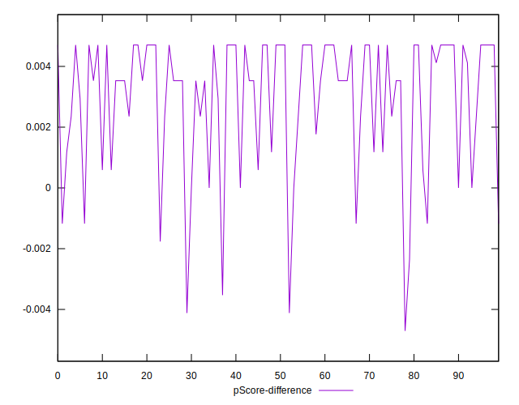

# //unused-javascript/samples/pages+cached+noadtech+nomedia+nocss

[→ Parent](../..)


## Raw


```yaml
p90min: 900
p90max: 1170
p90range: 270
p90mean: 1043.723404255319
p90median: 1050
p90stdev: 54.440755277820614
p90skewness: -0.8076627703998858
p90eccentricity: 1.000000000000001
p90discretization: 5.222222222222222
outlandishness: 0.999763544710241
confidence: 26.52560543950788
p90confidence: 22.01092538576924

```


## Score


```yaml
p90min: 0.45
p90max: 0.48
p90range: 0.02999999999999997
p90mean: 0.4624468085106386
p90median: 0.46
p90stdev: 0.007392660277911352
p90skewness: 1.4722679352577899
p90eccentricity: 0.9999999999999988
p90discretization: 23.5
outlandishness: 1.000662635615053
confidence: 0.003354688921659578
p90confidence: 0.0029889242525946253

```


## Raw Estimate


## Score Estimate


## P Score


```yaml
p90min: 0.4505882352941176
p90max: 0.4823529411764706
p90range: 0.03176470588235297
p90mean: 0.46544430538172676
p90median: 0.4647058823529412
p90stdev: 0.006404794738567131
p90skewness: 0.8076627704000694
p90eccentricity: 1.000000000000002
p90discretization: 5.222222222222222
outlandishness: 1.0000623850112322
confidence: 0.003120659463471516
p90confidence: 0.002589520633619911

```


## Score Difference


```yaml
p90min: 0
p90max: 5.551115123125783e-17
p90range: 5.551115123125783e-17
p90mean: 5.905441620346577e-19
p90median: 0
p90stdev: 5.695001657605475e-18
p90skewness: 9.539955591519904
p90eccentricity: 1
p90discretization: 47
outlandishness: 14.137600000000003
confidence: 4.264066145825139e-18
p90confidence: 2.302544406624999e-18

```


## P Score Difference


```yaml
p90min: -0.003529411764705892
p90max: 0.004705882352941171
p90range: 0.008235294117647063
p90mean: 0.0030287859824780867
p90median: 0.0035294117647058365
p90stdev: 0.002071669999179482
p90skewness: -1.168304678622883
p90eccentricity: 0.9999999999999991
p90discretization: 5.222222222222222
outlandishness: 0.8909175671060714
confidence: 0.0009366479814616641
p90confidence: 0.0008375962740262272

```

