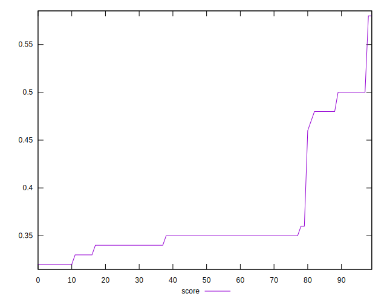

# //unused-javascript/samples/pages+cached+noadtech+nomedia

[→ Parent](../..)


## Raw


```yaml
p90min: 750
p90max: 2290
p90range: 1540
p90mean: 1859.5744680851064
p90median: 2030
p90stdev: 481.9682935047346
p90skewness: -1.5835178527067735
p90eccentricity: 0.9999999999999997
p90discretization: 3.032258064516129
outlandishness: 0.9755494818543847
confidence: 202.7539345722983
p90confidence: 194.86445572810078

```


## Score


```yaml
p90min: 0.32
p90max: 0.5
p90range: 0.18
p90mean: 0.3690425531914897
p90median: 0.35
p90stdev: 0.056738840854976186
p90skewness: 1.5852276722439236
p90eccentricity: 1.000000000000002
p90discretization: 10.444444444444445
outlandishness: 1.0221099253687127
confidence: 0.02523225084139411
p90confidence: 0.0229400636740011

```


## Raw Estimate


## Score Estimate


## P Score


```yaml
p90min: 0.31882352941176473
p90max: 0.5
p90range: 0.18117647058823527
p90mean: 0.3694618272841052
p90median: 0.3494117647058823
p90stdev: 0.05670215217702761
p90skewness: 1.5835178527067661
p90eccentricity: 0.9999999999999996
p90discretization: 3.032258064516129
outlandishness: 1.0215572040101915
confidence: 0.025252781127728198
p90confidence: 0.022925230085658915

```


## Score Difference


```yaml
p90min: 0
p90max: 5.551115123125783e-17
p90range: 5.551115123125783e-17
p90mean: 2.2440678157316992e-17
p90median: 0
p90stdev: 2.7241950054328385e-17
p90skewness: 0.3901994862858548
p90eccentricity: 1.0000000000000022
p90discretization: 47
outlandishness: 1.0286229916897507
confidence: 1.0702278667531071e-17
p90confidence: 1.101418462967141e-17

```


## P Score Difference


```yaml
p90min: -0.004705882352941171
p90max: 0.004117647058823559
p90range: 0.00882352941176473
p90mean: 0.00034348491169517174
p90median: 0.0005882352941176672
p90stdev: 0.0023288280684933636
p90skewness: -0.24903603208419323
p90eccentricity: 0.9999999999999997
p90discretization: 3.6153846153846154
outlandishness: 0.8836000000000002
confidence: 0.0009942569208592892
p90confidence: 0.0009415677756545733

```

