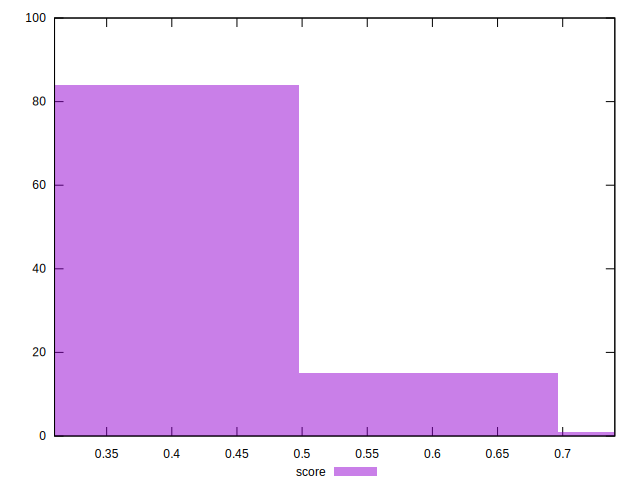

# //unused-javascript/samples/pages+cached+noadtech

[→ Parent](../..)


## Raw


```yaml
p90min: 480
p90max: 2290
p90range: 1810
p90mean: 1843.1914893617022
p90median: 2150
p90stdev: 592.4026318522237
p90skewness: -1.2652824113402346
p90eccentricity: 1
p90discretization: 2.6857142857142855
outlandishness: 0.9693235530134227
confidence: 247.36109346162053
p90confidence: 239.514129836933

```


## Score


```yaml
p90min: 0.32
p90max: 0.65
p90range: 0.33
p90mean: 0.3759574468085105
p90median: 0.34
p90stdev: 0.08087709547334533
p90skewness: 1.5819746505095433
p90eccentricity: 1.0000000000000007
p90discretization: 9.4
outlandishness: 1.0410697172491084
confidence: 0.0377272245013823
p90confidence: 0.03269939413582662

```


## Raw Estimate


## Score Estimate


## P Score


```yaml
p90min: 0.31882352941176473
p90max: 0.65
p90range: 0.3311764705882353
p90mean: 0.3760478375747462
p90median: 0.33529411764705885
p90stdev: 0.08122291214590617
p90skewness: 1.583115173661014
p90eccentricity: 0.9999999999999999
p90discretization: 2.6857142857142855
outlandishness: 1.0407359584227764
confidence: 0.03773048709789258
p90confidence: 0.03283921117065738

```


## Score Difference


```yaml
p90min: 0
p90max: 5.551115123125783e-17
p90range: 5.551115123125783e-17
p90mean: 8.267618268485208e-18
p90median: 0
p90stdev: 1.9763387771098395e-17
p90skewness: 1.972127205401751
p90eccentricity: 0.9999999999999994
p90discretization: 47
outlandishness: 1.3028591836734695
confidence: 8.173758983819138e-18
p90confidence: 7.990529363153346e-18

```


## P Score Difference


```yaml
p90min: -0.004705882352941171
p90max: 0.004117647058823504
p90range: 0.008823529411764675
p90mean: 0.00003267973856208619
p90median: 0
p90stdev: 0.002526001530901306
p90skewness: -0.2187848550112632
p90eccentricity: 0.9999999999999997
p90discretization: 3.76
outlandishness: 0.8836000000000003
confidence: 0.0010610357066208062
p90confidence: 0.0010212869189134678

```

