# //unused-javascript/samples/pages+cached

[→ Parent](../..)


## Raw


```yaml
p90min: 3140
p90max: 6210
p90range: 3070
p90mean: 5358.936170212766
p90median: 5700
p90stdev: 826.0074030953424
p90skewness: -1.4115002968730899
p90eccentricity: 0.9999999999999999
p90discretization: 1.323943661971831
outlandishness: 0.9811544701520188
confidence: 373.3497854308109
p90confidence: 333.96280460920957

```

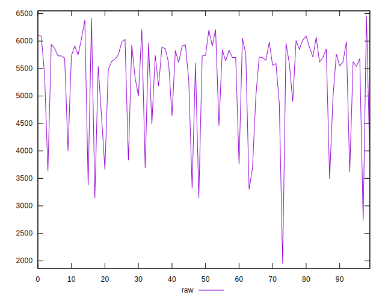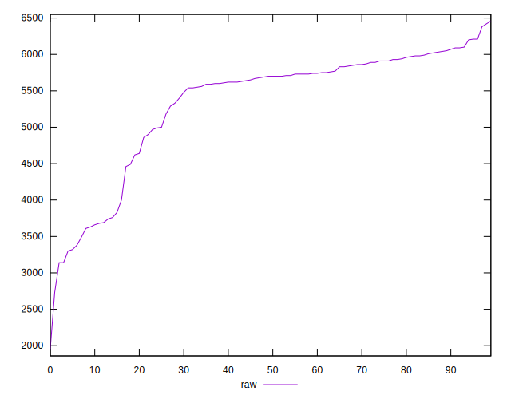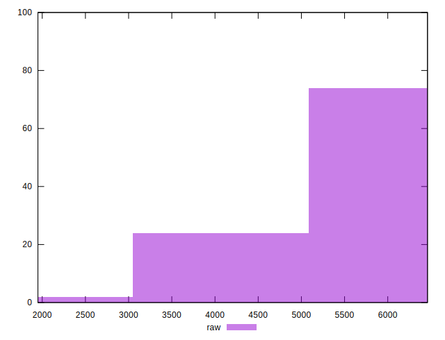
## Score


```yaml
p90min: 0
p90max: 0.22
p90range: 0.22
p90mean: 0.027340425531914892
p90median: 0
p90stdev: 0.0602684690843925
p90skewness: 1.9906424414538193
p90eccentricity: 1.0000000000000004
p90discretization: 7.230769230769231
outlandishness: 1.5647381550061323
confidence: 0.028955401741908283
p90confidence: 0.02436712660141127

```

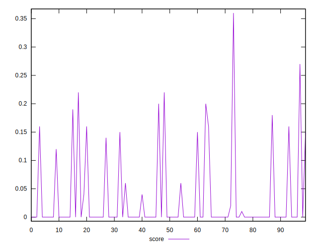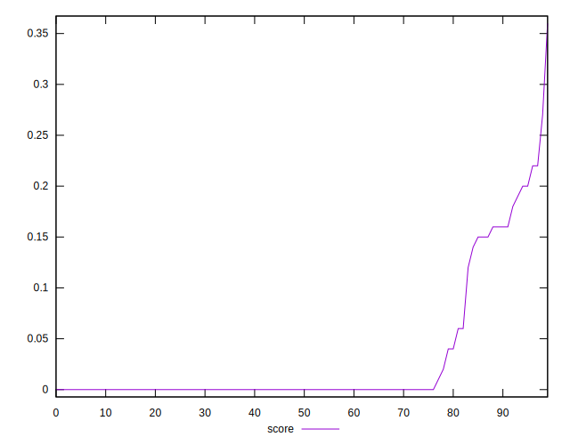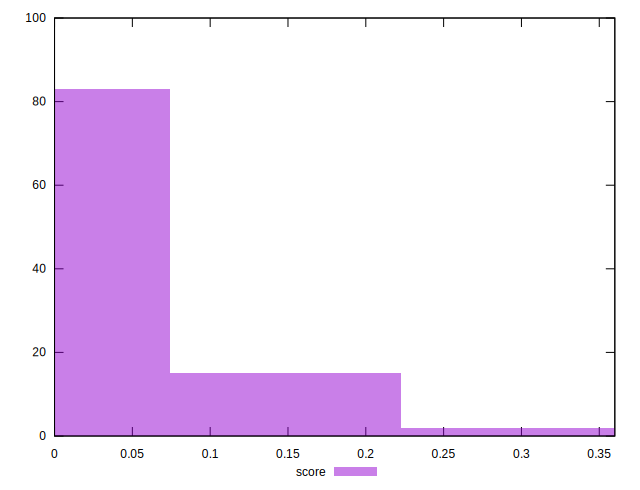
## Raw Estimate

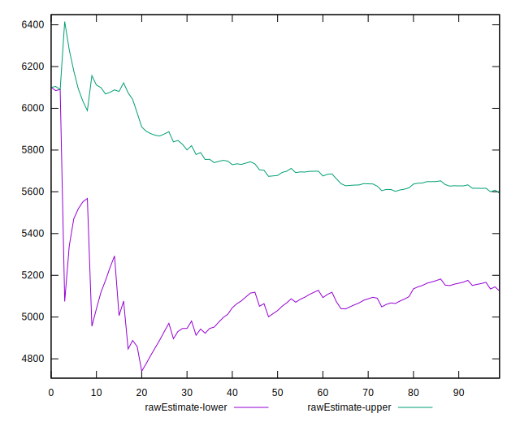
## Score Estimate


## P Score


```yaml
p90min: 0
p90max: 0.2188235294117647
p90range: 0.2188235294117647
p90mean: 0.027334167709637047
p90median: 0
p90stdev: 0.05995861674573424
p90skewness: 1.9851397270888382
p90eccentricity: 0.9999999999999983
p90discretization: 4.086956521739131
outlandishness: 1.5600742023239278
confidence: 0.0287938007961717
p90confidence: 0.024241850295599405

```

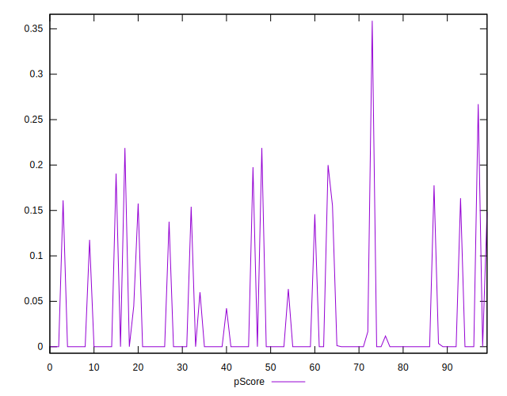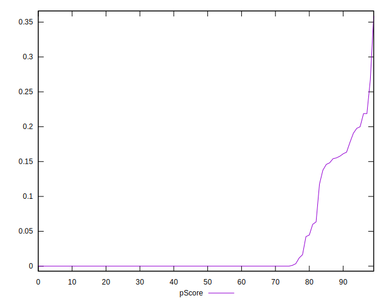
## Score Difference


```yaml
p90min: 0
p90max: 0
p90range: 0
p90mean: 0
p90median: 0
p90stdev: 0
p90skewness: .nan
p90eccentricity: .nan
p90discretization: 94
outlandishness: .nan
confidence: 0
p90confidence: 0

```


## P Score Difference


```yaml
p90min: -0.002941176470588225
p90max: 0.003529411764705892
p90range: 0.006470588235294117
p90mean: -0.00006257822277847419
p90median: 0
p90stdev: 0.0009220046927015294
p90skewness: 0.32548503276204505
p90eccentricity: 0.9999999999999991
p90discretization: 6.714285714285714
outlandishness: 0.8836000000000093
confidence: 0.0005303431958167215
p90confidence: 0.0003727754398853903

```

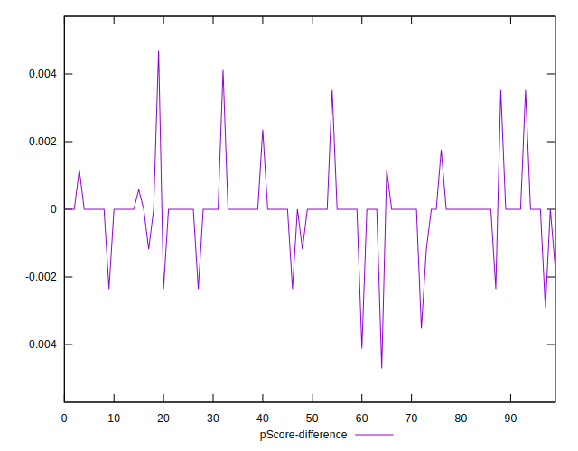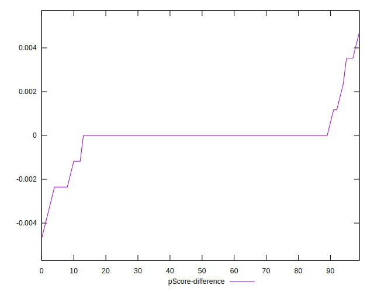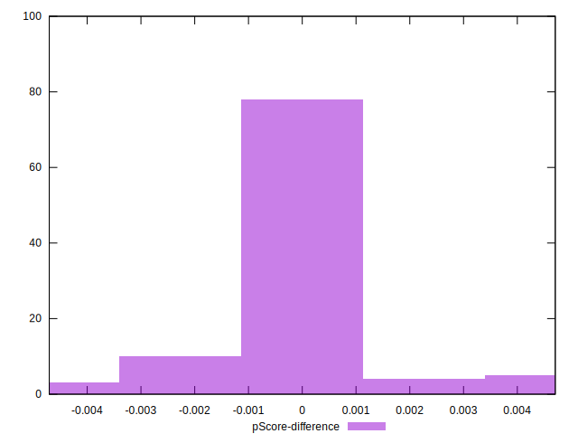