# //unused-javascript/samples/pages

[→ Parent](../..)


## Raw


```yaml
p90min: 2080
p90max: 6160
p90range: 4080
p90mean: 4930
p90median: 5470
p90stdev: 1174.9676319670311
p90skewness: -1.302837833692085
p90eccentricity: 0.9999999999999996
p90discretization: 1.4029850746268657
outlandishness: 0.9792969191397619
confidence: 500.8722088221085
p90confidence: 475.0508097461431

```

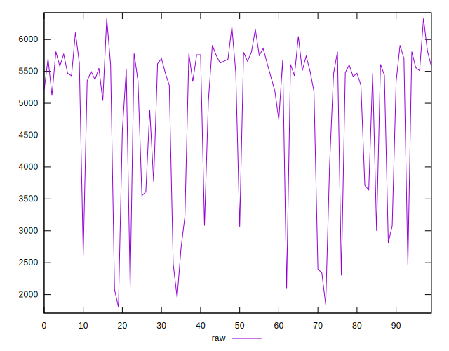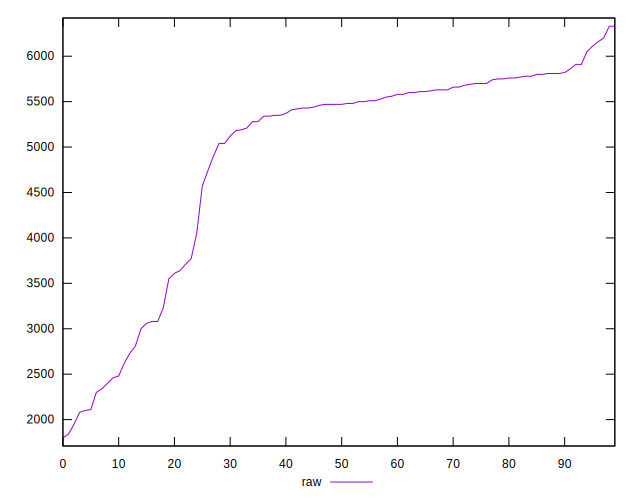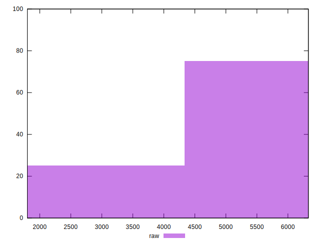
## Score


```yaml
p90min: 0
p90max: 0.34
p90range: 0.34
p90mean: 0.058404255319148946
p90median: 0
p90stdev: 0.10905106349769075
p90skewness: 1.55185236676741
p90eccentricity: 0.9999999999999992
p90discretization: 4.947368421052632
outlandishness: 1.2770235002538142
confidence: 0.04660924578105664
p90confidence: 0.04409040267052197

```

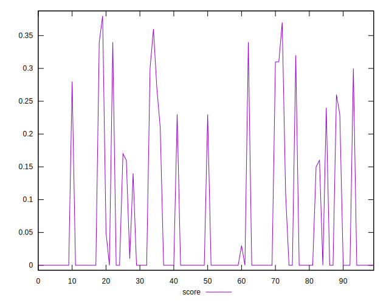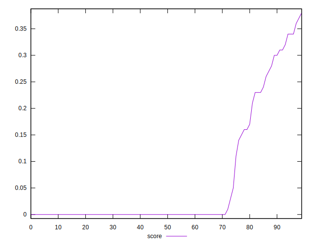
## Raw Estimate

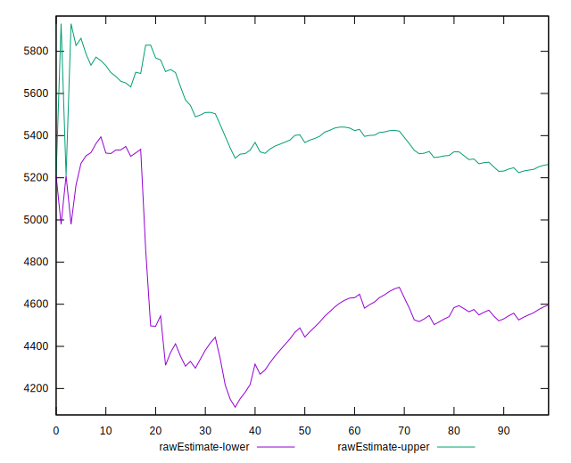
## Score Estimate

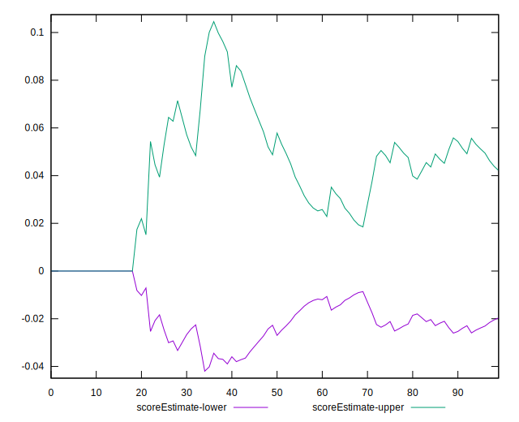
## P Score


```yaml
p90min: 0
p90max: 0.34352941176470586
p90range: 0.34352941176470586
p90mean: 0.05829787234042553
p90median: 0
p90stdev: 0.10869787651837863
p90skewness: 1.5519978119725808
p90eccentricity: 0.9999999999999997
p90discretization: 3.76
outlandishness: 1.276667120966786
confidence: 0.04646237215422288
p90confidence: 0.04394760574918625

```

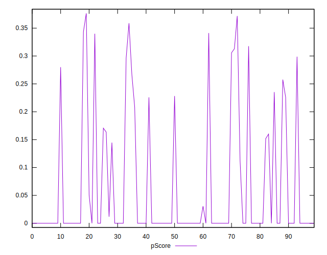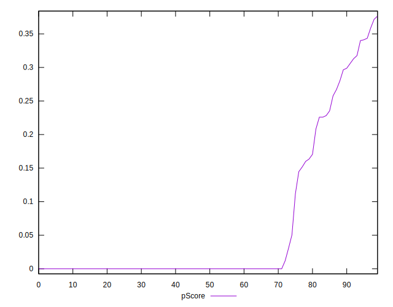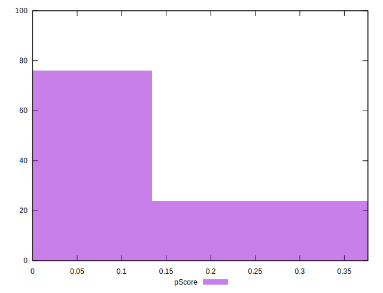
## Score Difference


```yaml
p90min: 0
p90max: 0
p90range: 0
p90mean: 0
p90median: 0
p90stdev: 0
p90skewness: .nan
p90eccentricity: .nan
p90discretization: 94
outlandishness: .nan
confidence: 0
p90confidence: 0

```


## P Score Difference


```yaml
p90min: -0.004117647058823504
p90max: 0.002941176470588225
p90range: 0.0070588235294117285
p90mean: -0.00012515644555694712
p90median: 0
p90stdev: 0.000992767560202847
p90skewness: -1.5096990693534833
p90eccentricity: 1.0000000000000009
p90discretization: 4.947368421052632
outlandishness: 1.0691560000000098
confidence: 0.0005481695071742296
p90confidence: 0.000401385553553103

```

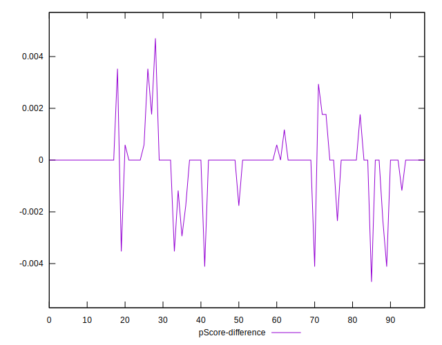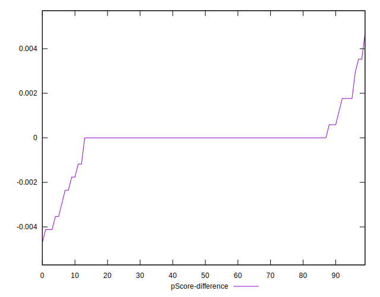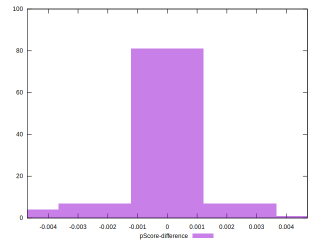