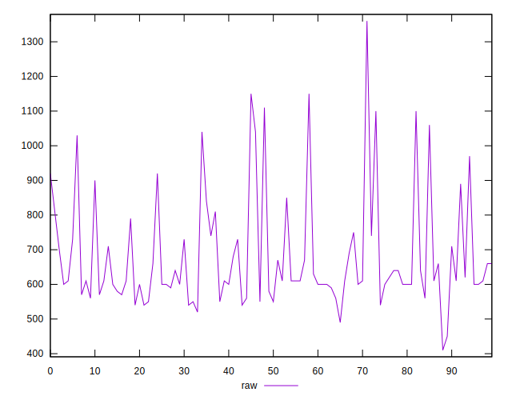

# //uses-http2/samples/pages+cached+noadtech+nomedia+nocss

[→ Parent](../..)


## Raw


```yaml
p90min: 520
p90max: 1110
p90range: 590
p90mean: 675.531914893617
p90median: 610
p90stdev: 146.21186188510032
p90skewness: 1.6202735482658377
p90eccentricity: 1
p90discretization: 2.764705882352941
outlandishness: 1.0285281717056234
confidence: 68.73746543565166
p90confidence: 59.11487388527235

```


## Score


```yaml
p90min: 0.46
p90max: 0.63
p90range: 0.16999999999999998
p90mean: 0.557234042553191
p90median: 0.58
p90stdev: 0.04722972953281512
p90skewness: -0.6828223699606242
p90eccentricity: 0.9999999999999994
p90discretization: 5.222222222222222
outlandishness: 0.999518958207863
confidence: 0.02096553236899975
p90confidence: 0.019095437736522013

```


## Raw Estimate


## Score Estimate


## P Score


```yaml
p90min: 0.4576470588235294
p90max: 0.6277777777777778
p90range: 0.17013071895424836
p90mean: 0.5573501599221249
p90median: 0.5777777777777777
p90stdev: 0.04713394788619787
p90skewness: -0.7315862363036938
p90eccentricity: 0.9999999999999988
p90discretization: 2.764705882352941
outlandishness: 0.9996417900601378
confidence: 0.020895140056870907
p90confidence: 0.019056712287797803

```


## Score Difference


```yaml
p90min: 0
p90max: 1.1102230246251565e-16
p90range: 1.1102230246251565e-16
p90mean: 3.543264972207946e-18
p90median: 0
p90stdev: 1.5801884812776703e-17
p90skewness: 4.850394434305287
p90eccentricity: 0.9999999999999999
p90discretization: 31.333333333333332
outlandishness: 3.5344000000000007
confidence: 9.374482588239097e-18
p90confidence: 6.3888552940456556e-18

```


## P Score Difference


```yaml
p90min: -0.004444444444444362
p90max: 0.004444444444444473
p90range: 0.008888888888888835
p90mean: 0.00016270337922404742
p90median: 0
p90stdev: 0.0026332020329867477
p90skewness: -0.07425424427969456
p90eccentricity: 0.9999999999999994
p90discretization: 3.9166666666666665
outlandishness: 0.8536496457009346
confidence: 0.0010897908259868815
p90confidence: 0.0010646291216562162

```

