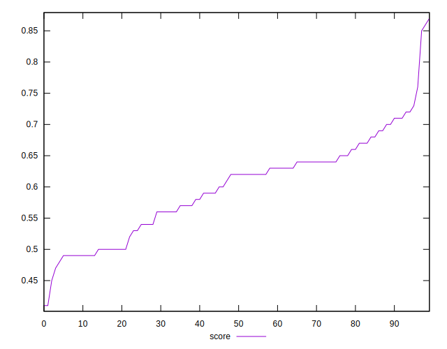

# //uses-http2/samples/pages+cached+noadtech+nomedia

[→ Parent](../..)


## Raw


```yaml
p90min: 290
p90max: 970
p90range: 680
p90mean: 585.531914893617
p90median: 540
p90stdev: 148.59352682900465
p90skewness: 0.4794058090084144
p90eccentricity: 0.9999999999999997
p90discretization: 2
outlandishness: 1.0402517494676178
confidence: 84.22479505456245
p90confidence: 60.07780412212632

```


## Score


```yaml
p90min: 0.47
p90max: 0.76
p90range: 0.29000000000000004
p90mean: 0.597872340425532
p90median: 0.62
p90stdev: 0.07136767759399706
p90skewness: -0.06986115605932422
p90eccentricity: 0.9999999999999984
p90discretization: 3.6153846153846154
outlandishness: 1.0088093517685945
confidence: 0.034550446140834426
p90confidence: 0.02885464425430341

```


## Raw Estimate


## Score Estimate


## P Score


```yaml
p90min: 0.47411764705882353
p90max: 0.7583333333333333
p90range: 0.28421568627450977
p90mean: 0.5976898206090947
p90median: 0.6166666666666667
p90stdev: 0.07172577518072096
p90skewness: -0.08077288969671069
p90eccentricity: 0.9999999999999996
p90discretization: 2
outlandishness: 1.0088191987533761
confidence: 0.034573871399102916
p90confidence: 0.02899942658184424

```


## Score Difference


```yaml
p90min: 0
p90max: 1.1102230246251565e-16
p90range: 1.1102230246251565e-16
p90mean: 7.677074106450551e-18
p90median: 0
p90stdev: 2.636367989820919e-17
p90skewness: 3.372058099992106
p90eccentricity: 1.0000000000000004
p90discretization: 31.333333333333332
outlandishness: 1.8874532544378695
confidence: 1.2191411171699458e-17
p90confidence: 1.0659091487112396e-17

```


## P Score Difference


```yaml
p90min: -0.004444444444444473
p90max: 0.004444444444444473
p90range: 0.008888888888888946
p90mean: -0.00018356278681685222
p90median: -0.0008496732026143372
p90stdev: 0.002735928201639287
p90skewness: 0.16679248452219406
p90eccentricity: 0.9999999999999987
p90discretization: 3.2413793103448274
outlandishness: 0.9657528925619733
confidence: 0.0011287942656073198
p90confidence: 0.0011061623079949843

```

