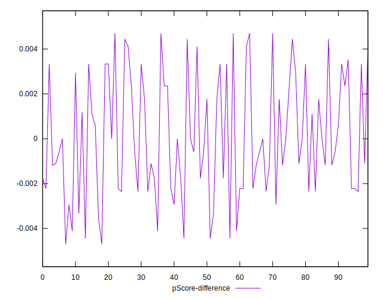

# //uses-http2/samples/pages+cached+noadtech

[→ Parent](../..)


## Raw


```yaml
p90min: 470
p90max: 1520
p90range: 1050
p90mean: 837.2340425531914
p90median: 795
p90stdev: 221.9421251727822
p90skewness: 0.6742086515264896
p90eccentricity: 1.0000000000000007
p90discretization: 1.709090909090909
outlandishness: 1.0326691544200628
confidence: 109.46875937447142
p90confidence: 89.73335384873687

```


## Score


```yaml
p90min: 0.41
p90max: 0.66
p90range: 0.25000000000000006
p90mean: 0.5102127659574467
p90median: 0.495
p90stdev: 0.05535146355681479
p90skewness: 0.9201546287427208
p90eccentricity: 1.0000000000000002
p90discretization: 4.086956521739131
outlandishness: 1.0085921890705418
confidence: 0.026592717381231534
p90confidence: 0.022379133576027575

```


## Raw Estimate


## Score Estimate


## P Score


```yaml
p90min: 0.40941176470588236
p90max: 0.6555555555555556
p90range: 0.2461437908496732
p90mean: 0.5104213600333751
p90median: 0.4947058823529412
p90stdev: 0.05528426782295471
p90skewness: 0.8988801590507555
p90eccentricity: 0.9999999999999999
p90discretization: 1.709090909090909
outlandishness: 1.0081176706796362
confidence: 0.02651604674606705
p90confidence: 0.02235196568908904

```


## Score Difference


```yaml
p90min: 0
p90max: 5.551115123125783e-17
p90range: 5.551115123125783e-17
p90mean: 6.495985782381235e-18
p90median: 0
p90stdev: 1.7843817357195944e-17
p90skewness: 2.3828522123573745
p90eccentricity: 0.9999999999999968
p90discretization: 47
outlandishness: 1.6430578512396692
confidence: 8.357075601442542e-18
p90confidence: 7.214428426685432e-18

```


## P Score Difference


```yaml
p90min: -0.004444444444444473
p90max: 0.004705882352941171
p90range: 0.009150326797385644
p90mean: 0.00009178139340842877
p90median: -0.0005882352941176117
p90stdev: 0.0026463646060755843
p90skewness: 0.18825187637226212
p90eccentricity: 0.9999999999999996
p90discretization: 3.032258064516129
outlandishness: 0.9379629017447118
confidence: 0.0011009252459416269
p90confidence: 0.0010699508776212947

```

