# //uses-http2/samples/pages+cached

[→ Parent](../..)


## Raw


```yaml
p90min: 0
p90max: 830
p90range: 830
p90mean: 98.82978723404256
p90median: 0
p90stdev: 185.55183013355645
p90skewness: 2.0235725368550015
p90eccentricity: 0.9999999999999976
p90discretization: 3.2413793103448274
outlandishness: 1.4644907688047262
confidence: 88.5295055842771
p90confidence: 75.02040461085495

```

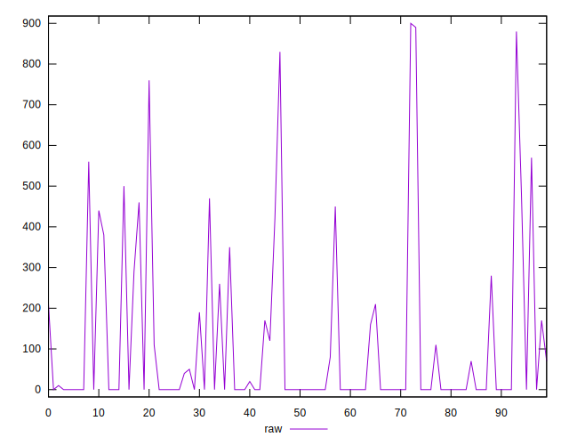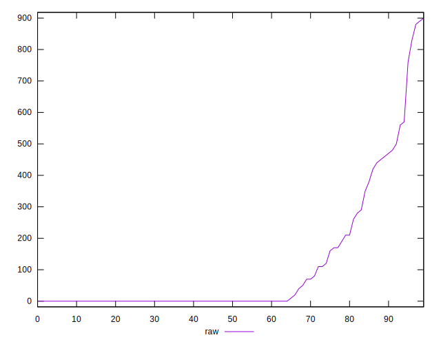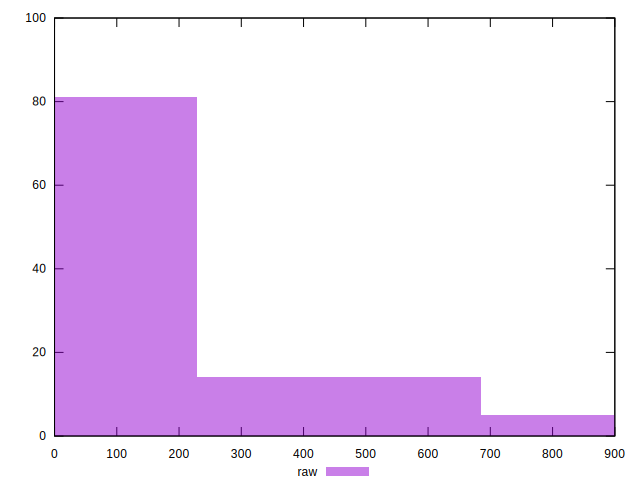
## Score


```yaml
p90min: 0.49
p90max: 1
p90range: 0.51
p90mean: 0.9264893617021274
p90median: 1
p90stdev: 0.13127612158954333
p90skewness: -1.7261472558824884
p90eccentricity: 1.0000000000000013
p90discretization: 3.4814814814814814
outlandishness: 0.9759915347172545
confidence: 0.05842785119720479
p90confidence: 0.05307620922037073

```

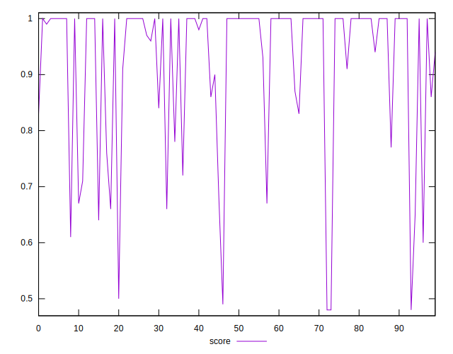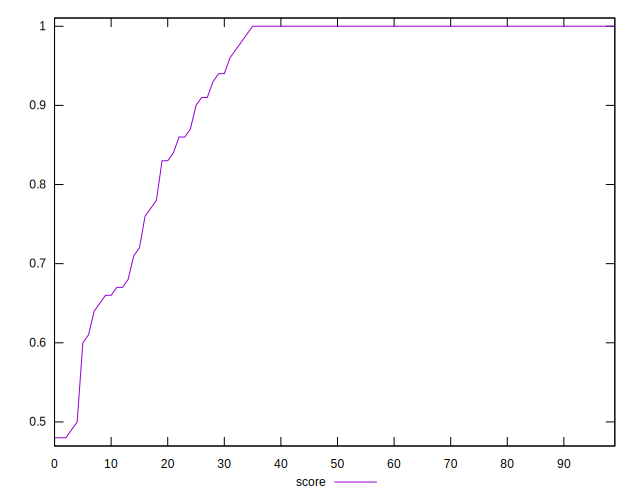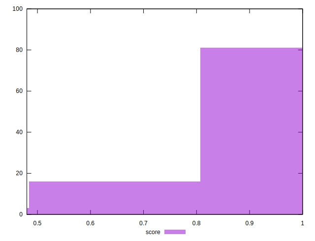
## Raw Estimate

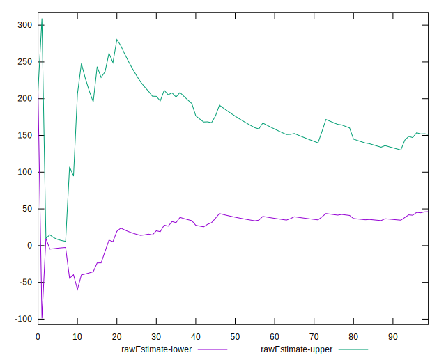
## Score Estimate

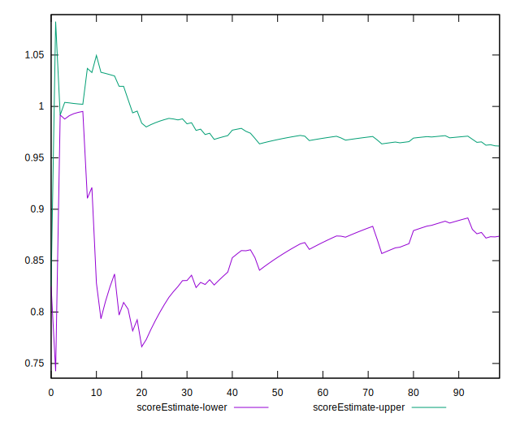
## P Score


```yaml
p90min: 0.49058823529411766
p90max: 1
p90range: 0.5094117647058823
p90mean: 0.9262466972604643
p90median: 1
p90stdev: 0.13165472265644046
p90skewness: -1.7204173182306362
p90eccentricity: 1.000000000000001
p90discretization: 3.2413793103448274
outlandishness: 0.9762422233744764
confidence: 0.05842354996852733
p90confidence: 0.05322928130381113

```

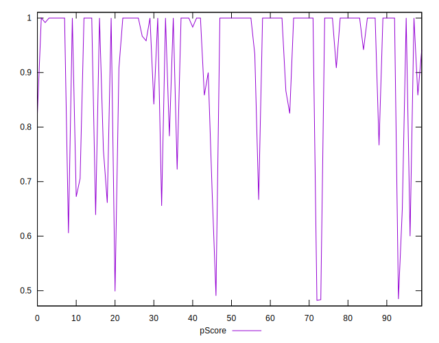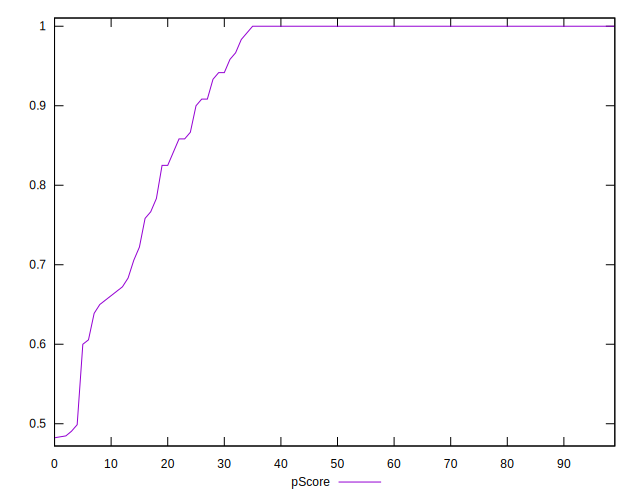
## Score Difference


```yaml
p90min: 0
p90max: 1.1102230246251565e-16
p90range: 1.1102230246251565e-16
p90mean: 1.1810883240693154e-18
p90median: 0
p90stdev: 1.139000331521095e-17
p90skewness: 9.539955591519908
p90eccentricity: 0.9999999999999996
p90discretization: 47
outlandishness: 14.137600000000003
confidence: 8.528132291650267e-18
p90confidence: 4.605088813249998e-18

```

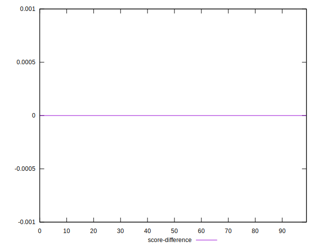
## P Score Difference


```yaml
p90min: -0.004444444444444362
p90max: 0.0033333333333332993
p90range: 0.007777777777777661
p90mean: -0.00009942984285912722
p90median: 0
p90stdev: 0.0013198344987735758
p90skewness: -0.6449965060031749
p90eccentricity: 1.000000000000001
p90discretization: 6.714285714285714
outlandishness: 1.5110082840237011
confidence: 0.0006543418825494468
p90confidence: 0.0005336218890758984

```

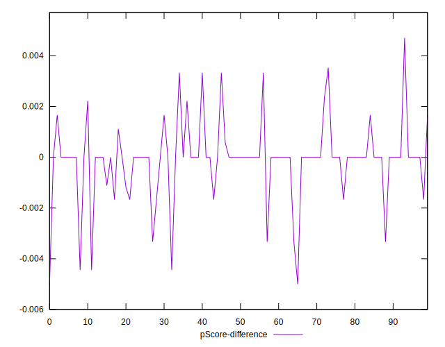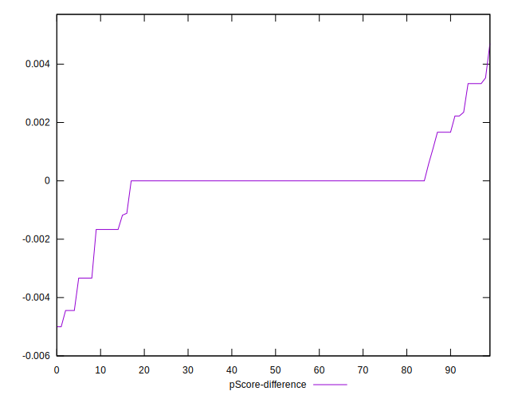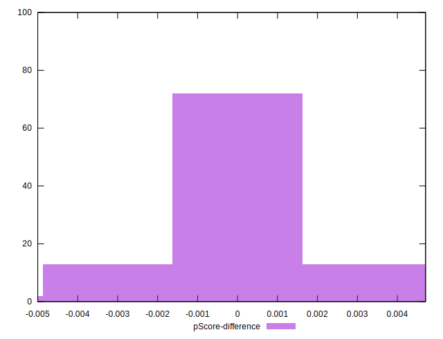