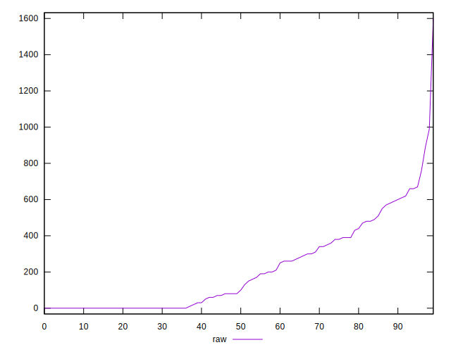
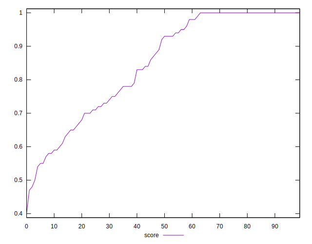

# //uses-http2/samples/pages

[→ Parent](../..)


## Raw


```yaml
p90min: 0
p90max: 760
p90range: 760
p90mean: 198.82978723404256
p90median: 90
p90stdev: 219.36007696944276
p90skewness: 0.7892721666636034
p90eccentricity: 0.9999999999999991
p90discretization: 2.1363636363636362
outlandishness: 1.2432786923935082
confidence: 108.4652710701624
p90confidence: 88.68940671655375

```


## Score


```yaml
p90min: 0.5
p90max: 1
p90range: 0.5
p90mean: 0.850212765957447
p90median: 0.925
p90stdev: 0.15661294424508923
p90skewness: -0.5700957090467521
p90eccentricity: 1
p90discretization: 2.473684210526316
outlandishness: 0.982405408167176
confidence: 0.06619423712313807
p90confidence: 0.06332013236467164

```


## Raw Estimate


## Score Estimate


## P Score


```yaml
p90min: 0.4988235294117647
p90max: 1
p90range: 0.5011764705882353
p90mean: 0.8503125434570991
p90median: 0.925
p90stdev: 0.15646808887365204
p90skewness: -0.5670446667256265
p90eccentricity: 0.9999999999999991
p90discretization: 2.1363636363636362
outlandishness: 0.9825169314964917
confidence: 0.0661015117724375
p90confidence: 0.06326156593303121

```


## Score Difference


```yaml
p90min: 0
p90max: 1.1102230246251565e-16
p90range: 1.1102230246251565e-16
p90mean: 1.0039250754589182e-17
p90median: 0
p90stdev: 3.132111734552389e-17
p90skewness: 2.85508010898523
p90eccentricity: 0.9999999999999997
p90discretization: 31.333333333333332
outlandishness: 1.6173854671280277
confidence: 1.371223553006746e-17
p90confidence: 1.2663431529799443e-17

```


## P Score Difference


```yaml
p90min: -0.0050000000000000044
p90max: 0.004444444444444473
p90range: 0.009444444444444478
p90mean: 0.00017382839660687026
p90median: 0
p90stdev: 0.002025685127846429
p90skewness: -0.3526612469166211
p90eccentricity: 0.9999999999999987
p90discretization: 4.7
outlandishness: 0.7125385744000077
confidence: 0.0008944535120760439
p90confidence: 0.0008190041445338872

```

