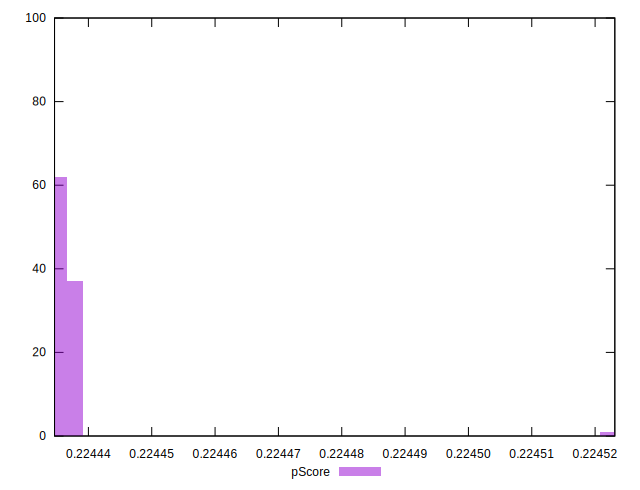

# //uses-long-cache-ttl/samples/pages+cached+noadtech+nomedia+nocss

[→ Parent](../..)


## Raw


```yaml
p90min: 321771.6
p90max: 321774.25
p90range: 2.650000000023283
p90mean: 321773.2632978725
p90median: 321774.25
p90stdev: 1.2810853014529433
p90skewness: -0.5281426181601199
p90eccentricity: 1.0000000000000007
p90discretization: 47
outlandishness: 0.9999928150496362
confidence: 4.386683654002932
p90confidence: 0.5179552127663879

```


## Score


```yaml
p90min: 0.22
p90max: 0.22
p90range: 0
p90mean: 0.21999999999999995
p90median: 0.22
p90stdev: 5.551115123125783e-17
p90skewness: 1
p90eccentricity: 1
p90discretization: 94
outlandishness: 0.9999999999999996
confidence: 4.3519942861448666e-17
p90confidence: 2.244369685163343e-17

```


## Raw Estimate


## Score Estimate


## P Score


```yaml
p90min: 0.22443465293876186
p90max: 0.22443673270564285
p90range: 0.0000020797668809913183
p90mean: 0.22443542732004731
p90median: 0.22443465293876186
p90stdev: 0.0000010054184081747927
p90skewness: 0.5281426179019998
p90eccentricity: 1.0000000000000016
p90discretization: 47
outlandishness: 1.0000080867036543
confidence: 0.0000034437065689392865
p90confidence: 4.0650041409014354e-7

```


## Score Difference


```yaml
p90min: 0
p90max: 0
p90range: 0
p90mean: 0
p90median: 0
p90stdev: 0
p90skewness: .nan
p90eccentricity: .nan
p90discretization: 94
outlandishness: .nan
confidence: 0
p90confidence: 0

```


## P Score Difference


```yaml
p90min: 0.004434652938761857
p90max: 0.0044367327056428485
p90range: 0.0000020797668809913183
p90mean: 0.0044354273200473355
p90median: 0.004434652938761857
p90stdev: 0.0000010054184081747927
p90skewness: 0.5281426177493043
p90eccentricity: 1.0000000000000024
p90discretization: 47
outlandishness: 1.0004092333510297
confidence: 0.0000034437065689392865
p90confidence: 4.0650041409014354e-7

```

