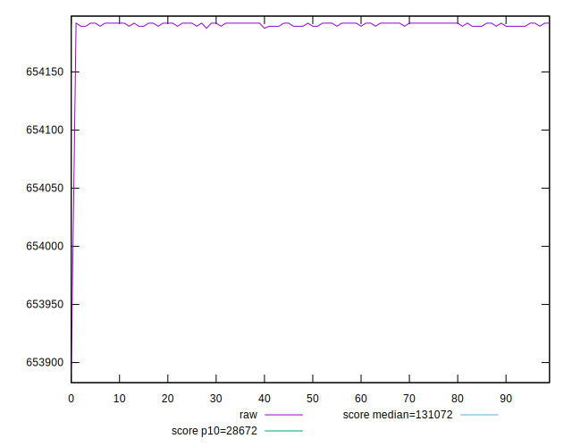

# //uses-long-cache-ttl/samples/pages+cached+noadtech+nomedia

[→ Parent](../..)


## Raw


```yaml
p90min: 654189.35
p90max: 654192
p90range: 2.650000000023283
p90mean: 654191.0696808514
p90median: 654192
p90stdev: 1.2648525707890401
p90skewness: -0.6240740787533349
p90eccentricity: 0.9999999999999997
p90discretization: 47
outlandishness: 0.999990631665632
confidence: 11.798602506441927
p90confidence: 0.5113921623159099

```


## Score


```yaml
p90min: 0.09
p90max: 0.09
p90range: 0
p90mean: 0.08999999999999991
p90median: 0.09
p90stdev: 8.326672684688674e-17
p90skewness: 1
p90eccentricity: 1
p90discretization: 94
outlandishness: 1
confidence: 3.26399571460865e-17
p90confidence: 3.366554527745014e-17

```


## Raw Estimate


## Score Estimate


## P Score


```yaml
p90min: 0.08761164010631045
p90max: 0.08761218379239344
p90range: 5.436860829877155e-7
p90mean: 0.08761183097482887
p90median: 0.08761164010631045
p90stdev: 2.59502920665356e-7
p90skewness: 0.6240740790324094
p90eccentricity: 0.9999999999999991
p90discretization: 47
outlandishness: 1.0000143588860766
confidence: 0.0000024218486946190516
p90confidence: 1.0491954777272161e-7

```


## Score Difference


```yaml
p90min: 0
p90max: 0
p90range: 0
p90mean: 0
p90median: 0
p90stdev: 0
p90skewness: .nan
p90eccentricity: .nan
p90discretization: 94
outlandishness: .nan
confidence: 0
p90confidence: 0

```


## P Score Difference


```yaml
p90min: -0.0023883598936895456
p90max: -0.002387816207606558
p90range: 5.436860829877155e-7
p90mean: -0.00238816902517105
p90median: -0.0023883598936895456
p90stdev: 2.595029206653558e-7
p90skewness: 0.6240740781700725
p90eccentricity: 1.000000000000001
p90discretization: 47
outlandishness: 0.9994733044006702
confidence: 0.0000024218486946190516
p90confidence: 1.0491954777272153e-7

```

