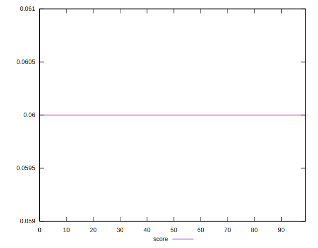

# //uses-long-cache-ttl/samples/pages+cached+noadtech

[→ Parent](../..)


## Raw


```yaml
p90min: 867931.1
p90max: 867933.75
p90range: 2.650000000023283
p90mean: 867932.8760638299
p90median: 867933.75
p90stdev: 1.2458597117994252
p90skewness: -0.7241005154596485
p90eccentricity: 1.0000000000000016
p90discretization: 47
outlandishness: 0.9999901719281107
confidence: 16.536300044139875
p90confidence: 0.5037131652125548

```


## Score


```yaml
p90min: 0.06
p90max: 0.06
p90range: 0
p90mean: 0.05999999999999992
p90median: 0.06
p90stdev: 7.632783294297951e-17
p90skewness: 1
p90eccentricity: 1
p90discretization: 94
outlandishness: 0.9999999999999993
confidence: 3.807995000376758e-17
p90confidence: 3.0860083170995966e-17

```


## Raw Estimate


## Score Estimate


## P Score


```yaml
p90min: 0.055467828591960866
p90max: 0.05546811691389786
p90range: 2.883219369920198e-7
p90mean: 0.05546792367685497
p90median: 0.055467828591960866
p90stdev: 1.355504472917638e-7
p90skewness: 0.7241005157477274
p90eccentricity: 1.0000000000000007
p90discretization: 47
outlandishness: 1.0000167414768033
confidence: 0.0000018001886337802617
p90confidence: 5.480436055893932e-8

```


## Score Difference


```yaml
p90min: 0
p90max: 0
p90range: 0
p90mean: 0
p90median: 0
p90stdev: 0
p90skewness: .nan
p90eccentricity: .nan
p90discretization: 94
outlandishness: .nan
confidence: 0
p90confidence: 0

```


## P Score Difference


```yaml
p90min: -0.004532171408039132
p90max: -0.00453188308610214
p90range: 2.883219369920198e-7
p90mean: -0.004532076323145017
p90median: -0.004532171408039132
p90stdev: 1.3555044729176375e-7
p90skewness: 0.7241005155173713
p90eccentricity: 0.9999999999999989
p90discretization: 47
outlandishness: 0.9997951130039914
confidence: 0.0000018001886337802617
p90confidence: 5.4804360558939295e-8

```

