# //uses-long-cache-ttl/samples/pages+cached

[→ Parent](../..)


## Raw


```yaml
p90min: 1389256.837462089
p90max: 1389271.3877414186
p90range: 14.550279329530895
p90mean: 1389262.1321994003
p90median: 1389262.5877414187
p90stdev: 2.5036558740161663
p90skewness: 1.5053871470783509
p90eccentricity: 0.9999999999999996
p90discretization: 3.032258064516129
outlandishness: 0.9999923175144855
confidence: 21.367484038176876
p90confidence: 1.0122523531017917

```

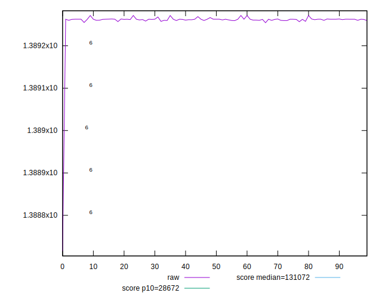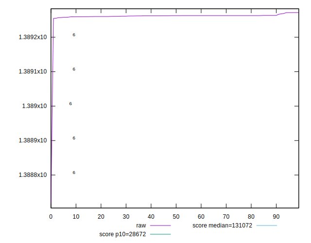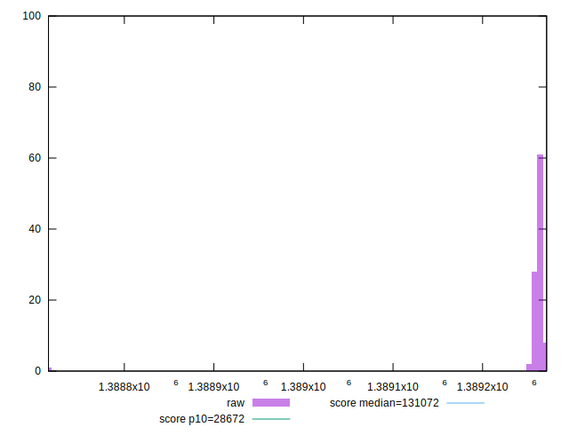
## Score


```yaml
p90min: 0.02
p90max: 0.02
p90range: 0
p90mean: 0.020000000000000014
p90median: 0.02
p90stdev: 1.3877787807814457e-17
p90skewness: -1
p90eccentricity: 1
p90discretization: 94
outlandishness: 1
confidence: 5.439992857681083e-18
p90confidence: 5.610924212908357e-18

```

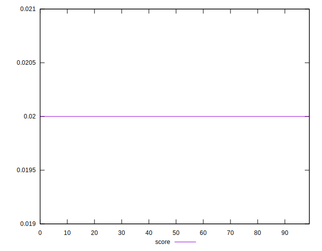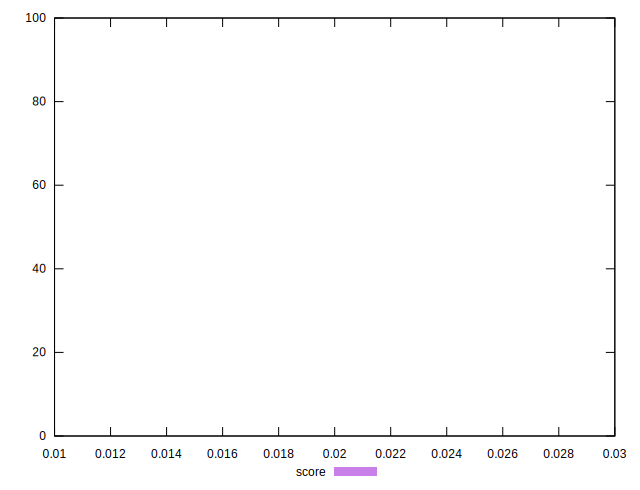
## Raw Estimate

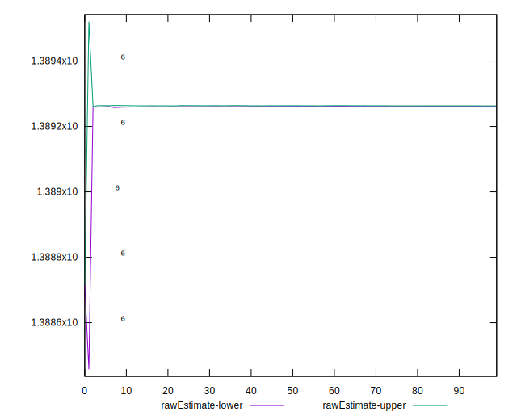
## Score Estimate

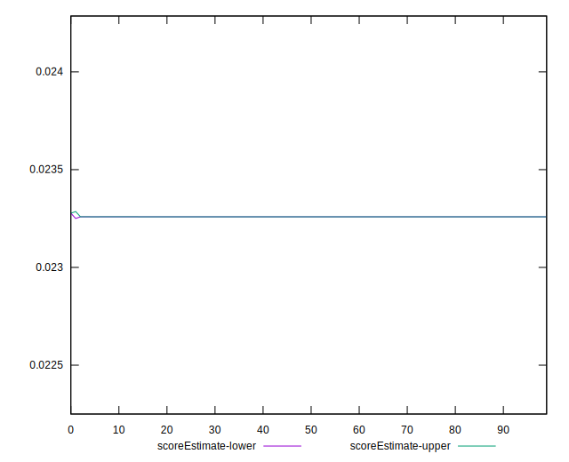
## P Score


```yaml
p90min: 0.023258523270502263
p90max: 0.023259009049481083
p90range: 4.857789788204059e-7
p90mean: 0.023258832276785508
p90median: 0.023258817067701554
p90stdev: 8.358764743788302e-8
p90skewness: -1.5053546560048183
p90eccentricity: 1.0000000000000002
p90discretization: 3.357142857142857
outlandishness: 1.0000153286703146
confidence: 7.137573750100772e-7
p90confidence: 3.379529658503448e-8

```

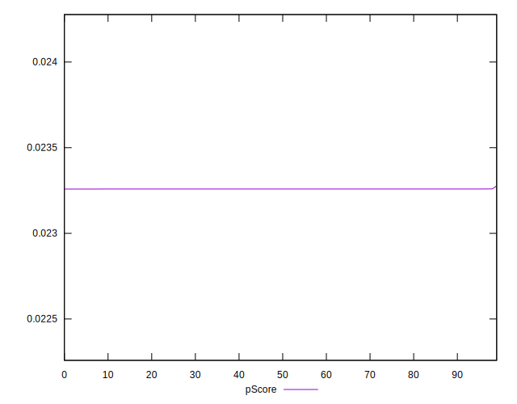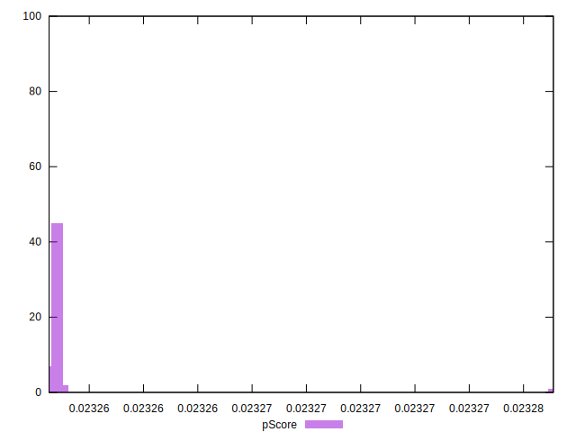
## Score Difference


```yaml
p90min: 0
p90max: 0
p90range: 0
p90mean: 0
p90median: 0
p90stdev: 0
p90skewness: .nan
p90eccentricity: .nan
p90discretization: 94
outlandishness: .nan
confidence: 0
p90confidence: 0

```


## P Score Difference


```yaml
p90min: 0.0032585232705022622
p90max: 0.0032590090494810826
p90range: 4.857789788204059e-7
p90mean: 0.0032588322767855117
p90median: 0.0032588170677015534
p90stdev: 8.3587647437883e-8
p90skewness: -1.5053546561604692
p90eccentricity: 1.0000000000000004
p90discretization: 3.357142857142857
outlandishness: 1.0001094058627633
confidence: 7.137573750100772e-7
p90confidence: 3.3795296585034474e-8

```

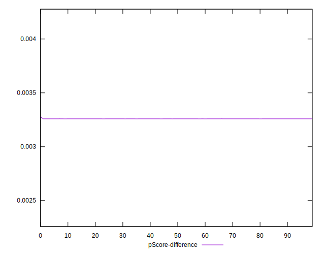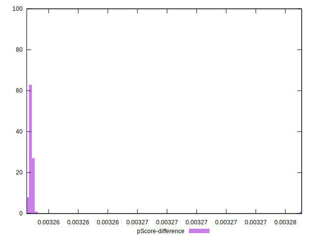