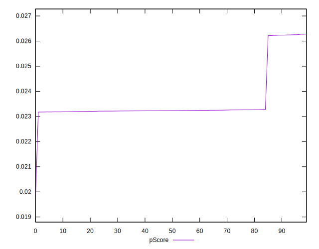

# //uses-long-cache-ttl/samples/pages

[→ Parent](../..)


## Raw


```yaml
p90min: 1306573.3279158906
p90max: 1391703.6263836126
p90range: 85130.29846772202
p90mean: 1379580.155286528
p90median: 1390038.8985763846
p90stdev: 27763.242583438645
p90skewness: -2.228433846821696
p90eccentricity: 1.0000000000000002
p90discretization: 1
outlandishness: 0.9989708451333911
confidence: 12675.335972660956
p90confidence: 11224.948255264964

```


## Score


```yaml
p90min: 0.02
p90max: 0.03
p90range: 0.009999999999999998
p90mean: 0.021276595744680864
p90median: 0.02
p90stdev: 0.0033371036470974695
p90skewness: 2.231518495721676
p90eccentricity: 1.000000000000006
p90discretization: 47
outlandishness: 1.02111025
confidence: 0.001399694251811446
p90confidence: 0.0013492233714613023

```


## Raw Estimate


## Score Estimate


## P Score


```yaml
p90min: 0.023177511149618468
p90max: 0.026255465318909932
p90range: 0.0030779541692914636
p90mean: 0.023611897947321284
p90median: 0.023232918286795384
p90stdev: 0.0010047144217081876
p90skewness: 2.2289279022035093
p90eccentricity: 0.9999999999999999
p90discretization: 1
outlandishness: 1.002797388559449
confidence: 0.00044863039482128135
p90confidence: 0.000406215785533652

```


## Score Difference


```yaml
p90min: 0
p90max: 0
p90range: 0
p90mean: 0
p90median: 0
p90stdev: 0
p90skewness: .nan
p90eccentricity: .nan
p90discretization: 94
outlandishness: .nan
confidence: 0
p90confidence: 0

```


## P Score Difference


```yaml
p90min: -0.003771154870800514
p90max: 0.0032676791389011535
p90range: 0.007038834009701667
p90mean: 0.0022979395404044665
p90median: 0.0032212575707576303
p90stdev: 0.0023399263425374077
p90skewness: -2.162625738136091
p90eccentricity: 0.9999999999999988
p90discretization: 1
outlandishness: 0.8712387629175786
confidence: 0.0009807687121514736
p90confidence: 0.0009460549154939759

```

