# //uses-rel-preconnect/samples/pages+cached+noadtech+nomedia+nocss

[→ Parent](../..)


## Raw


```yaml
p90min: 0
p90max: 328.808
p90range: 328.808
p90mean: 217.67519148937097
p90median: 248.19350000051782
p90stdev: 91.41383106492516
p90skewness: -0.6717818012470307
p90eccentricity: 1.0000000000000007
p90discretization: 1.1058823529411765
outlandishness: 0.9896381865928957
confidence: 39.79497970601852
p90confidence: 36.95949853247391

```

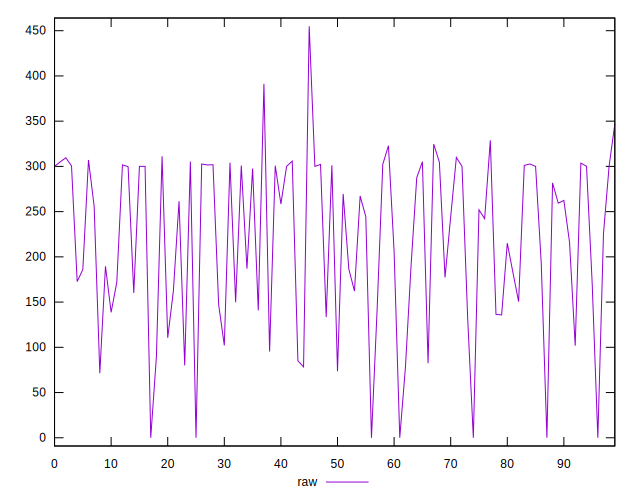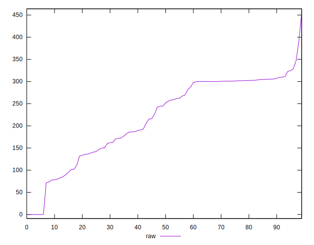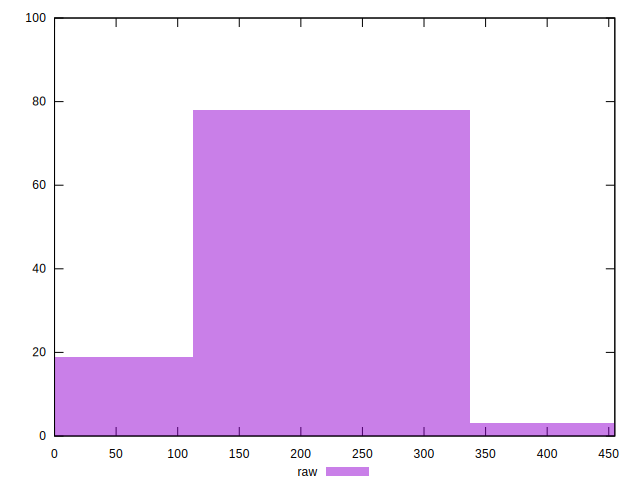
## Score


```yaml
p90min: 0.73
p90max: 1
p90range: 0.27
p90mean: 0.8194680851063828
p90median: 0.795
p90stdev: 0.07548942466835146
p90skewness: 0.6898965058010217
p90eccentricity: 1.0000000000000004
p90discretization: 4.2727272727272725
outlandishness: 1.0039868296203416
confidence: 0.03239053819950952
p90confidence: 0.03052110657374864

```

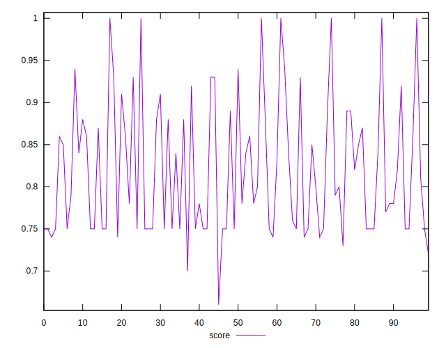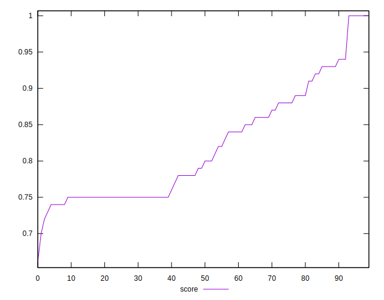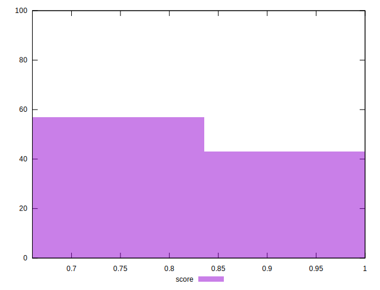
## Raw Estimate

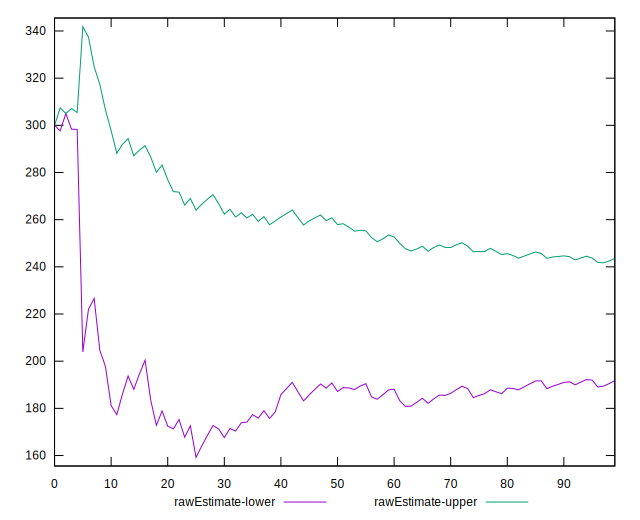
## Score Estimate

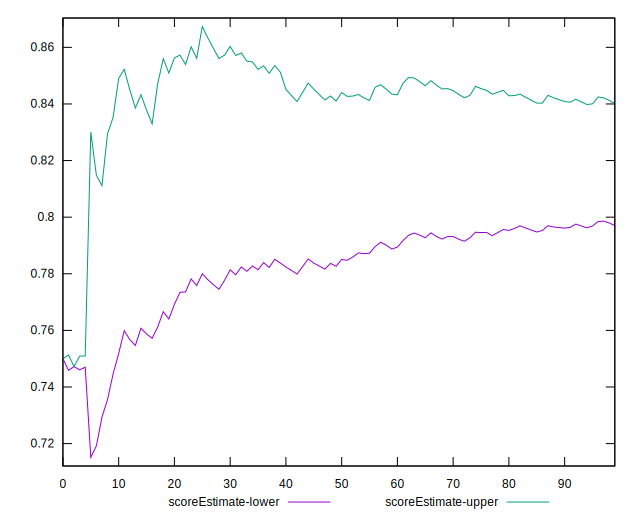
## P Score


```yaml
p90min: 0.7339955555555555
p90max: 1
p90range: 0.2660044444444445
p90mean: 0.8191009869976278
p90median: 0.7931720833329018
p90stdev: 0.07565911850325048
p90skewness: 0.6876848311747761
p90eccentricity: 1.0000000000000004
p90discretization: 1.1058823529411765
outlandishness: 1.0042194603291068
confidence: 0.03240608935757649
p90confidence: 0.030589715437077718

```

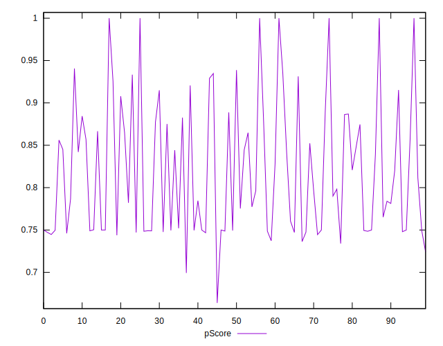
## Score Difference


```yaml
p90min: 0
p90max: 1.1102230246251565e-16
p90range: 1.1102230246251565e-16
p90mean: 4.724353296277262e-18
p90median: 0
p90stdev: 2.240957533134066e-17
p90skewness: 4.532597979574665
p90eccentricity: 0.9999999999999997
p90discretization: 47
outlandishness: 2.706025000000001
confidence: 1.1103983576888548e-17
p90confidence: 9.060408659427041e-18

```

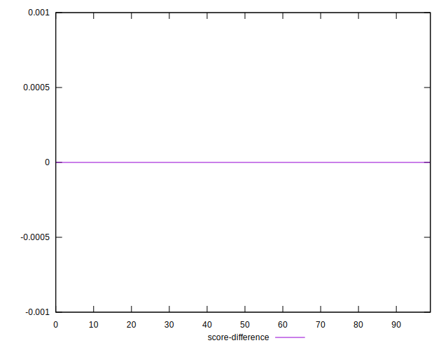
## P Score Difference


```yaml
p90min: -0.004774999999596519
p90max: 0.004711666665971226
p90range: 0.009486666665567745
p90mean: -0.00028777482271212724
p90median: -0.00017000000000000348
p90stdev: 0.002542277876939493
p90skewness: 0.3677673339194604
p90eccentricity: 0.9999999999999999
p90discretization: 1.1604938271604939
outlandishness: 0.8983052306187942
confidence: 0.0010729983568677013
p90confidence: 0.0010278676034827991

```

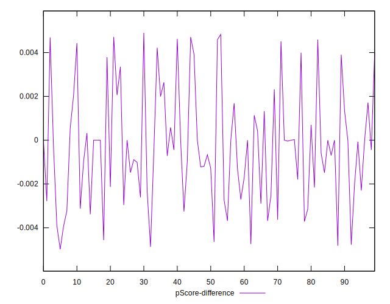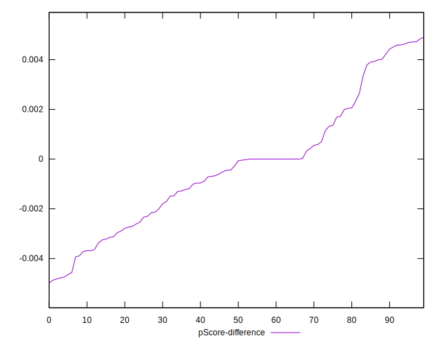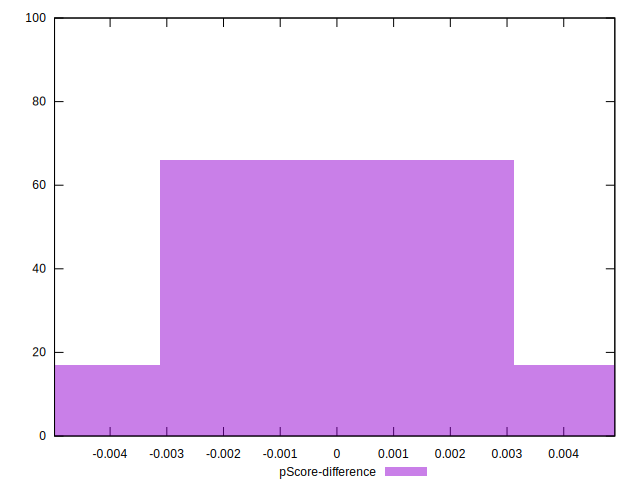