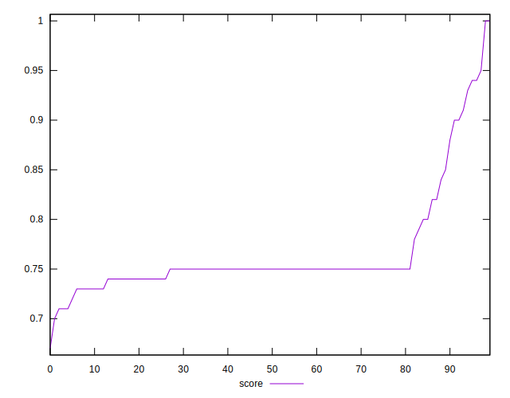

# //uses-rel-preconnect/samples/pages+cached+noadtech+nomedia

[→ Parent](../..)


## Raw


```yaml
p90min: 69.69600000046194
p90max: 364.422
p90range: 294.7259999995381
p90mean: 286.8050744681063
p90median: 301.938
p90stdev: 59.723321578964274
p90skewness: -2.333527747395588
p90eccentricity: 1.0000000000000007
p90discretization: 1.1325301204819278
outlandishness: 0.9694474156061583
confidence: 30.161797646146077
p90confidence: 24.14671817752029

```


## Score


```yaml
p90min: 0.71
p90max: 0.94
p90range: 0.22999999999999998
p90mean: 0.7634042553191488
p90median: 0.75
p90stdev: 0.04825802086324037
p90skewness: 2.470099285300869
p90eccentricity: 1.0000000000000002
p90discretization: 5.875
outlandishness: 1.0118128305875904
confidence: 0.02414048740914428
p90confidence: 0.019511185894925034

```


## Raw Estimate


## Score Estimate


## P Score


```yaml
p90min: 0.71421
p90max: 0.9419199999996151
p90range: 0.22770999999961505
p90mean: 0.7632125768321376
p90median: 0.7489233333333334
p90stdev: 0.0482600790398175
p90skewness: 2.4953063253324235
p90eccentricity: 1.0000000000000002
p90discretization: 1.1325301204819278
outlandishness: 1.0116128874769237
confidence: 0.024123495099377893
p90confidence: 0.01951201803567765

```


## Score Difference


```yaml
p90min: 0
p90max: 1.1102230246251565e-16
p90range: 1.1102230246251565e-16
p90mean: 3.543264972207946e-18
p90median: 0
p90stdev: 1.9514781802162963e-17
p90skewness: 5.326002287485497
p90eccentricity: 1.0000000000000044
p90discretization: 47
outlandishness: 3.5344000000000007
confidence: 1.0335413782903689e-17
p90confidence: 7.89001555865578e-18

```


## P Score Difference


```yaml
p90min: -0.004637777777777741
p90max: 0.0042255555555555935
p90range: 0.008863333333333334
p90mean: -0.0002815691489374219
p90median: -0.0002383333333333404
p90stdev: 0.0021578754483885473
p90skewness: 0.20011568372367736
p90eccentricity: 0.9999999999999992
p90discretization: 1.1604938271604939
outlandishness: 0.9104339777075129
confidence: 0.0009370371709891915
p90confidence: 0.0008724499732577014

```

