# //uses-rel-preconnect/samples/pages+cached+noadtech

[→ Parent](../..)


## Raw


```yaml
p90min: 0
p90max: 379.15
p90range: 379.15
p90mean: 280.76747872339917
p90median: 301.591
p90stdev: 77.79553678573947
p90skewness: -2.4901095041579215
p90eccentricity: 1.0000000000000002
p90discretization: 1.1604938271604939
outlandishness: 0.9666268762930178
confidence: 36.12309183271775
p90confidence: 31.453490070046783

```

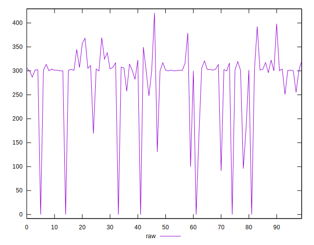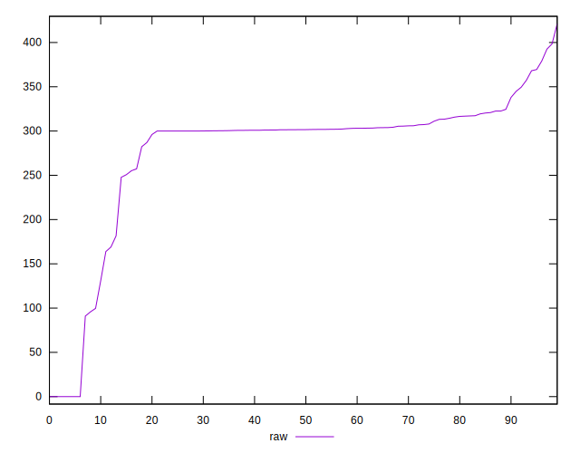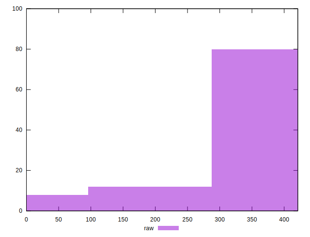
## Score


```yaml
p90min: 0.71
p90max: 1
p90range: 0.29000000000000004
p90mean: 0.7689361702127662
p90median: 0.75
p90stdev: 0.06293306280361198
p90skewness: 2.6393256163810914
p90eccentricity: 0.9999999999999991
p90discretization: 7.833333333333333
outlandishness: 1.012167391093298
confidence: 0.029010221384398
p90confidence: 0.025444447686282838

```

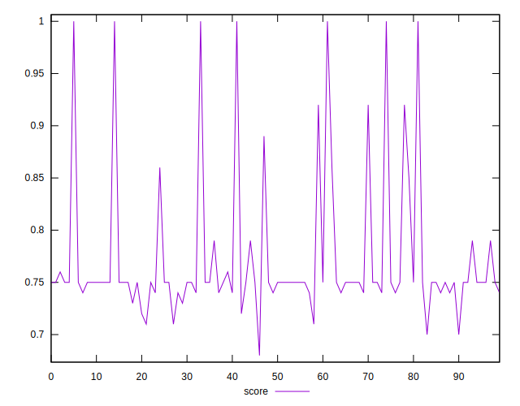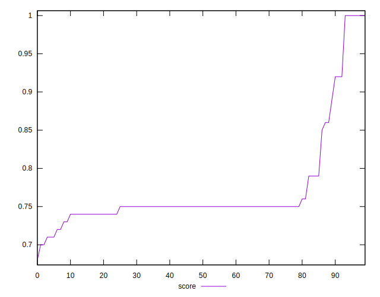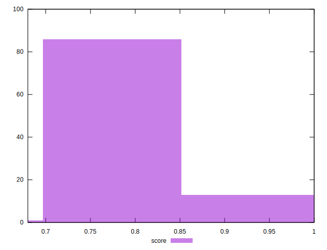
## Raw Estimate

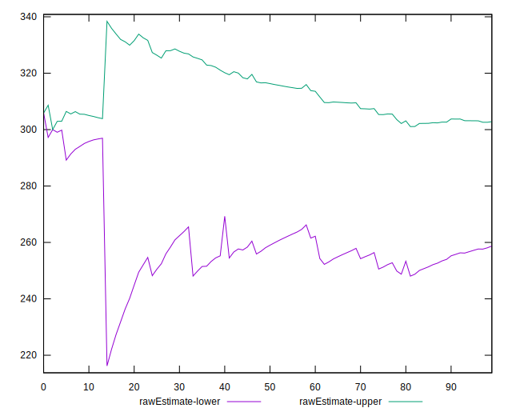
## Score Estimate

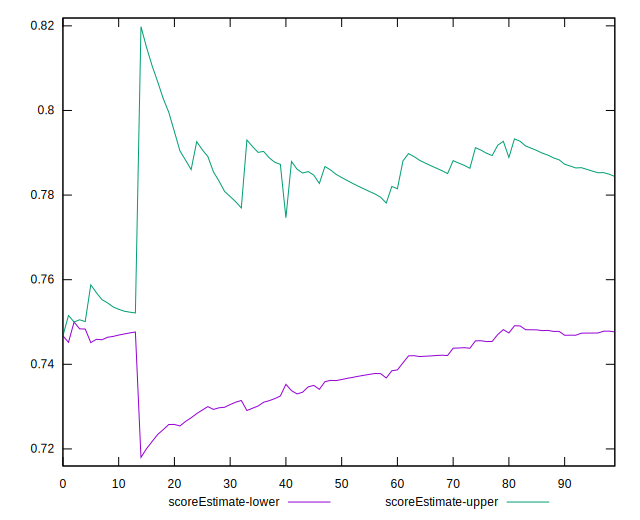
## P Score


```yaml
p90min: 0.7060277777777778
p90max: 1
p90range: 0.2939722222222222
p90mean: 0.7683440277777813
p90median: 0.7491161111111111
p90stdev: 0.06323602166177412
p90skewness: 2.633036303044111
p90eccentricity: 1.0000000000000009
p90discretization: 1.1604938271604939
outlandishness: 1.0121807267704253
confidence: 0.029130073128687574
p90confidence: 0.025566936891069487

```

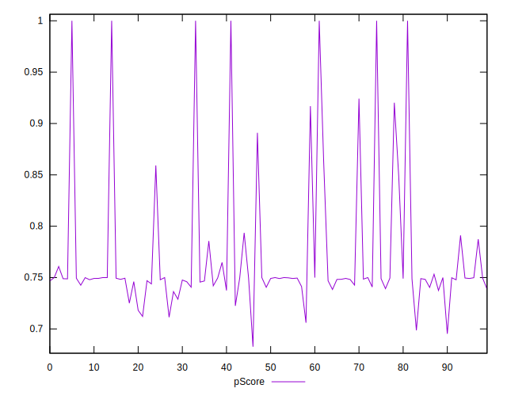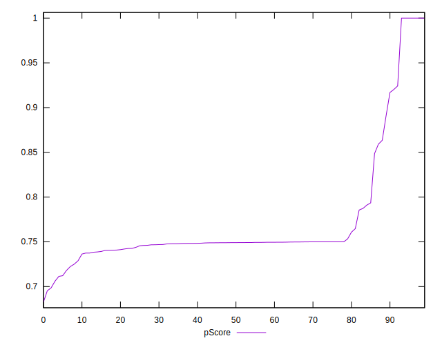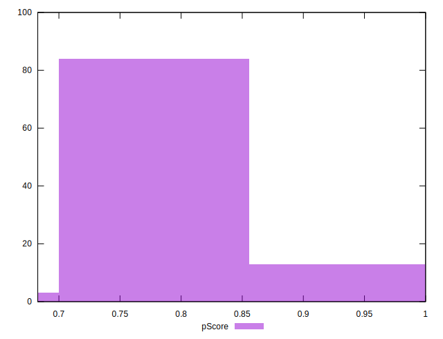
## Score Difference


```yaml
p90min: 0
p90max: 0
p90range: 0
p90mean: 0
p90median: 0
p90stdev: 0
p90skewness: .nan
p90eccentricity: .nan
p90discretization: 94
outlandishness: .inf
confidence: 6.092792000602807e-18
p90confidence: 0

```

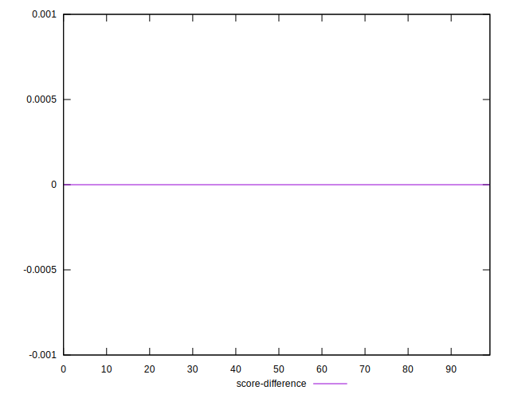
## P Score Difference


```yaml
p90min: -0.004402222222222196
p90max: 0.003540833333196658
p90range: 0.007943055555418854
p90mean: -0.0006149290780180819
p90median: -0.0005522222222222317
p90stdev: 0.0016597549176994603
p90skewness: 0.1805668185103534
p90eccentricity: 1
p90discretization: 1.2207792207792207
outlandishness: 0.9225673951618252
confidence: 0.0007644781602113683
p90confidence: 0.0006710550113736203

```

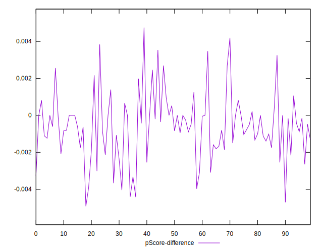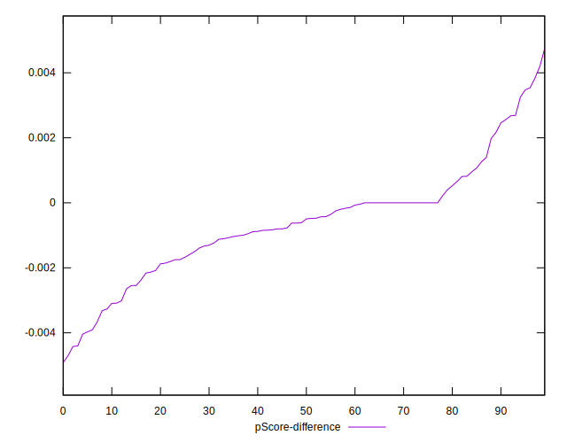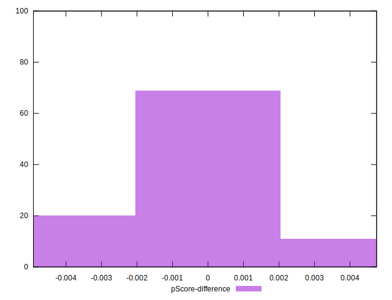