# //uses-rel-preconnect/samples/pages+cached

[→ Parent](../..)


## Raw


```yaml
p90min: 273.1619999995455
p90max: 389.74800000000005
p90range: 116.58600000045453
p90mean: 313.78230851065507
p90median: 305.347
p90stdev: 19.90150798470127
p90skewness: 1.8669983235190917
p90eccentricity: 1.0000000000000007
p90discretization: 1.032967032967033
outlandishness: 1.011857800756115
confidence: 11.111187658769838
p90confidence: 8.046372705156315

```

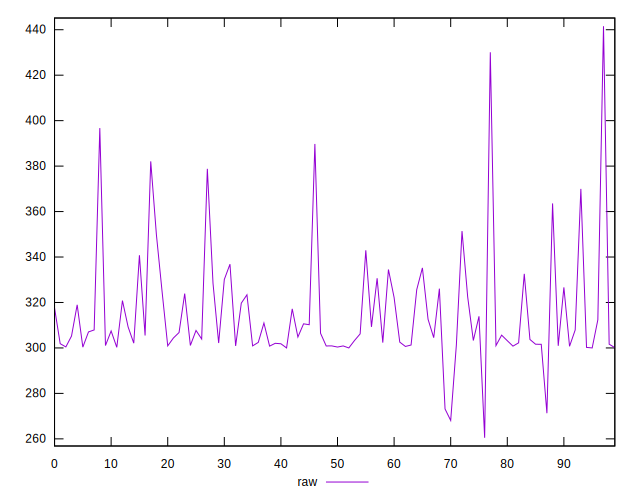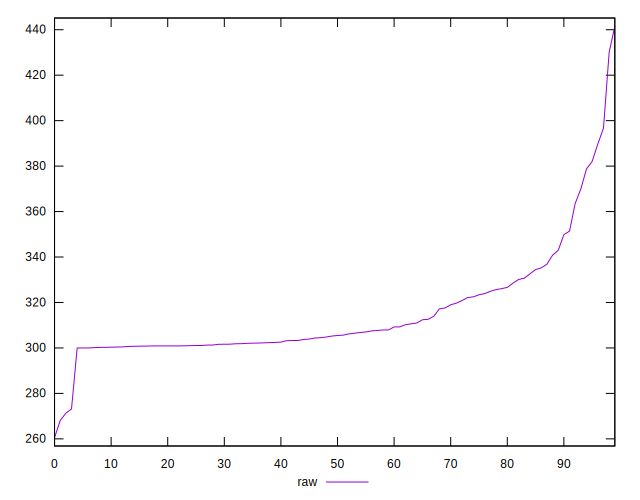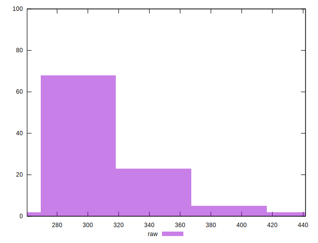
## Score


```yaml
p90min: 0.7
p90max: 0.77
p90range: 0.07000000000000006
p90mean: 0.7430851063829786
p90median: 0.75
p90stdev: 0.011852515286035451
p90skewness: -1.7632650536805372
p90eccentricity: 1.0000000000000016
p90discretization: 13.428571428571429
outlandishness: 0.9978880167984464
confidence: 0.006532416181153703
p90confidence: 0.004792086889009442

```

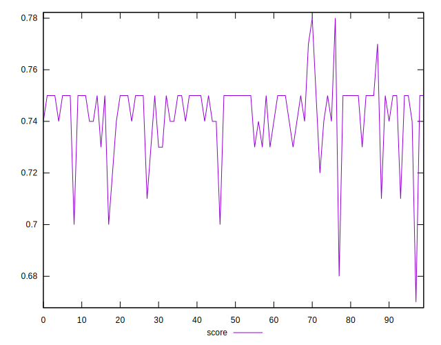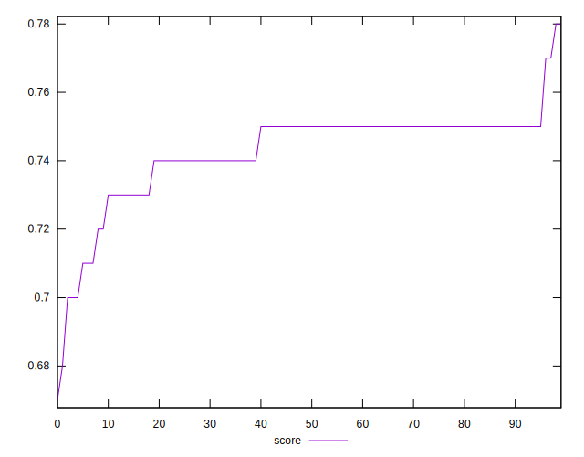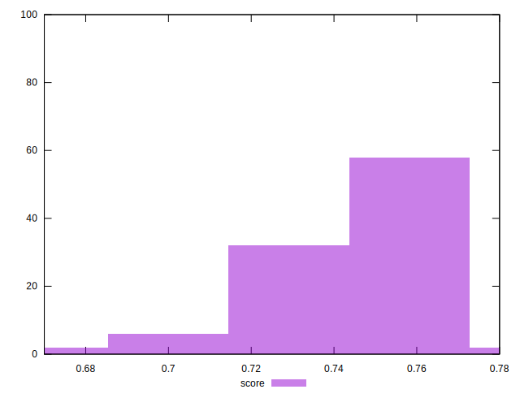
## Raw Estimate

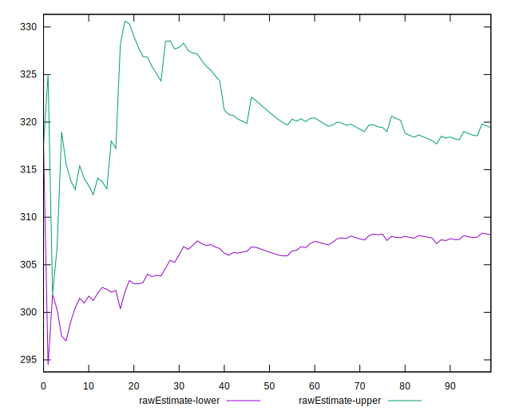
## Score Estimate

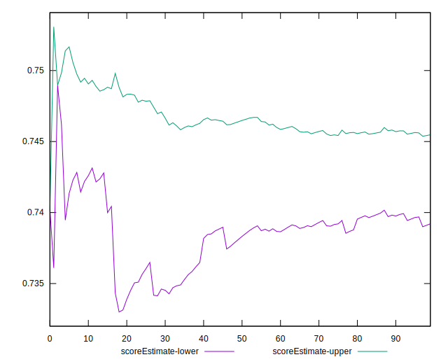
## P Score


```yaml
p90min: 0.70014
p90max: 0.7723650000003788
p90range: 0.07222500000037879
p90mean: 0.7424224704491647
p90median: 0.7470294444444444
p90stdev: 0.011243143381343431
p90skewness: -1.680143648529787
p90eccentricity: 0.9999999999999994
p90discretization: 1.032967032967033
outlandishness: 0.9979616023201366
confidence: 0.006439927077595015
p90confidence: 0.004545711917576512

```

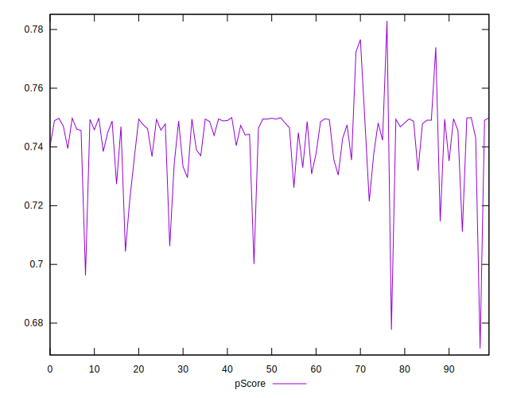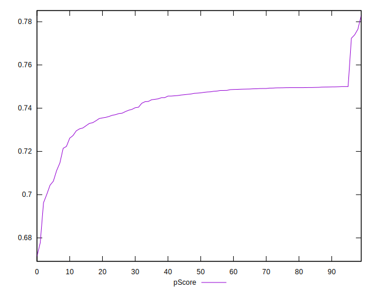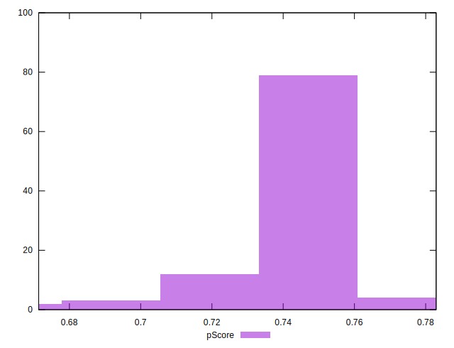
## Score Difference


```yaml
p90min: 0
p90max: 0
p90range: 0
p90mean: 0
p90median: 0
p90stdev: 0
p90skewness: .nan
p90eccentricity: .nan
p90discretization: 94
outlandishness: .inf
confidence: 7.423946114831066e-18
p90confidence: 0

```

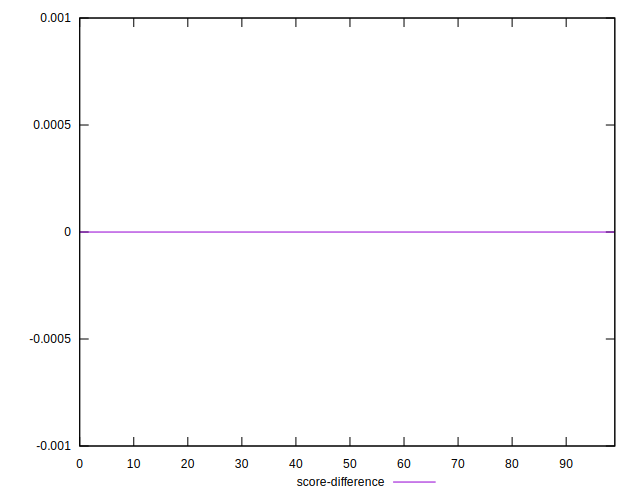
## P Score Difference


```yaml
p90min: -0.004396666666666604
p90max: 0.004395555555555597
p90range: 0.008792222222222201
p90mean: -0.0006826093380630015
p90median: -0.000594444444444453
p90stdev: 0.002216710484108826
p90skewness: 0.5011346473247865
p90eccentricity: 0.9999999999999991
p90discretization: 1.032967032967033
outlandishness: 0.8642597332658007
confidence: 0.0009578795601899702
p90confidence: 0.0008962375488469717

```

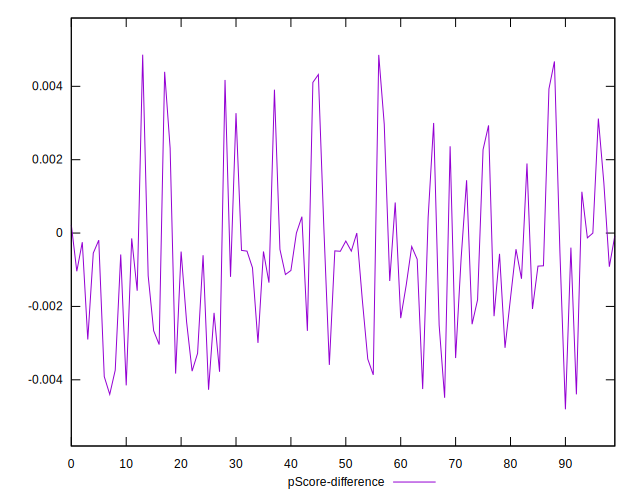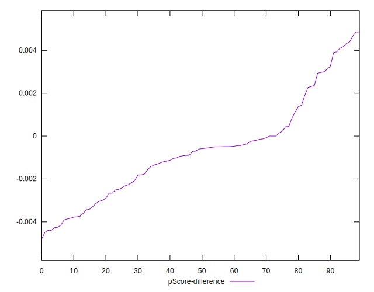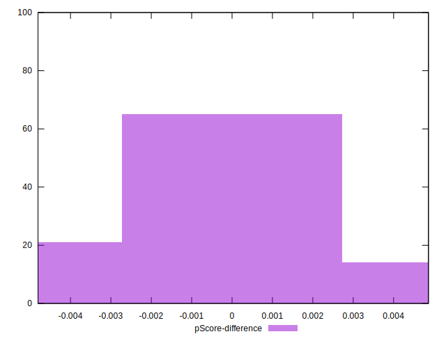