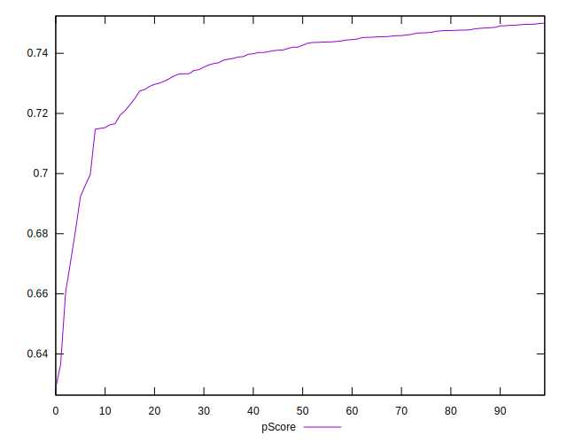

# //uses-rel-preconnect/samples/pages

[→ Parent](../..)


## Raw


```yaml
p90min: 300.644
p90max: 442.84
p90range: 142.19599999999997
p90mean: 323.2837021276598
p90median: 313.721
p90stdev: 26.822476925145942
p90skewness: 2.255120665524094
p90eccentricity: 1.0000000000000002
p90discretization: 1
outlandishness: 1.0276830854916161
confidence: 15.530149894011481
p90confidence: 10.844587575026368

```


## Score


```yaml
p90min: 0.67
p90max: 0.75
p90range: 0.07999999999999996
p90mean: 0.7375531914893615
p90median: 0.74
p90stdev: 0.015484114729726462
p90skewness: -2.0465711584492916
p90eccentricity: 0.9999999999999996
p90discretization: 10.444444444444445
outlandishness: 0.9933588201875945
confidence: 0.008721201067869923
p90confidence: 0.0062603777673810295

```


## Raw Estimate


## Score Estimate


## P Score


```yaml
p90min: 0.6706444444444445
p90max: 0.7496422222222222
p90range: 0.07899777777777772
p90mean: 0.737064609929078
p90median: 0.7423772222222222
p90stdev: 0.01490137606952552
p90skewness: -2.2551206655240272
p90eccentricity: 1.0000000000000002
p90discretization: 1
outlandishness: 0.9933116758219129
confidence: 0.008627861052228599
p90confidence: 0.006024770875014647

```


## Score Difference


```yaml
p90min: 0
p90max: 0
p90range: 0
p90mean: 0
p90median: 0
p90stdev: 0
p90skewness: .nan
p90eccentricity: .nan
p90discretization: 94
outlandishness: .inf
confidence: 7.423946114831068e-18
p90confidence: 0

```


## P Score Difference


```yaml
p90min: -0.004684444444444491
p90max: 0.0045544444444444165
p90range: 0.009238888888888908
p90mean: -0.000535992907801592
p90median: -0.0006711111111111223
p90stdev: 0.0026665719298019086
p90skewness: 0.3006280059932882
p90eccentricity: 0.9999999999999999
p90discretization: 1.010752688172043
outlandishness: 0.8855496904929677
confidence: 0.0011151845380391108
p90confidence: 0.0010781208945969303

```

