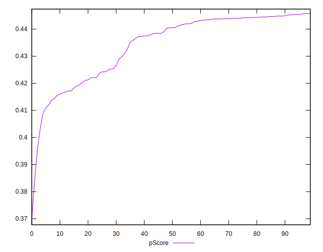

# //uses-rel-preload/samples/pages+cached+noadtech+nomedia+nocss

[→ Parent](../..)


## Raw


```yaml
p90min: 1213
p90max: 1573
p90range: 360
p90mean: 1304.1702127659576
p90median: 1255.5
p90stdev: 97.15611896914274
p90skewness: 0.899537453946307
p90eccentricity: 1.0000000000000004
p90discretization: 1.4242424242424243
outlandishness: 1.0160893909182172
confidence: 48.21644550203675
p90confidence: 39.28116122723875

```


## Score


```yaml
p90min: 0.4
p90max: 0.45
p90range: 0.04999999999999999
p90mean: 0.4338297872340428
p90median: 0.44
p90stdev: 0.011022837316586057
p90skewness: -0.9412884859057502
p90eccentricity: 1.0000000000000007
p90discretization: 15.666666666666666
outlandishness: 0.9952582093030914
confidence: 0.0055734704276295425
p90confidence: 0.004456640038822056

```


## Raw Estimate


## Score Estimate


## P Score


```yaml
p90min: 0.4031764705882353
p90max: 0.4455294117647059
p90range: 0.04235294117647059
p90mean: 0.4348035043804756
p90median: 0.4405294117647059
p90stdev: 0.011430131643428562
p90skewness: -0.8995374539462533
p90eccentricity: 1
p90discretization: 1.4242424242424243
outlandishness: 0.9943530872954036
confidence: 0.0056725230002396205
p90confidence: 0.004621313085557502

```


## Score Difference


```yaml
p90min: 0
p90max: 5.551115123125783e-17
p90range: 5.551115123125783e-17
p90mean: 1.1810883240693154e-18
p90median: 0
p90stdev: 8.010530753054493e-18
p90skewness: 6.634888026970373
p90eccentricity: 0.9999999999999988
p90discretization: 47
outlandishness: 5.522500000000001
confidence: 4.7424758240429775e-18
p90confidence: 3.2387352784895233e-18

```


## P Score Difference


```yaml
p90min: -0.004705882352941171
p90max: 0.0048235294117647265
p90range: 0.009529411764705897
p90mean: 0.0008210262828535699
p90median: 0.0016470588235294181
p90stdev: 0.0032017709670742267
p90skewness: -0.40306841884431927
p90eccentricity: 0.9999999999999997
p90discretization: 1.7407407407407407
outlandishness: 0.888996017995241
confidence: 0.0013040405608785853
p90confidence: 0.001294507056321175

```

