# //uses-rel-preload/samples/pages+cached+noadtech+nomedia

[→ Parent](../..)


## Raw


```yaml
p90min: 971
p90max: 1423
p90range: 452
p90mean: 1187.3297872340424
p90median: 1176
p90stdev: 97.98256339646338
p90skewness: 0.20625115081120496
p90eccentricity: 1.0000000000000002
p90discretization: 1.0681818181818181
outlandishness: 0.9713206361297048
confidence: 78.64527130092488
p90confidence: 39.61530072498099

```

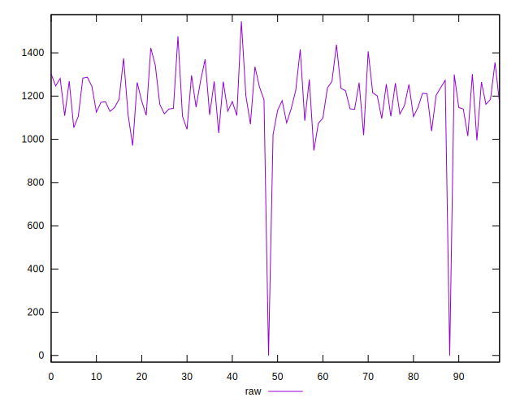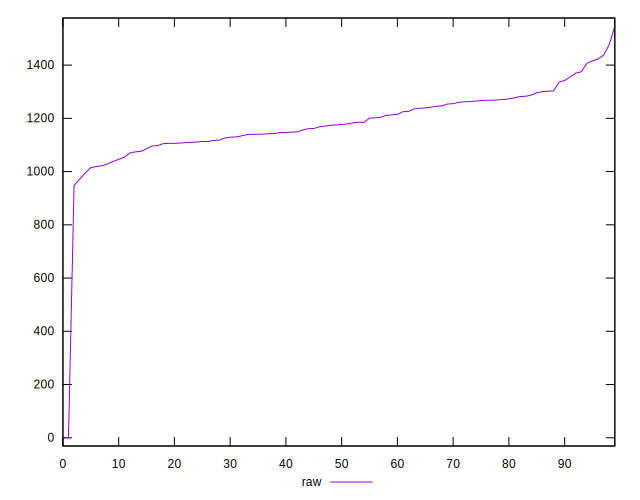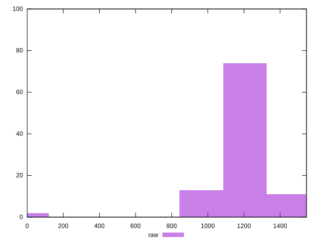
## Score


```yaml
p90min: 0.42
p90max: 0.47
p90range: 0.04999999999999999
p90mean: 0.4488297872340428
p90median: 0.45
p90stdev: 0.011747012565331227
p90skewness: -0.16611723462552985
p90eccentricity: 1.0000000000000007
p90discretization: 15.666666666666666
outlandishness: 1.0462879942040322
confidence: 0.030736309932588444
p90confidence: 0.00474943111574609

```

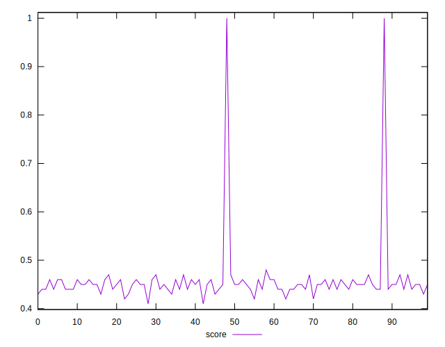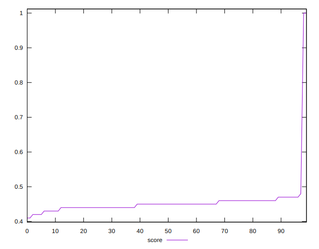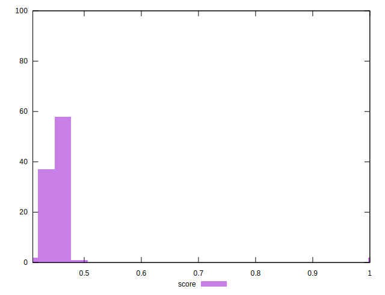
## Raw Estimate

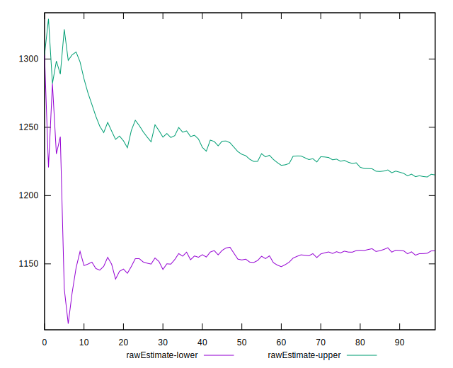
## Score Estimate

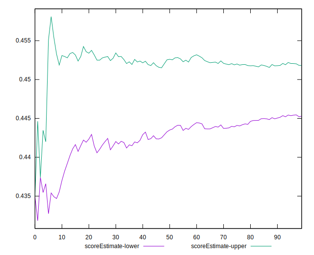
## P Score


```yaml
p90min: 0.4208235294117647
p90max: 0.474
p90range: 0.05317647058823527
p90mean: 0.4485494367959949
p90median: 0.4498823529411765
p90stdev: 0.011527360399583925
p90skewness: -0.20625115081117884
p90eccentricity: 0.9999999999999999
p90discretization: 1.0681818181818181
outlandishness: 1.046238365566371
confidence: 0.03073529346369189
p90confidence: 0.004660623614703646

```

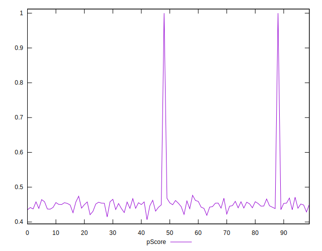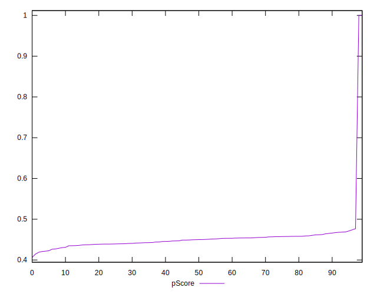
## Score Difference


```yaml
p90min: 0
p90max: 5.551115123125783e-17
p90range: 5.551115123125783e-17
p90mean: 4.133809134242604e-18
p90median: 0
p90stdev: 1.457340475159285e-17
p90skewness: 3.241763593892418
p90eccentricity: 0.9999999999999976
p90discretization: 47
outlandishness: 1.8032653061224493
confidence: 6.527991429217294e-18
p90confidence: 5.892168890144142e-18

```

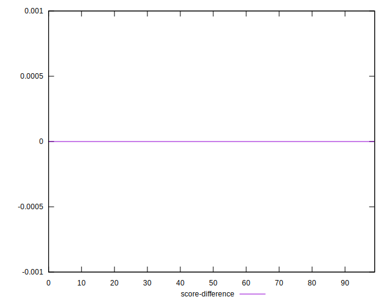
## P Score Difference


```yaml
p90min: -0.004705882352941171
p90max: 0.004235294117647059
p90range: 0.00894117647058823
p90mean: -0.0003141426783479382
p90median: -0.0006470588235294172
p90stdev: 0.0025700457836975964
p90skewness: 0.18260188354427714
p90eccentricity: 1
p90discretization: 1.4461538461538461
outlandishness: 0.8977373755972091
confidence: 0.0010797922424689694
p90confidence: 0.0010390944375091194

```

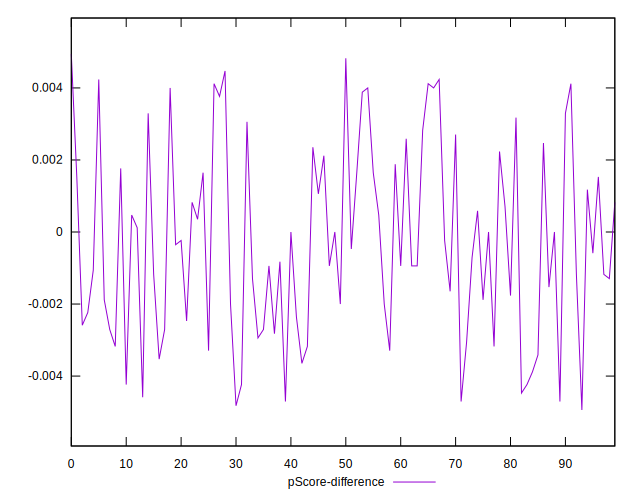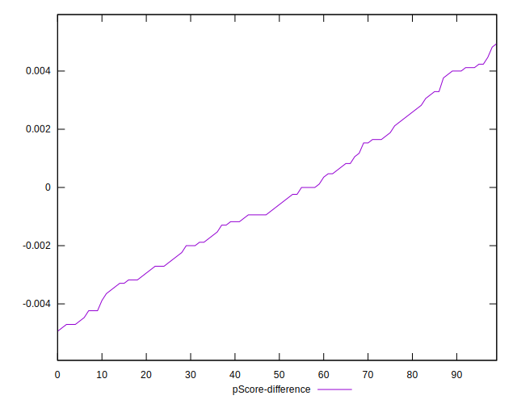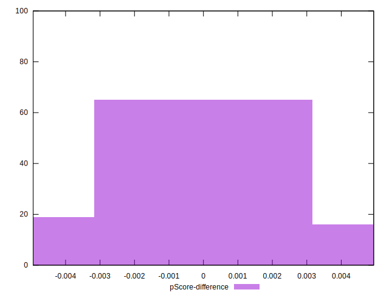