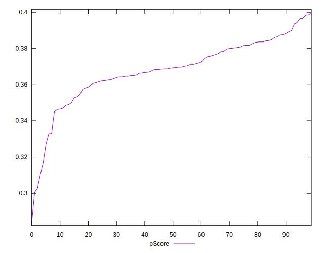

# //uses-rel-preload/samples/pages+cached+noadtech

[→ Parent](../..)


## Raw


```yaml
p90min: 1629
p90max: 2361
p90range: 732
p90mean: 1866.212765957447
p90median: 1862
p90stdev: 136.3820410230983
p90skewness: 1.060322652224083
p90eccentricity: 1.0000000000000004
p90discretization: 1.1058823529411765
outlandishness: 1.0116802060301973
confidence: 68.94808272920392
p90confidence: 55.140581970238046

```


## Score


```yaml
p90min: 0.31
p90max: 0.4
p90range: 0.09000000000000002
p90mean: 0.3685106382978722
p90median: 0.37
p90stdev: 0.016108504877232088
p90skewness: -0.9485780418607013
p90eccentricity: 0.9999999999999994
p90discretization: 10.444444444444445
outlandishness: 0.9928994853031374
confidence: 0.008261288882007469
p90confidence: 0.006512824760047109

```


## Raw Estimate


## Score Estimate


## P Score


```yaml
p90min: 0.3104705882352941
p90max: 0.39658823529411763
p90range: 0.08611764705882352
p90mean: 0.36868085106382964
p90median: 0.36917647058823533
p90stdev: 0.016044946002717452
p90skewness: -1.0603226522240672
p90eccentricity: 1.0000000000000004
p90discretization: 1.1058823529411765
outlandishness: 0.9930764977123545
confidence: 0.008111539144612226
p90confidence: 0.006487127290616241

```


## Score Difference


```yaml
p90min: 0
p90max: 5.551115123125783e-17
p90range: 5.551115123125783e-17
p90mean: 4.133809134242604e-18
p90median: 0
p90stdev: 1.4573404751592843e-17
p90skewness: 3.2417635938924234
p90eccentricity: 0.9999999999999983
p90discretization: 47
outlandishness: 1.8032653061224493
confidence: 6.5279914292172965e-18
p90confidence: 5.89216889014414e-18

```


## P Score Difference


```yaml
p90min: -0.004352941176470615
p90max: 0.004588235294117671
p90range: 0.008941176470588286
p90mean: 0.00020901126408010066
p90median: 0.00005882352941177782
p90stdev: 0.0026369940350971497
p90skewness: 0.08939168787017691
p90eccentricity: 1
p90discretization: 1.540983606557377
outlandishness: 0.937302248198211
confidence: 0.0011033212762763275
p90confidence: 0.0010661622648885025

```

