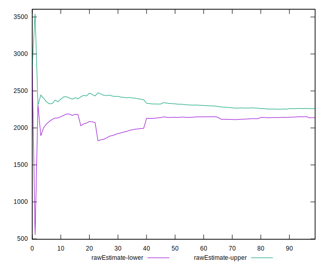

# //uses-rel-preload/samples/pages+cached

[→ Parent](../..)


## Raw


```yaml
p90min: 1280
p90max: 2692
p90range: 1412
p90mean: 2201.021276595745
p90median: 2192.5
p90stdev: 213.33127663298612
p90skewness: -1.372979757953387
p90eccentricity: 1.0000000000000004
p90discretization: 1.0561797752808988
outlandishness: 0.9677688173101864
confidence: 163.7034067125431
p90confidence: 86.25190426651868

```


## Score


```yaml
p90min: 0.27
p90max: 0.44
p90range: 0.16999999999999998
p90mean: 0.3290425531914892
p90median: 0.33
p90stdev: 0.025267469159702804
p90skewness: 1.4649605503151681
p90eccentricity: 0.9999999999999992
p90discretization: 7.833333333333333
outlandishness: 1.0771527219196613
confidence: 0.0390672497630686
p90confidence: 0.010215882853264269

```


## Raw Estimate


## Score Estimate


## P Score


```yaml
p90min: 0.2715294117647059
p90max: 0.4376470588235294
p90range: 0.16611764705882348
p90mean: 0.32929161451814776
p90median: 0.3302941176470588
p90stdev: 0.02509779725093955
p90skewness: 1.3729797579533731
p90eccentricity: 1.0000000000000002
p90discretization: 1.0561797752808988
outlandishness: 1.0769990896021897
confidence: 0.039067259150972374
p90confidence: 0.010147282854884553

```


## Score Difference


```yaml
p90min: 0
p90max: 5.551115123125783e-17
p90range: 5.551115123125783e-17
p90mean: 4.724353296277262e-18
p90median: 0
p90stdev: 1.5489828153710842e-17
p90skewness: 2.9737221214857903
p90eccentricity: 0.9999999999999967
p90discretization: 47
outlandishness: 1.67055625
confidence: 6.808472172051192e-18
p90confidence: 6.26268776011305e-18

```


## P Score Difference


```yaml
p90min: -0.004588235294117615
p90max: 0.004235294117647059
p90range: 0.008823529411764675
p90mean: 0.0002565707133917322
p90median: 0.0003529411764706114
p90stdev: 0.002551737358617235
p90skewness: -0.17741744857826341
p90eccentricity: 1
p90discretization: 1.3623188405797102
outlandishness: 0.8326339940511513
confidence: 0.0010689650333666114
p90confidence: 0.001031692163673676

```

