# //uses-rel-preload/samples/pages

[→ Parent](../..)


## Raw


```yaml
p90min: 0
p90max: 2981
p90range: 2981
p90mean: 1755.063829787234
p90median: 2399.5
p90stdev: 1131.6965498896518
p90skewness: -0.8067419706261495
p90eccentricity: 1.0000000000000007
p90discretization: 1.5161290322580645
outlandishness: 0.9900040116038197
confidence: 457.279330736718
p90confidence: 457.5558915712162

```

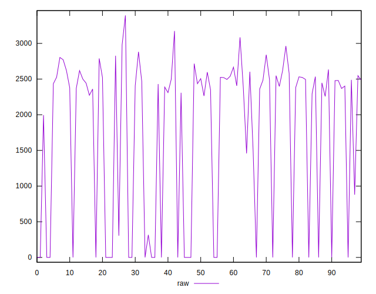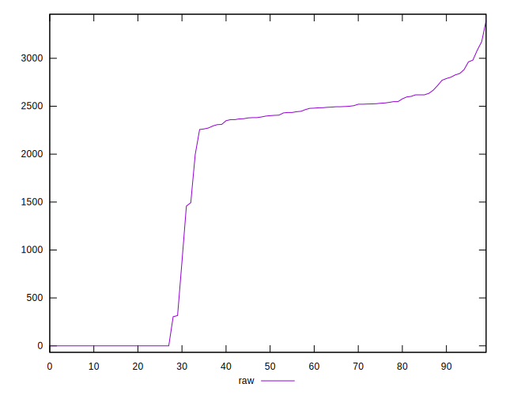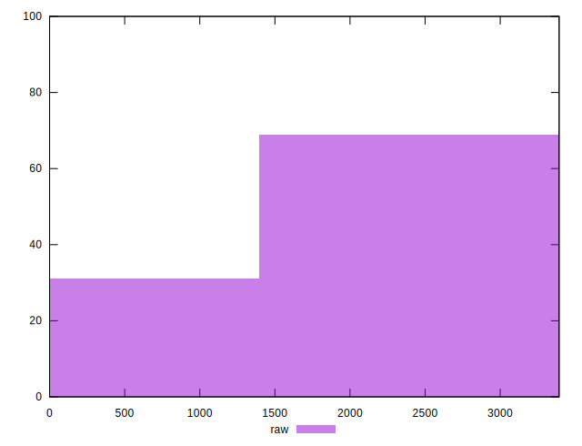
## Score


```yaml
p90min: 0.24
p90max: 1
p90range: 0.76
p90mean: 0.49553191489361686
p90median: 0.31
p90stdev: 0.31185313312682
p90skewness: 0.9450138284838734
p90eccentricity: 0.9999999999999997
p90discretization: 5.875
outlandishness: 1.026684916267548
confidence: 0.1248622218809151
p90confidence: 0.12608524642143035

```

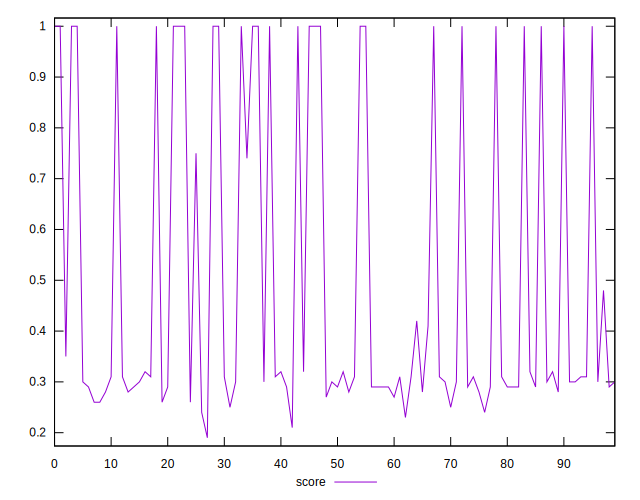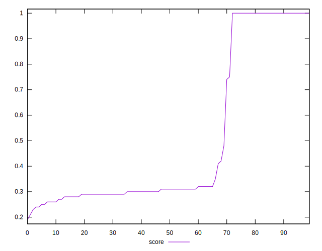
## Raw Estimate

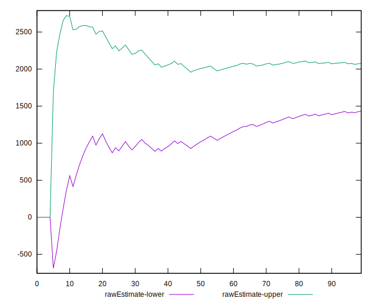
## Score Estimate

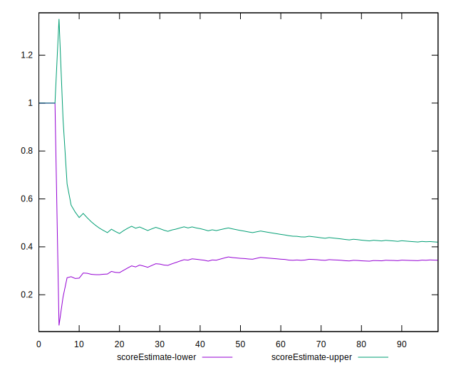
## P Score


```yaml
p90min: 0.23752941176470588
p90max: 1
p90range: 0.7624705882352941
p90mean: 0.4953686552635237
p90median: 0.3059411764705882
p90stdev: 0.3119610398523903
p90skewness: 0.9448290391591535
p90eccentricity: 1.0000000000000002
p90discretization: 1.5161290322580645
outlandishness: 1.0267049646859987
confidence: 0.12490425404092327
p90confidence: 0.12612887415717777

```

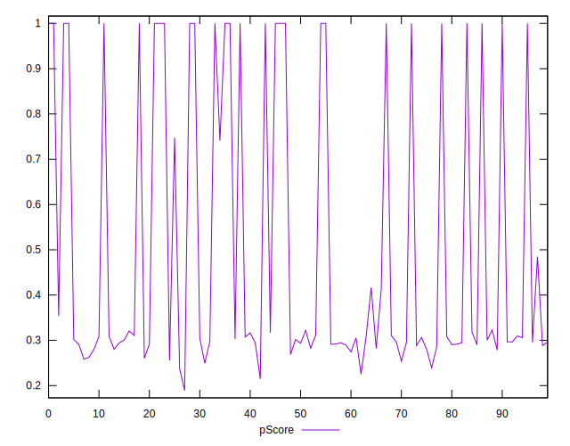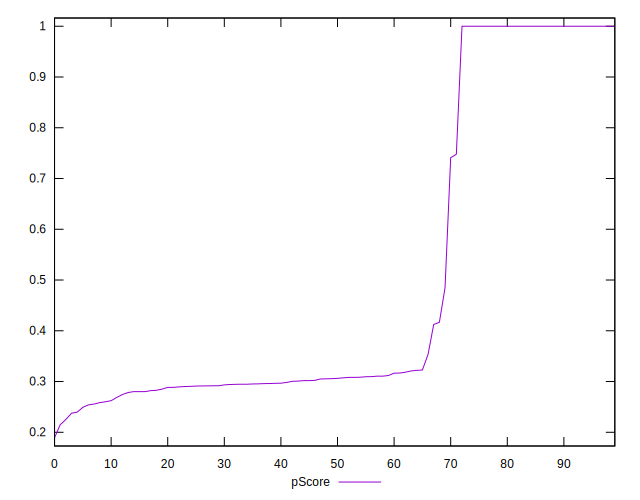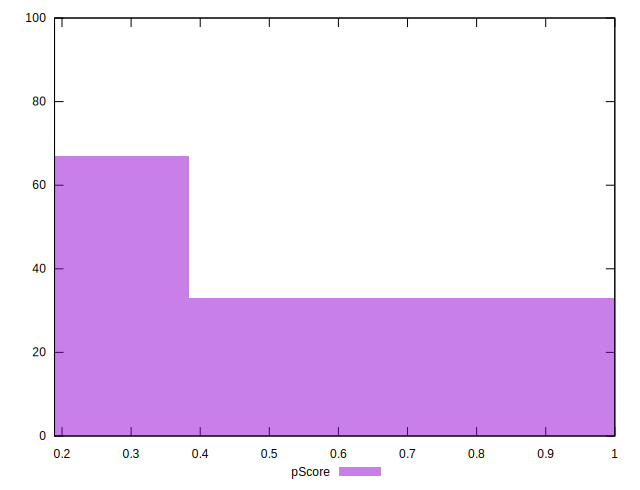
## Score Difference


```yaml
p90min: 0
p90max: 0
p90range: 0
p90mean: 0
p90median: 0
p90stdev: 0
p90skewness: .nan
p90eccentricity: .nan
p90discretization: 94
outlandishness: .inf
confidence: 3.0463960003014037e-18
p90confidence: 0

```

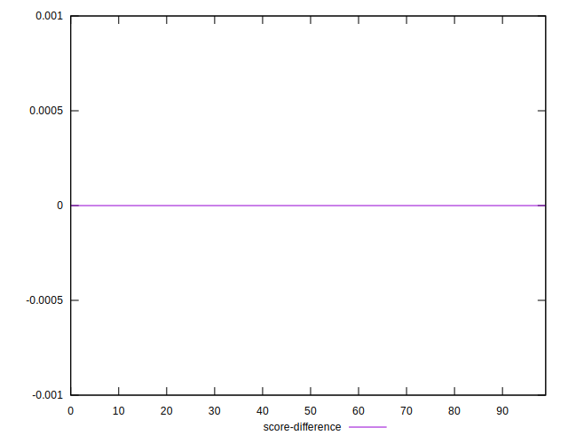
## P Score Difference


```yaml
p90min: -0.004705882352941199
p90max: 0.004705882352941171
p90range: 0.00941176470588237
p90mean: -0.00016701432345987994
p90median: 0
p90stdev: 0.0021503710977082723
p90skewness: -0.10131104824159573
p90eccentricity: 0.9999999999999992
p90discretization: 1.88
outlandishness: 0.9237754704828958
confidence: 0.0009403623317359079
p90confidence: 0.0008694158914921336

```

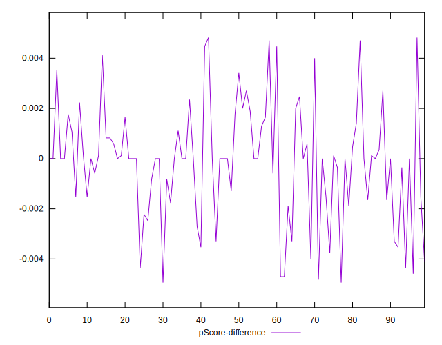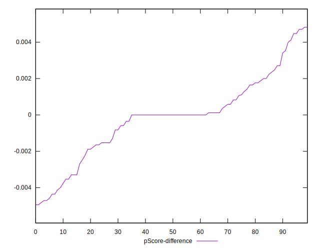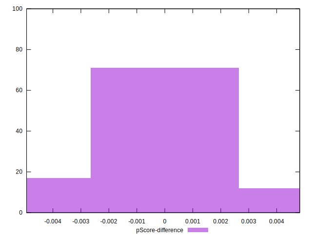